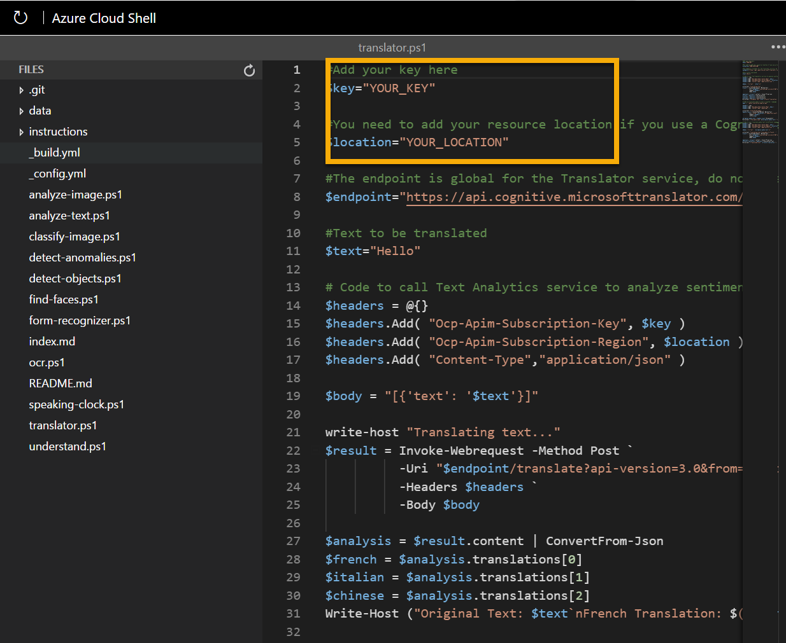

---
lab:
    title: 'Translation'
    module: 'Module 3: Explore Natural Language Processing'
---

# Translation

One of the driving forces that has enabled human civilization to develop is the ability to communicate with one another. In most human endeavors, communication is key.

Artificial Intelligence (AI) can help simplify communication by translating text or speech between languages, helping to remove barriers to communication across countries and cultures.

## Create a Cognitive Services resource 

In Azure, you can use the cognitive services to translate between multiple languages.

If you don't already have one, use the following steps to create a **Cognitive Services** resource in your Azure subscription:

> **Note**: If you already have a Cognitive Services resource, just open its **Quick start** page in the Azure portal and copy its key and endpoint to the cell below. Otherwise, follow the steps below to create one.

1. In another browser tab, open the Azure portal at https://portal.azure.com, signing in with your Microsoft account.
2. Click the **&#65291;Create a resource** button, search for *Cognitive Services*, and create a **Cognitive Services** resource with the following settings:
    - **Subscription**: *Your Azure subscription*.
    - **Resource group**: *Select or create a resource group with a unique name*.
    - **Region**: *Choose any available region*:
    - **Name**: *Enter a unique name*.
    - **Pricing tier**: S0
    - **I confirm I have read and understood the notices**: Selected.

### Get the Key and Location for your Cognitive Services resource

To use your cognitive services resource, client applications need its authentication key and location:

1. Wait for deployment to complete. Then go to your cognitive services resource, and on the **Overview** page, click the link to manage the keys for the service. You will need the endpoint and keys to connect to your cognitive services resource from client applications.
2. View the **Keys and Endpoint** page for your Speech resource. You will need the **location/region** and keys to connect from client applications.

**Note**: To use the Translator service you do not need to use the Cognitive Service endpoint. A global endpoint just for the Translator service is provided. 

## Use a cloud shell

To test the capabilities of the Custom Vision service to detect objects in images, we'll use a simple command-line application that runs in the cloud shell.
> **Note**: For this lab, you will test out an application in a cloud shell environment. When you build your own application, you can use an environment of your choice.

1. Click the **Activate Sandbox** button at the top of the page. This starts a Cloud Shell instance to your right, as shown here. You may be prompted to review permissions. Click **Accept**. 

    

2. When you open the cloud shell, you will need to change the type of shell you are using from *Bash* to *PowerShell*. Type in pwsh and press enter. 

    ```
    pwsh
    ```

## Configure and run a client application

Now that you have a cloud shell environment, you can run a simple client application that uses the Computer Vision service to analyze an image.

1. In the command shell, enter the following command to download the sample application.

    ```
    git clone https://github.com/GraemeMalcolm/ai-stuff ai-900
    ```

2. The files are downloaded to a folder named **ai-900**. Now we want to see all of the files in your cloud shell storage and work with them. Type the following command into the shell: 

     ```
    code .
    ```

    Notice how this opens up an editor. 

3. In the **Files** pane on the left, expand **ai-900** and select **translator.ps1**. This file contains some code that uses the Translator service:

    

4. Don't worry too much about the details of the code, the important thing is that it needs the region/location and either of the keys for your Speech resource. Copy these from the **Keys and Endpoints** page for your resource (which should still be in the top area of the browser) and paste them into the code editor, replacing the **YOUR_LOCATION** and **YOUR_KEY** placeholder values respectively.

    >**Tip**: You may need to use the separator bar to adjust the screen area as you work with the **Keys and Endpoint** and **Editor** panes.

    After pasting the location and key values, the first two lines of code should look similar to this:

    ```PowerShell
    $region="eastus"
    $key="1a2b3c4d5e6f7g8h9i0j...."
    ```

5. At the top right of the editor pane, use the **...** button to open the menu and select **Save** to save your changes. Then open the menu again and select **Close Editor**.

    The sample client application will use the Translator service to do several tasks:
    - Translate text from English into French, Italian, and Chinese 
    - Translate audio from English into text in French 
    >Note: A real application could accept the input from a microphone and send the response to a speaker, but in this simple example, we'll use pre-recorded input in an audio file.

    Use the audio player below to hear the input audio the application will process:

    <audio controls>
      <source src="https://github.com/GraemeMalcolm/ai-stuff/raw/main/data/speech/time.wav" type="audio/wav">
    Your browser does not support the audio element.
    </audio>

6. In the PowerShell pane, enter the following command to run the code:

    ```
    cd ai-900
    .\translator.ps1
    ```

7. Review the output. 

## Learn more

This simple app shows only some of the capabilities of the Translator service. To learn more about what you can do with this service, see the [Translator page](https://docs.microsoft.com/azure/cognitive-services/translator/translator-overview).
