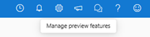

---
lab:
    title: 'Explore Automated Machine Learning in Azure ML'
---

# Explore Automated Machine Learning in Azure ML

In this exercise, you'll use the automated machine learning feature in Azure Machine Learning to train and evaluate a machine learning model. You'll then deploy and test the trained model.

This exercise should take approximately **30** minutes to complete.

> **Note**
> To complete this lab, you will need an [Azure subscription](https://azure.microsoft.com/free) in which you have administrative access.

## Create an Azure Machine Learning workspace

To use Azure Machine Learning, you need to provision an Azure Machine Learning workspace in your Azure subscription. Then you'll be able to use Azure Machine Learning studio to work with the resources in your workspace.

> **Tip**: If you already have an Azure Machine Learning workspace, you can use that and skip to the next task.

1. Sign into the [Azure portal](https://portal.azure.com) at `https://portal.azure.com` using your Microsoft credentials.

1. Select **+ Create a resource**, search for *Machine Learning*, and create a new **Azure Machine Learning** resource with the following settings:
    - **Subscription**: *Your Azure subscription*.
    - **Resource group**: *Create or select a resource group*.
    - **Name**: *Enter a unique name for your workspace*.
    - **Region**: *Select the closest geographical region*.
    - **Storage account**: *Note the default new storage account that will be created for your workspace*.
    - **Key vault**: *Note the default new key vault that will be created for your workspace*.
    - **Application insights**: *Note the default new application insights resource that will be created for your workspace*.
    - **Container registry**: None (*one will be created automatically the first time you deploy a model to a container*).

1. Select **Review + create**, then select **Create**. Wait for your workspace to be created (it can take a few minutes), and then go to the deployed resource.

1. Select **Launch studio** (or open a new browser tab and navigate to [https://ml.azure.com](https://ml.azure.com?azure-portal=true), and sign into Azure Machine Learning studio using your Microsoft account). Close any messages that are displayed.

1. In Azure Machine Learning studio, you should see your newly created workspace. If not, select **All workspaces** in the left-hand menu and then select the workspace you just created.

## Enable preview features

Some features of Azure Machine Learning are in preview, and need to be explicitly enabled in your workspace.

1. In Azure Machine Learning Studio, click on **manage preview features** (the loud speaker icon - &#128363;).

    

1. Enable the following preview feature:

    - *Guided experience for submitting training jobs with serverless compute*

## Use automated machine learning to train a model

Automated machine learning enables you to try multiple algorithms and parameters to train multiple models, and identify the best one for your data. In this exercise, you'll use a dataset of historical bicycle rental details to train a model that predicts the number of bicycle rentals that should be expected on a given day, based on seasonal and meteorological features.

> **Citation**: *The data used in this exercise is derived from [Capital Bikeshare](https://www.capitalbikeshare.com/system-data) and is used in accordance with the published data [license agreement](https://www.capitalbikeshare.com/data-license-agreement)*.


1. In [Azure Machine Learning studio](https://ml.azure.com?azure-portal=true), view the **Automated ML** page (under **Authoring**).

1. Create a new Automated ML job with the following settings, using **Next** as required to progress through the user interface:

    **Basic settings**:

    - **Job name**: mslearn-bike-automl
    - **New experiment name**: mslearn-bike-rental
    - **Description**: Automated machine learning for bike rental prediction
    - **Tags**: *none*

   **Task type & data**:

    - **Select task type**: Regression
    - **Select dataset**: Create a new dataset with the following settings:
        - **Data type**:
            - **Name**: bike-rentals
            - **Description**: Historic bike rental data
            - **Type**: Tabular
        - **Data source**:
            - Select **From web files**
        - **Web URL**:
            - **Web URL**: `https://aka.ms/bike-rentals`
            - **Skip data validation**: *do not select*
        - **Settings**:
            - **File format**: Delimited
            - **Delimiter**: Comma
            - **Encoding**: UTF-8
            - **Column headers**: Only first file has headers
            - **Skip rows**: None
            - **Dataset contains multi-line data**: *do not select*
        - **Schema**:
            - Include all columns other than **Path**
            - Review the automatically detected types

        Select the **bike-rentals** dataset after you've created it.

    **Task settings**:

    - **Task type**: Regression
    - **Dataset**: bike-rentals
    - **Target column**: Rentals (integer)
    - **Additional configuration settings**:
        - **Primary metric**: Normalized root mean squared error
        - **Explain best model**: *Unselected*
        - **Use all supported models**: <u>Un</u>selected. *You'll restrict the job to try only a few specific algorithms.*
        - **Allowed models**: *Select only **RandomForest** and **LightGBM** — normally you'd want to try as many as possible, but each model added increases the time it takes to run the job.*
    - **Limits**: *Expand this section*
        - **Max trials**: 3
        - **Max concurrent trials**: 3
        - **Max nodes**: 3
        - **Metric score threshold**: 0.85 (*so that if a model achieves a normalized root mean squared error metric score of 0.085 or less, the job ends.*)
        - **Timeout**: 15
        - **Iteration timeout**: 5
        - **Enable early termination**: *Selected*
    - **Validation and test**:
        - **Validation type**: Train-validation split
        - **Percentage of validation data**: 10
        - **Test dataset**: None

    **Compute**:

    - **Select compute type**: Serverless
    - **Virtual machine type**: CPU
    - **Virtual machine tier**: Dedicated
    - **Virtual machine size**: Standard_DS3_V2
    - **Number of instances**: 1

1. Submit the training job. It starts automatically.

1. Wait for the job to finish. It might take a while — now might be a good time for a coffee break!

## Review the best model

When the automated machine learning job has completed, you can review the best model it trained.

1. On the **Overview** tab of the automated machine learning job, note the best model summary.
    

    > **Note**
    > You may see a message under the status "Warning: User specified exit score reached...". This is an expected message. Please continue to the next step.
  
1. Select the text under **Algorithm name** for the best model to view its details.

1. Select the **Metrics** tab and select the **residuals** and **predicted_true** charts if they are not already selected. 

    Review the charts which show the performance of the model. The **residuals** chart shows the *residuals* (the differences between predicted and actual values) as a histogram. The **predicted_true** chart compares the predicted values against the true values. 

## Deploy and test the model

1. On the **Model** tab for the best model trained by your automated machine learning job, select **Deploy** and use the **Web service** option to deploy the model with the following settings:
    - **Name**: predict-rentals
    - **Description**: Predict cycle rentals
    - **Compute type**: Azure Container Instance
    - **Enable authentication**: *Selected*

1. Wait for the deployment to start - this may take a few seconds. The **Deploy status** for the **predict-rentals** endpoint will be indicated in the main part of the page as *Running*.
1. Wait for the **Deploy status** to change to *Succeeded*. This may take 5-10 minutes.

## Test the deployed service

Now you can test your deployed service.

1. In Azure Machine Learning studio, on the left hand menu, select **Endpoints** and open the **predict-rentals** real-time endpoint.

1. On the **predict-rentals** real-time endpoint page view the **Test** tab.

1. In the **Input data to test endpoint** pane, replace the template JSON with the following input data:

    ```JSON
    {
      "Inputs": { 
        "data": [
          {
            "day": 1,
            "mnth": 1,   
            "year": 2022,
            "season": 2,
            "holiday": 0,
            "weekday": 1,
            "workingday": 1,
            "weathersit": 2, 
            "temp": 0.3, 
            "atemp": 0.3,
            "hum": 0.3,
            "windspeed": 0.3 
          }
        ]    
      },   
      "GlobalParameters": 1.0
    }
    ```

1. Click the **Test** button.

1. Review the test results, which include a predicted number of rentals based on the input features - similar to this:

    ```JSON
    {
      "Results": [
        444.27799000000000
      ]
    }
    ```

    The test pane took the input data and used the model you trained to return the predicted number of rentals.

Let's review what you have done. You used a dataset of historical bicycle rental data to train a model. The model predicts the number of bicycle rentals expected on a given day, based on seasonal and meteorological *features*.

## Clean-up

The web service you created is hosted in an *Azure Container Instance*. If you don't intend to experiment with it further, you should delete the endpoint to avoid accruing unnecessary Azure usage.

1. In [Azure Machine Learning studio](https://ml.azure.com?azure-portal=true), on the **Endpoints** tab, select the **predict-rentals** endpoint. Then select **Delete** and confirm that you want to delete the endpoint.

    Deleting your compute ensures your subscription won't be charged for compute resources. You will however be charged a small amount for data storage as long as the Azure Machine Learning workspace exists in your subscription. If you have finished exploring Azure Machine Learning, you can delete the Azure Machine Learning workspace and associated resources.

To delete your workspace:

1. In the [Azure portal](https://portal.azure.com?azure-portal=true), in the **Resource groups** page, open the resource group you specified when creating your Azure Machine Learning workspace.
2. Click **Delete resource group**, type the resource group name to confirm you want to delete it, and select **Delete**.
