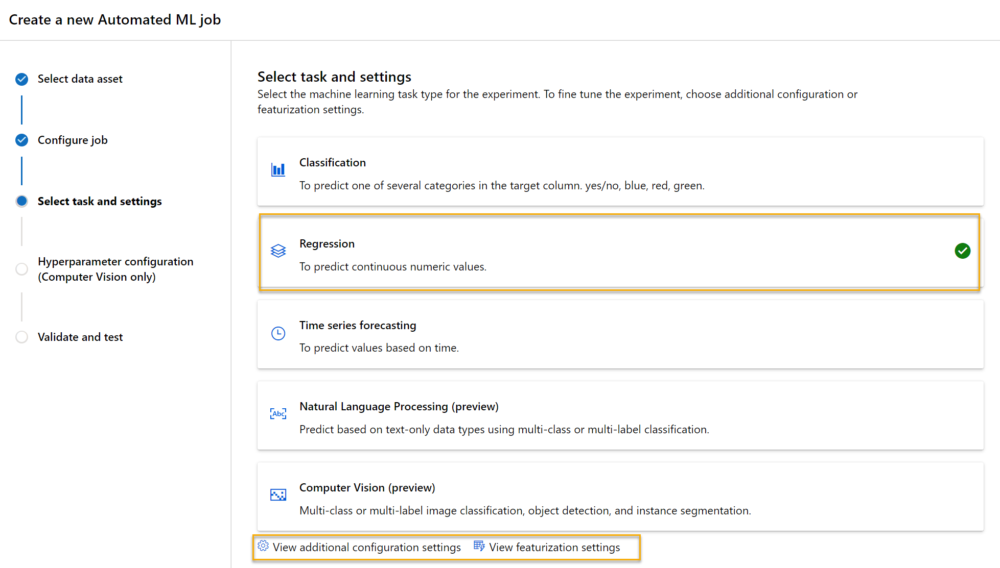
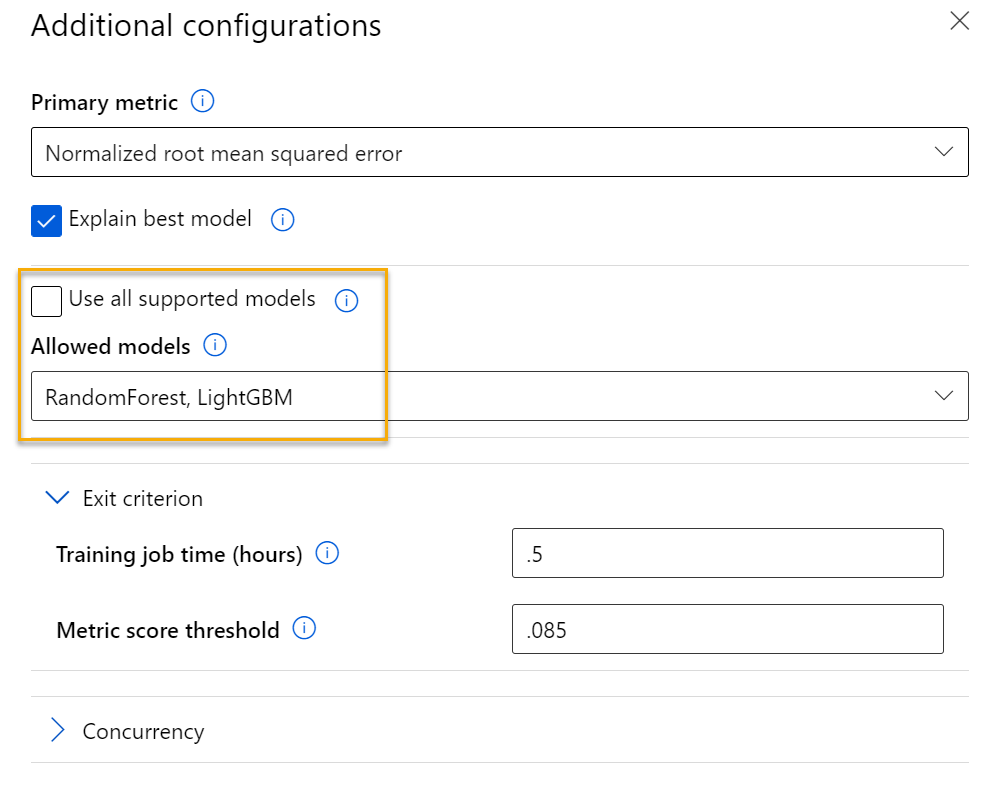
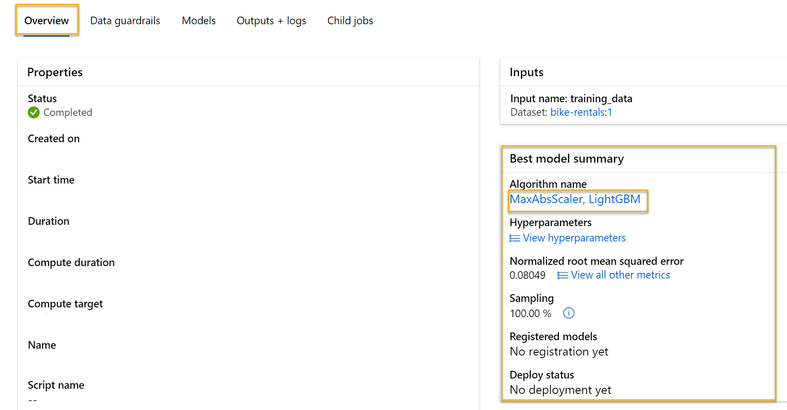
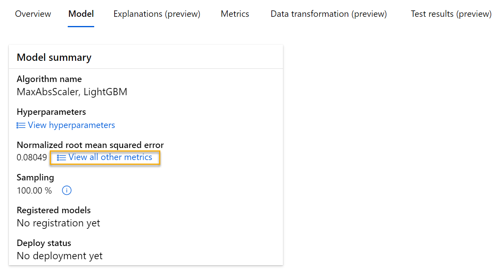
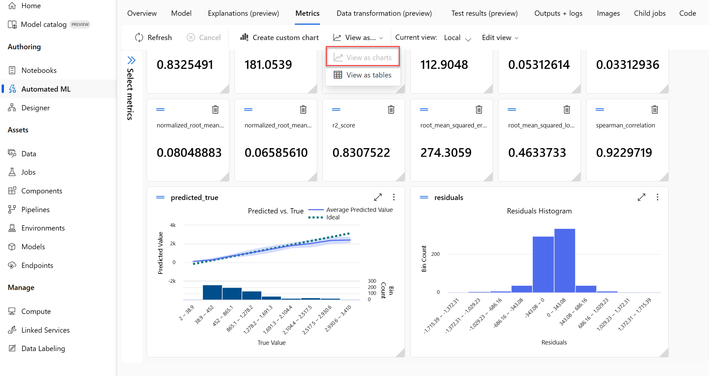
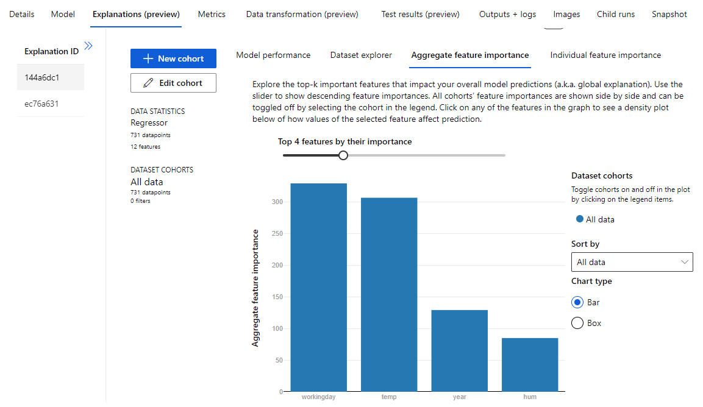
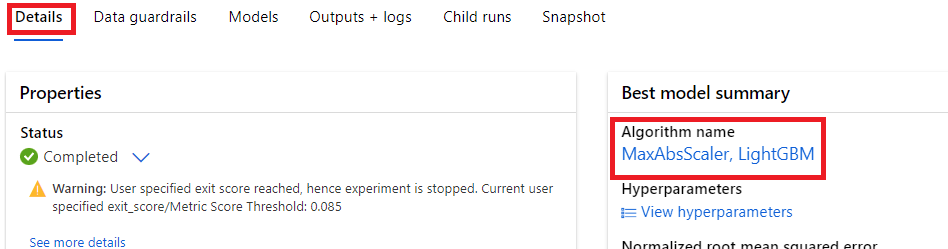
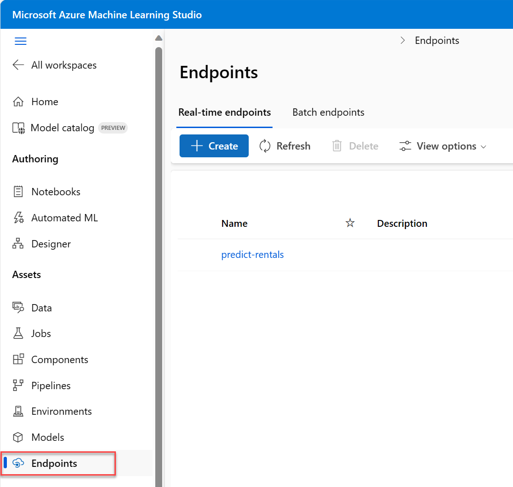
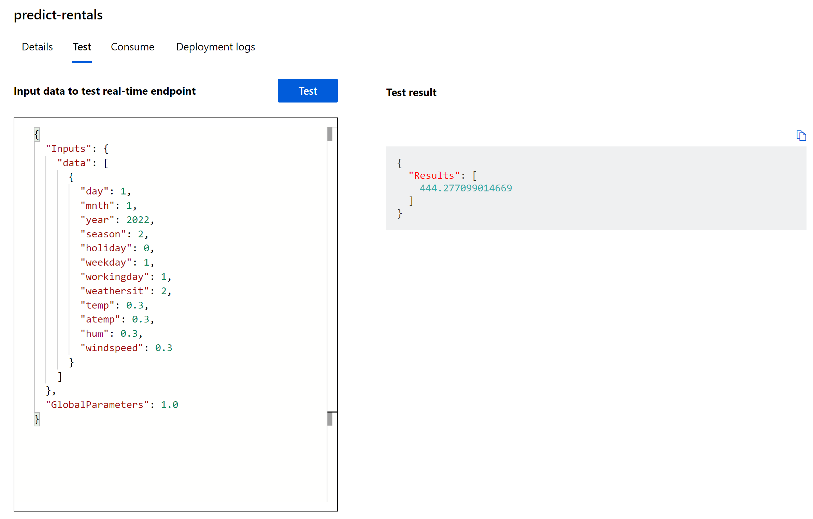

---
lab:
    title: 'Explore Automated Machine Learning in Azure ML'
---

# Explore Automated Machine Learning in Azure ML

> **Note**
> To complete this lab, you will need an [Azure subscription](https://azure.microsoft.com/free?azure-portal=true) in which you have administrative access.

In this exercise, you will use a dataset of historical bicycle rental details to train a model that predicts the number of bicycle rentals that should be expected on a given day, based on seasonal and meteorological features.

## Create an Azure Machine Learning workspace  

1. Sign into the [Azure portal](https://portal.azure.com?azure-portal=true) using your Microsoft credentials.

1. Select **+ Create a resource**, search for *Machine Learning*, and create a new **Azure Machine Learning** resource with an *Azure Machine Learning* plan. Use the following settings:
    - **Subscription**: *Your Azure subscription*.
    - **Resource group**: *Create or select a resource group*.
    - **Workspace name**: *Enter a unique name for your workspace*.
    - **Region**: *Select the closest geographical region*.
    - **Storage account**: *Note the default new storage account that will be created for your workspace*.
    - **Key vault**: *Note the default new key vault that will be created for your workspace*.
    - **Application insights**: *Note the default new application insights resource that will be created for your workspace*.
    - **Container registry**: None (*one will be created automatically the first time you deploy a model to a container*).

1. Select **Review + create**, then select **Create**. Wait for your workspace to be created (it can take a few minutes), and then go to the deployed resource.

1. Select **Launch studio** (or open a new browser tab and navigate to [https://ml.azure.com](https://ml.azure.com?azure-portal=true), and sign into Azure Machine Learning studio using your Microsoft account).

1. Close any messages that are displayed.

1. In Azure Machine Learning studio, you should see your newly created workspace. If that is not the case, select your Azure directory in the left-hand menu. Then from the new left-hand menu select **Workspaces**, where all the workspaces associated to your directory are listed, and select the one you created for this exercise.

> **Note**
> This module is one of many that make use of an Azure Machine Learning workspace, including the other modules in the [Microsoft Azure AI Fundamentals: Explore visual tools for machine learning](https://docs.microsoft.com/learn/paths/create-no-code-predictive-models-azure-machine-learning/) learning path. If you are using your own Azure subscription, you may consider creating the workspace once and reusing it in other modules. Your Azure subscription will be charged a small amount for data storage as long as the Azure Machine Learning workspace exists in your subscription, so we recommend you delete the Azure Machine Learning workspace when it is no longer required.

## Create compute

1. In [Azure Machine Learning studio](https://ml.azure.com?azure-portal=true), select the **&#8801;** icon (a menu icon that looks like a stack of three lines) at the top left to view the various pages in the interface (you may need to maximize the size of your screen). You can use these pages in the left hand pane to manage the resources in your workspace. Select the **Compute** page (under **Manage**).

1. On the **Compute** page, select the **Compute clusters** tab, and add a new compute cluster with the following settings. You'll use this to train a machine learning model:
    - **Location**: *Select the same as your workspace. If that location is not listed, choose the one closest to you*.
    - **Virtual machine tier**: Dedicated
    - **Virtual machine type**: CPU
    - **Virtual machine size**:
        - Choose **Select from all options**
        - Search for and select **Standard_DS11_v2**
    - Select **Next**
    - **Compute name**: *enter a unique name*.
    - **Minimum number of nodes**: 0
    - **Maximum number of nodes**: 2
    - **Idle seconds before scale down**: 120
    - **Enable SSH access**: Clear
    - Select **Create**

> **Note**
> Compute instances and clusters are based on standard Azure virtual machine images. For this module, the *Standard_DS11_v2* image is recommended to achieve the optimal balance of cost and performance. If your subscription has a quota that does not include this image, choose an alternative image; but bear in mind that a larger image may incur higher cost and a smaller image may not be sufficient to complete the tasks. Alternatively, ask your Azure administrator to extend your quota.

The compute cluster will take some time to be created. You can move onto the next step while you wait.

## Create a dataset

1. View the comma-separated data at [https://aka.ms/bike-rentals](https://aka.ms/bike-rentals?azure-portal=true) in your web browser.

1. In [Azure Machine Learning studio](https://ml.azure.com?azure-portal=true), expand the left pane by selecting the menu icon at the top left of the screen. View the **Data** page (under **Assets**). The Data page contains specific data files or tables that you plan to work with in Azure ML. You can create datasets from this page as well.

1. On the **Data** page, under the **Data assets** tab, select **Create**. Then configure a data asset with the following settings:
    * **Data type**:
        * **Name**: bike-rentals
        * **Description**: Bicycle rental data
        * **Dataset type**: Tabular
    * **Data source**: From Web Files
    * **Web URL**:
        * **Web URL**: [https://aka.ms/bike-rentals](https://aka.ms/bike-rentals?azure-portal=true)
        * **Skip data validation**: *do not select*
    * **Settings**:
        * **File format**: Delimited
        * **Delimiter**: Comma
        * **Encoding**: UTF-8
        * **Column headers**: Only first file has headers
        * **Skip rows**: None
        * **Dataset contains multi-line data**: *do not select*
    * **Schema**:
        * Include all columns other than **Path**
        * Review the automatically detected types
    * **Review**
        * Select **Create**

1. After the dataset has been created, open it and view the **Explore** page to see a sample of the data. This data contains historical features and labels for bike rentals.

> **Citation**: *This data is derived from [Capital Bikeshare](https://www.capitalbikeshare.com/system-data) and is used in accordance with the published data [license agreement](https://www.capitalbikeshare.com/data-license-agreement)*.

## Run an automated machine learning job

Follow the next steps to run a job that uses automated machine learning to train a regression model that predicts bicycle rentals.

1. In [Azure Machine Learning studio](https://ml.azure.com?azure-portal=true), view the **Automated ML** page (under **Author**).

1. Create an Automated ML job with the following settings:
    - **Select data asset**:
        - **Dataset**: bike-rentals
    - **Configure job**:
        - **New experiment name**: mslearn-bike-rental
        - **Target column**: rentals (*this is the label that the model is trained to predict)*
        - **Select Azure ML compute cluster**: *the compute cluster that you created previously*.
    - **Select task and settings**: 
        - **Task type**: Regression *(the model predicts a numeric value)* 

    

    Notice under task type there are settings *View additional configuration settings* and *View featurization settings*. Now configure these settings.

    - **Additional configuration settings:**
        - **Primary metric**: Select **Normalized root mean squared error**
        - **Explain best model**: Selected — *this option causes automated machine learning to calculate feature importance for the best model which makes it possible to determine the influence of each feature on the predicted label.*
        - **Use all supported models**: <u>Un</u>selected. *You'll restrict the job to try only a few specific algorithms.*
        - **Allowed models**: *Select only **RandomForest** and **LightGBM** — normally you'd want to try as many as possible, but each model added increases the time it takes to run the job.*

        
        - **Exit criterion**:
            - **Training job time (hours)**: 0.5 — *ends the job after a maximum of 30 minutes.*
            - **Metric score threshold**: 0.085 — *if a model achieves a normalized root mean squared error metric score of 0.085 or less, the job ends.*
        - **Concurrency**: *do not change*
    - **Featurization settings:**
        - **Enable featurization**: Selected — *automatically preprocess the features before training.*

    Click **Next** to go to the next selection pane.

    - **Select the validation and test type**
        - **Validation type**: Auto
        - **Test data asset (preview)**: No test data asset required

1. When you finish submitting the automated machine learning job details, it starts automatically. Wait for the status to change from *Preparing* to *Running*.

1. When the status changes to *Running*, view the **Models** tab and observe as each possible combination of training algorithm and pre-processing steps is tried and the performance of the resulting model is evaluated. The page automatically refreshes periodically, but you can also select **Refresh**. It might take 10 minutes or so before models start to appear, as the cluster nodes must be initialized before training can begin.

1. Wait for the job to finish. It might take a while — now might be a good time for a coffee break!

## Review the best model

1. On the **Overview** tab of the automated machine learning job, note the best model summary.
    

    >[!NOTE]
    > You may see a message under the status "Warning: User specified exit score reached...". This is an expected message. Please continue to the next step.  
1. Select the text under **Algorithm name** for the best model to view its details.

1. Next to the *Normalized root mean squared error* value, select **View all other metrics** to see values of other possible evaluation metrics for a regression model.

    

1. Select the **Metrics** tab and select the **residuals** and **predicted_true** charts if they are not already selected. 
    

    Review the charts which show the performance of the model. The first chart shows the *residuals*, the differences between predicted and actual values, as a histogram, the second chart compares the predicted values against the true values.

1. Select the **Explanations** tab. Select an Explanation ID and then select **Aggregate feature importance**. This chart shows how much each feature in the dataset influences the label prediction, like this:

    

## Deploy a predictive service

1. In [Azure Machine Learning studio](https://ml.azure.com?azure-portal=true), on the **Automated ML** page, select your automated machine learning job.

1. On the **Overview** tab, select the algorithm name for the best model.

    

1. On the **Models** tab, select the **Deploy** button and use the **Deploy to web service** option to deploy the model with the following settings:
    - **Name**: predict-rentals
    - **Description**: Predict cycle rentals
    - **Compute type**: Azure Container Instance
    - **Enable authentication**: Selected

1. Wait for the deployment to start - this may take a few seconds. Then, in the **Model summary** section, observe the **Deploy status** for the **predict-rentals** service, which should be **Running**. Wait for this status to change to **Succeeded**, which may take some time. You may need to select **Refresh** periodically.

1. In Azure Machine Learning studio, on the left hand menu, select **Endpoints**.
    

## Test the deployed service

Now you can test your deployed service.

1. On the **Endpoints** page, open the **predict-rentals** real-time endpoint.

1. When the **predict-rentals** endpoint opens, view the **Test** tab.

1. In the **Input data to test real-time endpoint** pane, replace the template JSON with the following input data:

    ```JSON
    {
      "Inputs": { 
        "data": [
          {
            "day": 1,
            "mnth": 1,   
            "year": 2022,
            "season": 2,
            "holiday": 0,
            "weekday": 1,
            "workingday": 1,
            "weathersit": 2, 
            "temp": 0.3, 
            "atemp": 0.3,
            "hum": 0.3,
            "windspeed": 0.3 
          }
        ]    
      },   
      "GlobalParameters": 1.0
    }
    ```

1. Click on the **Test** button.

1. Review the test results, which include a predicted number of rentals based on the input features. The test pane took the input data and used the model you trained to return the predicted number of rentals.

    

Let's review what you have done. You used a dataset of historical bicycle rental data to train a model. The model predicts the number of bicycle rentals expected on a given day, based on seasonal and meteorological *features*. In this case, the *labels* are number of bicycle rentals.

You have just tested a service that is ready to be connected to a client application using the credentials in the **Consume** tab. We will end the lab here. You are welcome to continue to experiment with the service you just deployed.

## Clean-up

The web service you created is hosted in an *Azure Container Instance*. If you don't intend to experiment with it further, you should delete the endpoint to avoid accruing unnecessary Azure usage. You should also stop the compute instance until you need it again.

1. In [Azure Machine Learning studio](https://ml.azure.com?azure-portal=true), on the **Endpoints** tab, select the **predict-rentals** endpoint. Then select **Delete** and confirm that you want to delete the endpoint.
2. On the **Compute** page, on the **Compute Instances** tab, select your compute instance and then select **Stop**.

>[!NOTE]
> Stopping your compute ensures your subscription won't be charged for compute resources. You will however be charged a small amount for data storage as long as the Azure Machine Learning workspace exists in your subscription. If you have finished exploring Azure Machine Learning, you can delete the Azure Machine Learning workspace and associated resources. However, if you plan to complete any other labs in this series, you will need to recreate it.
>
> To delete your workspace:
> 1. In the [Azure portal](https://portal.azure.com?azure-portal=true), in the **Resource groups** page, open the resource group you specified when creating your Azure Machine Learning workspace.
> 2. Click **Delete resource group**, type the resource group name to confirm you want to delete it, and select **Delete**.