---
lab:
    title: 'Explore regression with Azure Machine Learning Designer'
---

# Explore regression with Azure Machine Learning Designer

> **Note**
> To complete this lab, you will need an [Azure subscription](https://azure.microsoft.com/free?azure-portal=true) in which you have administrative access.

In this exercise, you will train a regression model that predicts the price of an automobile based on its characteristics.

## Create an Azure Machine Learning workspace  

1. Sign into the [Azure portal](https://portal.azure.com?azure-portal=true) using your Microsoft credentials.

1. Select **+ Create a resource**, search for *Machine Learning*, and create a new **Azure Machine Learning** resource with an *Azure Machine Learning* plan. Use the following settings:
    - **Subscription**: *Your Azure subscription*.
    - **Resource group**: *Create or select a resource group*.
    - **Workspace name**: *Enter a unique name for your workspace*.
    - **Region**: *Select the closest geographical region*.
    - **Storage account**: *Note the default new storage account that will be created for your workspace*.
    - **Key vault**: *Note the default new key vault that will be created for your workspace*.
    - **Application insights**: *Note the default new application insights resource that will be created for your workspace*.
    - **Container registry**: None (*one will be created automatically the first time you deploy a model to a container*)

1. Select **Review + create**, then select **Create**. Wait for your workspace to be created (it can take a few minutes), and then go to the deployed resource.

1. Select **Launch studio** (or open a new browser tab and navigate to [https://ml.azure.com](https://ml.azure.com?azure-portal=true), and sign into Azure Machine Learning studio using your Microsoft account).

1. In Azure Machine Learning studio, you should see your newly created workspace. If that is not the case, select your Azure directory in the left-hand menu. Then from the new left-hand menu select **Workspaces**, where all the workspaces associated to your directory are listed, and select the one you created for this exercise.

> **Note**
> This module is one of many that make use of an Azure Machine Learning workspace, including the other modules in the [Microsoft Azure AI Fundamentals: Explore visual tools for machine learning](https://docs.microsoft.com/learn/paths/create-no-code-predictive-models-azure-machine-learning/) learning path. If you are using your own Azure subscription, you may consider creating the workspace once and reusing it in other modules. Your Azure subscription will be charged a small amount for data storage as long as the Azure Machine Learning workspace exists in your subscription, so we recommend you delete the Azure Machine Learning workspace when it is no longer required.

## Create compute

1. In [Azure Machine Learning studio](https://ml.azure.com?azure-portal=true), select the **&#8801;** icon (a menu icon that looks like a stack of three lines) at the top left to view the various pages in the interface (you may need to maximize the size of your screen). You can use these pages in the left hand pane to manage the resources in your workspace. Select the **Compute** page (under **Manage**).

1. On the **Compute** page, select the **Compute clusters** tab, and add a new compute cluster with the following settings to train a machine learning model:
    - **Location**: *Select the same as your workspace. If that location is not listed, choose the one closest to you*.
    - **Virtual machine tier**: Dedicated
    - **Virtual machine type**: CPU
    - **Virtual machine size**:
        - Choose **Select from all options**
        - Search for and select **Standard_DS11_v2**
    - Select **Next**
    - **Compute name**: *enter a unique name*
    - **Minimum number of nodes**: 0
    - **Maximum number of nodes**: 2
    - **Idle seconds before scale down**: 120
    - **Enable SSH access**: Clear
    - Select **Create**

> **Note**
> Compute instances and clusters are based on standard Azure virtual machine images. For this module, the *Standard_DS11_v2* image is recommended to achieve the optimal balance of cost and performance. If your subscription has a quota that does not include this image, choose an alternative image; but bear in mind that a larger image may incur higher cost and a smaller image may not be sufficient to complete the tasks. Alternatively, ask your Azure administrator to extend your quota.

The compute cluster will take some time to be created. You can move onto the next step while you wait.

## Create a pipeline in Designer 

1. In [Azure Machine Learning studio](https://ml.azure.com?azure-portal=true), expand the left pane by selecting the menu icon at the top left of the screen. View the **Designer** page (under **Author**), and select **+** to create a new pipeline.

1. At the top right-hand side of the screen, select **Settings**. If the **Settings** pane is not visible, select the wheel icon next to the pipeline name at the top.

1. In **Settings**, you must specify a compute target on which to run the pipeline. Under **Select compute type**, select **Compute cluster**. Then under **Select Azure ML compute cluster**, select the compute cluster you created previously.

1. In **Settings**, under **Draft details**, change the draft name (**Pipeline-Created-on-*date***) to **Auto Price Training**.

1. Select the *close* icon on the top right of the **Settings** pane to close the pane. 

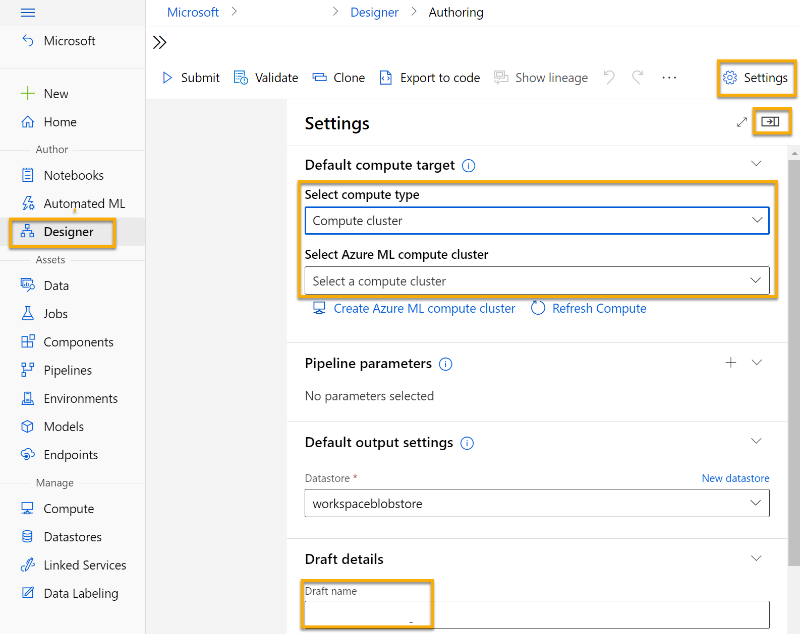

## Add and explore a dataset

Azure Machine Learning includes a sample dataset that you can use for your regression model.

1. Next to the pipeline name on the left, select the arrows icon to expand the panel if it is not already expanded. The panel should open by default to the **Asset library** pane, indicated by the books icon at the top of the panel. There is a search bar to locate assets on the pane and two buttons, **Data** and **Component**.

    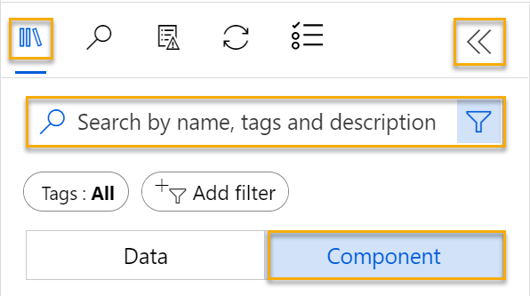

1. Click on **Component**. Search for and place the **Automobile price data (Raw)** dataset onto the canvas.

1. Right-click (Ctrl+click on a Mac) the **Automobile price data (Raw)** dataset on the canvas, and click on **Preview data**.

1. Review the *Dataset output* schema of the data, noting that you can see the distributions of the various columns as histograms.

1. Scroll to the right of the dataset until you see the **Price** column, which is the label that your model predicts.

1. Scroll back to the left and select the **normalized-losses** column header. Then review the statistics for this column. Note there are quite a few missing values in this column. Missing values  limit the column's usefulness for predicting the **price** label so you might want to exclude it from training.

1. Close the **Automobile price data (Raw) result visualization** window so that you can see the dataset on the canvas like this:

    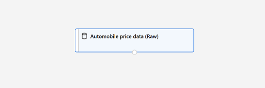

## Add data transformations

You typically apply data transformations to prepare the data for modeling. In the case of the automobile price data, you add transformations to address the issues you identified when you explored the data.

1. In the **Asset library** pane on the left, click on **Component**, which contain a wide range of modules you can use for data transformation and model training. You can also use the search bar to quickly locate modules.

1. Search for a **Select Columns in Dataset** module and place it to the canvas, below the **Automobile price data (Raw)** module. Then connect the output at the bottom of the **Automobile price data (Raw)** module to the input at the top of the **Select Columns in Dataset** module, like this:

    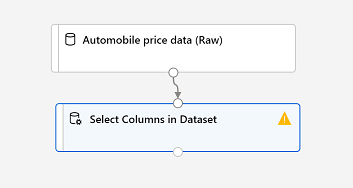

1. Double click on the **Select Columns in Dataset** module to access a settings pane on the right. Select **Edit column**. Then in the **Select columns** window, select **By name** and **Add all** to add all the columns. Then remove **normalized-losses**, so your final column selection looks like this:

    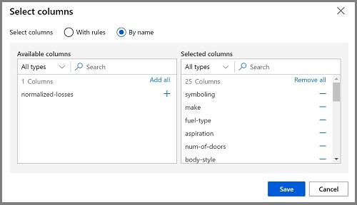

1. Click on the **Save** button.

In the rest of this exercise, you go through steps to create a pipeline that looks like this:

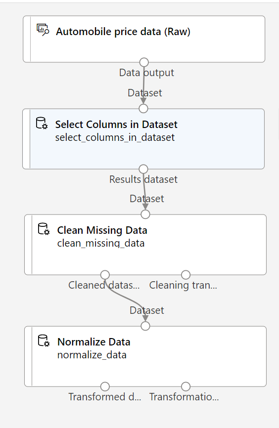

Follow the remaining steps, use the image for reference as you add and configure the required modules.

1. In the **Asset library**, search for a **Clean Missing Data** module and place it under the **Select Columns in Dataset** module on the canvas. Then connect the output from the **Select Columns in Dataset** module to the input of the **Clean Missing Data** module.

1. Double click the **Clean Missing Data** module, and in the pane on the right, click **Edit column**. Then in the **Columns to be cleaned** window, select **With rules**, in the **Include** list select **Column names**, in the box of column names enter **bore**, **stroke**, and **horsepower** like this:

    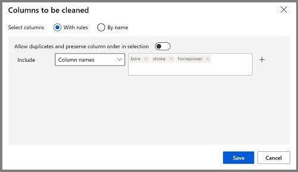

1. With the **Clean Missing Data** module still selected, in the pane on the right, set the following configuration settings:
    - **Minimum missing value ratio**: 0.0
    - **Maximum missing value ratio**: 1.0
    - **Cleaning mode**: Remove entire row

    >**Tip**
    >If you view the statistics for the **bore**, **stroke**, and **horsepower** columns, you'll see a number of missing values. These columns have fewer missing values than **normalized-losses**, so they might still be useful in predicting **price** once you exclude the rows where the values are missing from training.

1. In the **Asset library**, search for a **Normalize Data** module and place it on the canvas, below the **Clean Missing Data** module. Then connect the left-most output from the **Clean Missing Data** module to the input of the **Normalize Data** module.

1. Double click on the **Normalize Data** module to view its parameters pane. You will need to specify the transformation method and the columns to be transformed. Set the transformation method to **MinMax**. Apply a rule by selecting **Edit column** to include the following **Column names**:
    - **symboling**
    - **wheel-base**
    - **length**
    - **width**
    - **height**
    - **curb-weight**
    - **engine-size**
    - **bore**
    - **stroke**
    - **compression-ratio**
    - **horsepower**
    - **peak-rpm**
    - **city-mpg**
    - **highway-mpg**

    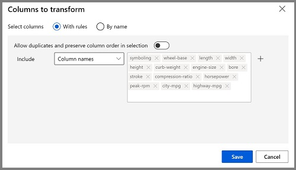

    >**Tip**
    >If you compare the values in the **stroke**, **peak-rpm**, and **city-mpg** columns, they are all measured in different scales, and it is possible that the larger values for **peak-rpm** might bias the training algorithm and create an over-dependency on this column compared to columns with lower values, such as **stroke**. Typically, data scientists mitigate this possible bias by *normalizing* the numeric columns so they're on the similar scales.

## Run the pipeline

To apply your data transformations, you must run the pipeline.

1. Ensure that your pipeline looks similar to this image:

    

1. Select **Submit**, and create a new experiment named **mslearn-auto-training** on your compute cluster.

1. Wait for the run to finish, which might take 5 minutes or more.

    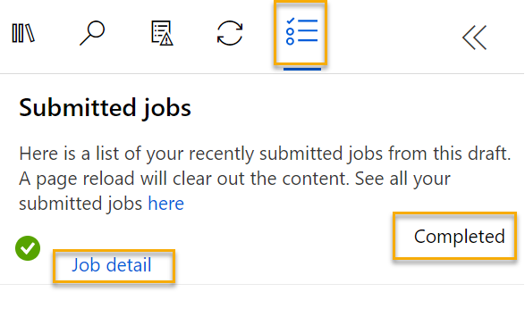

    Notice that the left hand panel is now on the **Submitted Jobs** pane. You will know when the run is complete because the status of the job will change to **Completed**. 

1. When the run has completed, click on **Job detail**. A new tab will open, and you will see the components that have completed with check marks like this:

    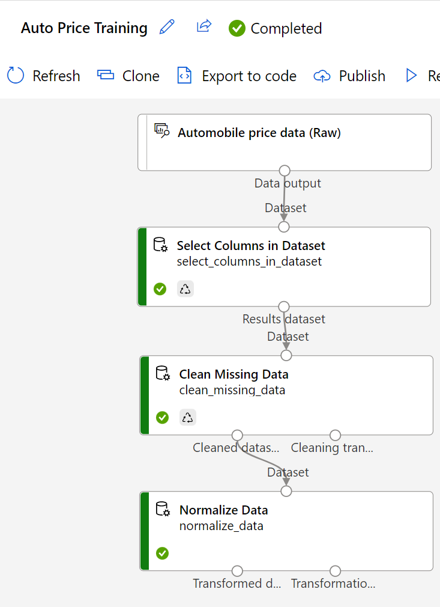

The dataset is now prepared for model training. Close the Job detail tab to return to the pipeline.

## Create training pipeline

After you've used data transformations to prepare the data, you can use it to train a machine learning model. Work through the following steps to extend the **Auto Price Training** pipeline.

1. Return to the **Auto Price Training** pipeline you created in the previous unit if it's not already open.

1. In the **Asset library** pane on the left, search for and place a **Split Data** module onto the canvas under the **Normalize Data** module. Then connect the *Transformed Dataset* (left) output of the **Normalize Data** module to the input of the **Split Data** module.

    >**Tip**
    > Use the search bar to quickly locate modules. 

1. Double click on the **Split Data** module, and configure its settings as follows:
    * **Splitting mode**: Split Rows
    * **Fraction of rows in the first output dataset**: 0.7
    * **Randomized split**: True
    * **Random seed**: 123
    * **Stratified split**: False

1. In the **Asset library**, search for and place a **Train Model** module to the canvas, under the **Split Data** module. Then connect the *Results dataset1* (left) output of the **Split Data** module to the *Dataset* (right) input of the **Train Model** module.

1. The model you are training will predict the **price** value, so select the **Train Model** module and modify its settings to set the **Label column** to  **price** (matching the case and spelling exactly!)

    The **price** label the model will predict is a numeric value, so we need to train the model using a *regression* algorithm.

1. In the **Asset library**, search for and place a **Linear Regression** module to the canvas, to the left of the **Split Data** module and above the **Train Model** module. Then connect its output to the **Untrained model** (left) input of the **Train Model** module.

    > **Note**
    > There are multiple algorithms you can use to train a regression model. For help choosing one, take a look at the [Machine Learning Algorithm Cheat Sheet for Azure Machine Learning designer](https://aka.ms/mlcheatsheet?azure-portal=true).

    To test the trained model, we need to use it to *score* the validation dataset we held back when we split the original data - in other words, predict labels for the features in the validation dataset.
 
1. In the **Asset library**, search for and place a **Score Model** module to the canvas, below the **Train Model** module. Then connect the output of the **Train Model** module to the **Trained model** (left) input of the **Score Model** module; and drag the **Results dataset2** (right) output of the **Split Data** module to the **Dataset** (right) input of the **Score Model** module.

1. Ensure your pipeline looks like this image:

    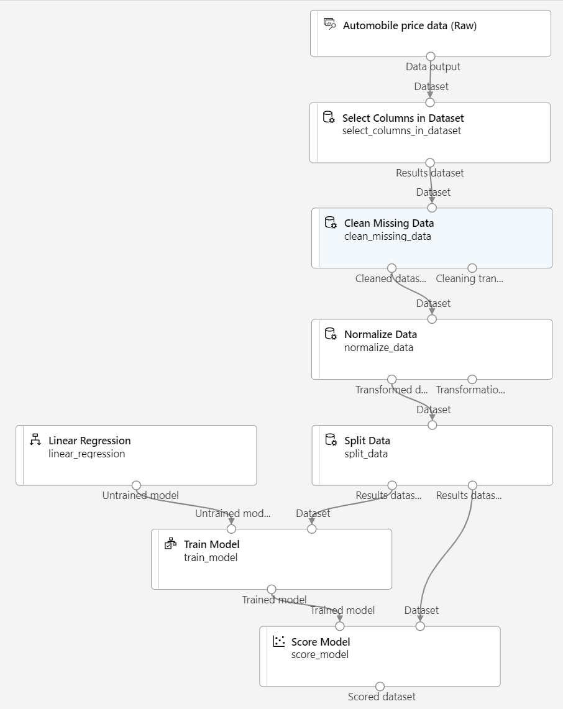

## Run the training pipeline

Now you're ready to run the training pipeline and train the model.

1. Select **Submit**, and run the pipeline using the existing experiment named **mslearn-auto-training**.

1. The experiment run will take 5 minutes or more to complete. When the experiment run has completed, click on **Job details**. You will be taken to a new tab.

1. In the new window, right click on the **Score Model** module and select **Preview data** and then **Scored dataset** to view the results.

1. Scroll to the right, and note that next to the **price** column (which contains the known true values of the label) there is a new column named **Scored Labels**, which contains the predicted label values.

1. Close the **Score Model result visualization** tab.

The model is predicting values for the **price** label, but how reliable are its predictions? To assess that, you need to evaluate the model.

## Evaluate model

One way to evaluate a regression model is to compare the predicted labels to the actual labels in the validation dataset to held back during training. Another way is to compare the performance of multiple models.

1. Open the **Auto Price Training** pipeline you created.

1. In the **Asset library**, search for and place an **Evaluate Model** module to the canvas, under the **Score Model** module, and connect the output of the **Score Model** module to the **Scored dataset** (left) input of the **Evaluate Model** module.

1. Ensure your pipeline looks like this:

    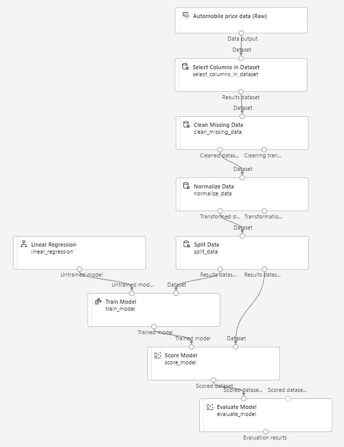

1. Select **Submit**, and run the pipeline using the existing experiment named **mslearn-auto-training**.

1. Wait for the experiment run to complete.

    

1. When the experiment run has completed, select **Job detail**, which will open another tab. Find and right click on the **Evaluate Model** module. Select **Preview data** and then **Evaluation results**.

    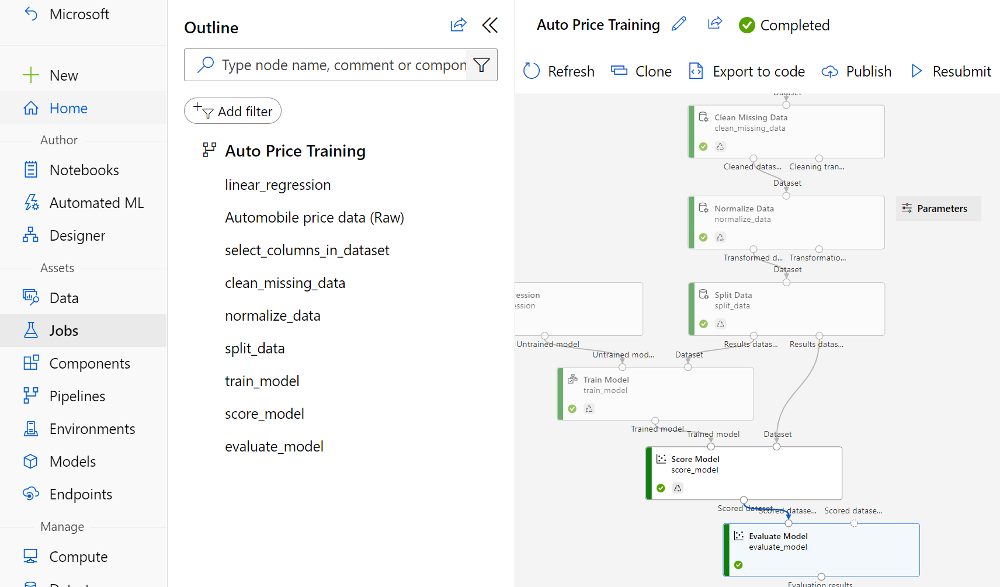

1. In the *Evaluation_results* pane, review the regression performance metrics:
    - **Mean Absolute Error (MAE)**
    - **Root Mean Squared Error (RMSE)**
    - **Relative Squared Error (RSE)**
    - **Relative Absolute Error (RAE)**
    - **Coefficient of Determination (R<sup>2</sup>)**
1. Close the *Evaluation_results* pane.

When you've identified a model with evaluation metrics that meet your needs, you can prepare to use that model with new data.

## Create and run an inference pipeline

1. In Azure Machine Learning studio, expand the left-hand pane by selecting the menu icon at the top left of the screen. Click on **Jobs** (under **Assets**) to view all of the jobs you have run. Select the experiment **mslearn-auto-training**, then select the **mslearn-auto-training** pipeline. 

    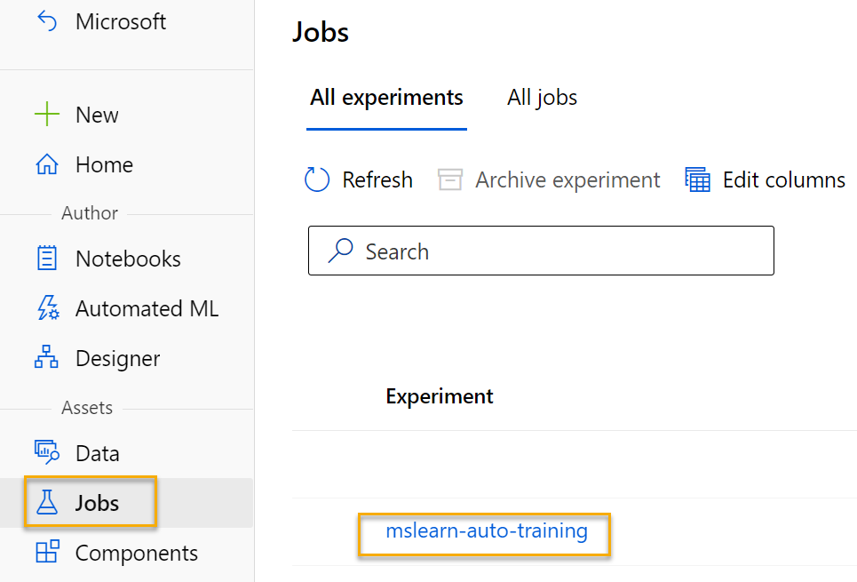

1. Locate the menu above the canvas and click on **Create inference pipeline**. You may need to expand your screen to full and click on the three dots icon **...** on the top right hand corner of the screen in order to find **Create inference pipeline** in the menu.  

    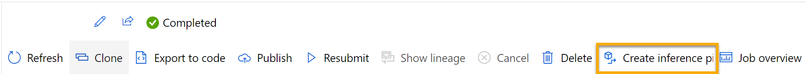

1. In the **Create inference pipeline** drop-down list, click **Real-time inference pipeline**. After a few seconds, a new version of your pipeline named **Auto Price Training-real time inference** will be opened.

    *If the pipeline doesn't include **Web Service Input** and **Web Service Output** modules, go back to the **Designer** page and then reopen the **Auto Price Training-real time inference** pipeline.*

1. Rename the new pipeline to **Predict Auto Price**, and then review the new pipeline. It contains a web service input for new data to be submitted, and a web service output to return results. Some of the transformations and training steps are a part of this pipeline. The trained model will be used to score the new data.

    You're going to make the following changes to the inference pipeline in the next steps #5-9:

    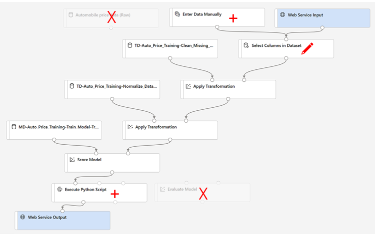

   Use the image for reference as you modify the pipeline in the next steps.

1. The inference pipeline assumes that new data will match the schema of the original training data, so the **Automobile price data (Raw)** dataset from the training pipeline is included. However, this input data includes the **price** label that the model predicts, which is unintuitive to include in new car data for which a price prediction hasn't yet been made. Delete this module and replace it with an **Enter Data Manually** module from the **Data Input and Output** section, containing the following CSV data, which includes feature values without labels for three cars (copy and paste the entire block of text):

    ```CSV
    symboling,normalized-losses,make,fuel-type,aspiration,num-of-doors,body-style,drive-wheels,engine-location,wheel-base,length,width,height,curb-weight,engine-type,num-of-cylinders,engine-size,fuel-system,bore,stroke,compression-ratio,horsepower,peak-rpm,city-mpg,highway-mpg
    3,NaN,alfa-romero,gas,std,two,convertible,rwd,front,88.6,168.8,64.1,48.8,2548,dohc,four,130,mpfi,3.47,2.68,9,111,5000,21,27
    3,NaN,alfa-romero,gas,std,two,convertible,rwd,front,88.6,168.8,64.1,48.8,2548,dohc,four,130,mpfi,3.47,2.68,9,111,5000,21,27
    1,NaN,alfa-romero,gas,std,two,hatchback,rwd,front,94.5,171.2,65.5,52.4,2823,ohcv,six,152,mpfi,2.68,3.47,9,154,5000,19,26
    ```

1. Connect the new **Enter Data Manually** module to the same **dataset** input of the **Select Columns in Dataset** module as the **Web Service Input**.

1. Now that you've changed the schema of the incoming data to exclude the **price** field, you need to remove any explicit uses of this field in the remaining modules. Select the **Select Columns in Dataset** module and then in the settings pane, edit the columns to remove the **price** field.

1. The inference pipeline includes the **Evaluate Model** module, which isn't useful when predicting from new data, so delete this module.

1. The output from the **Score Model** module includes all of the input features and the predicted label. To modify the output to include only the prediction:
    - Delete the connection between the **Score Model** module and the **Web Service Output**.
    - Add an **Execute Python Script** module from the **Python Language** section, replacing all of the default python script with the following code (which selects only the **Scored Labels** column and renames it to **predicted_price**):

```Python
import pandas as pd

def azureml_main(dataframe1 = None, dataframe2 = None):

    scored_results = dataframe1[['Scored Labels']]
    scored_results.rename(columns={'Scored Labels':'predicted_price'},
                        inplace=True)
    return scored_results
```

1. Connect the output from the **Score Model** module to the **Dataset1** (left-most) input of the **Execute Python Script**, and connect the output of the **Execute Python Script** module to the **Web Service Output**.

1. Verify that your pipeline looks similar to the following image:

    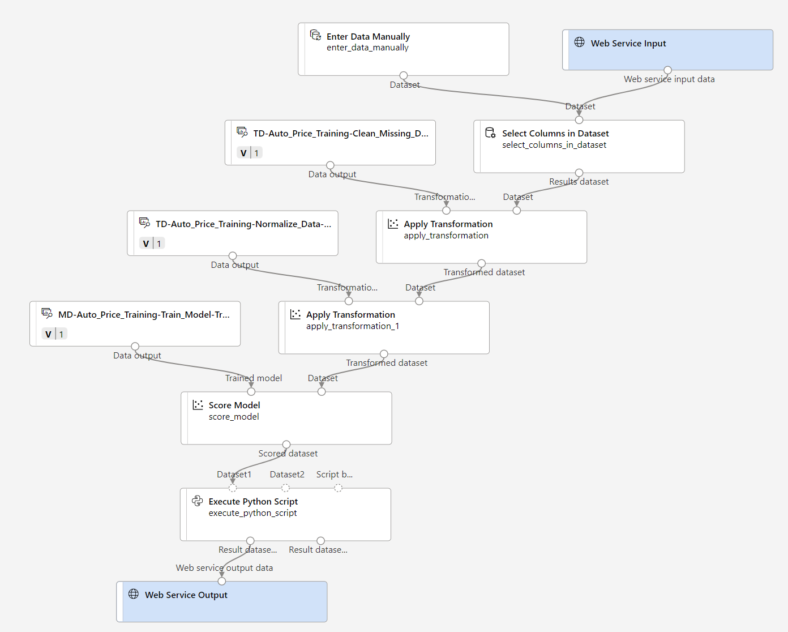

1. Submit the pipeline as a new experiment named **mslearn-auto-inference** on your compute cluster. The experiment may take a while to run.

1. When the pipeline has completed, select **Job detail**. In the new tab, right click on the **Execute Python Script** module. Select **Preview data** and then **Result dataset** to see the predicted prices for the three cars in the input data.

1. Close the visualization tab.

Your inference pipeline predicts prices for cars based on their features. Now you're ready to publish the pipeline so that client applications can use it.

## Deploy model

After you've created and tested an inference pipeline for real-time inferencing, you can publish it as a service for client applications to use.

> **Note**
> In this exercise, you'll deploy the web service to an Azure Container Instance (ACI). This type of compute is created dynamically, and is useful for development and testing. For production, you should create an *inference cluster*, which provides an Azure Kubernetes Service (AKS) cluster that provides better scalability and security.

## Deploy a service

1. View the **Predict Auto Price** inference pipeline you created in the previous unit.

1. Select **Job detail** on the left hand pane, which will open a new tab.

    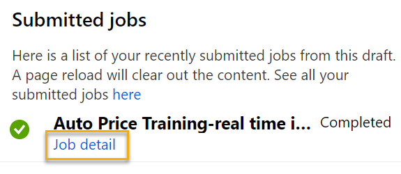

1. In the new tab, select **Deploy**.

    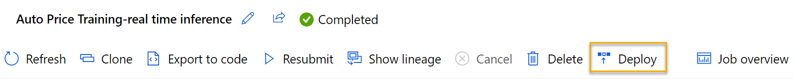

1. In the configuration screen, select **Deploy a new real-time endpoint**, using the following settings:
    -  **Name**: predict-auto-price
    -  **Description**: Auto price regression
    - **Compute type**: Azure Container Instance

1. Wait a few minutes for the web service to be deployed. The deployment status is shown at the top left of the designer interface.

## Test the service

1. On the **Endpoints** page, open the **predict-auto-price** real-time endpoint.

    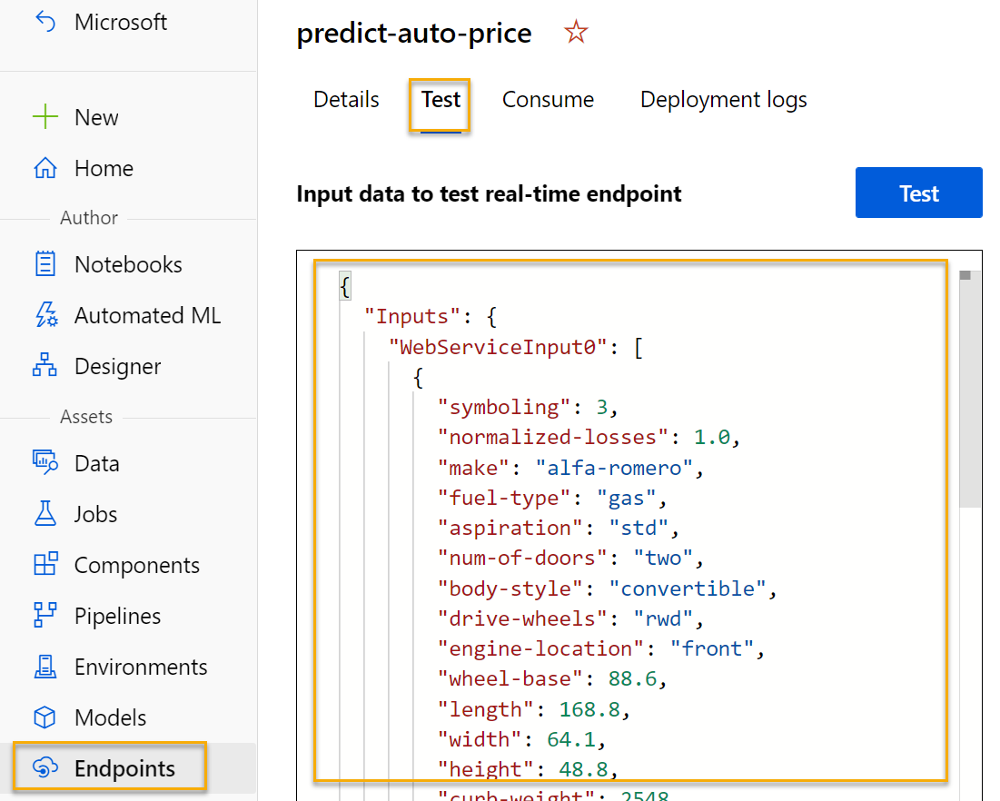

1. When the **predict-auto-price** endpoint opens, select the **Test** tab. We will use it to test our model with new data. Delete the current data under **Input data to test real-time endpoint**. Copy and paste the below data into the data section:  

    ```json
    {
    "Inputs": {
                "WebServiceInput0":
                [
                    {
                        "symboling": 3,
                        "normalized-losses": 1.0,
                        "make": "alfa-romero",
                        "fuel-type": "gas",
                        "aspiration": "std",
                        "num-of-doors": "two",
                        "body-style": "convertible",
                        "drive-wheels": "rwd",
                        "engine-location": "front",
                        "wheel-base": 88.6,
                        "length": 168.8,
                        "width": 64.1,
                        "height": 48.8,
                        "curb-weight": 2548,
                        "engine-type": "dohc",
                        "num-of-cylinders": "four",
                        "engine-size": 130,
                        "fuel-system": "mpfi",
                        "bore": 3.47,
                        "stroke": 2.68,
                        "compression-ratio": 9,
                        "horsepower": 111,
                        "peak-rpm": 5000,
                        "city-mpg": 21,
                        "highway-mpg": 27
                    }
                ]
            },
    "GlobalParameters": {}
    }
    ```

1. Select **Test**. On the right hand of the screen, you should see the output **'predicted_price'**. The output is the predicted price for a vehicle with the particular input features specified in the data. 

    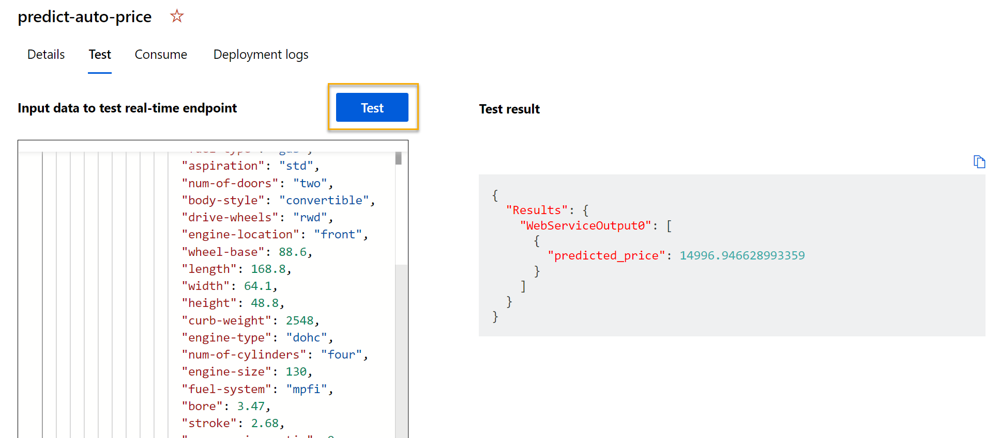

Let's review what you have done. You cleaned and transformed a dataset of automobile data, then used the car *features* to train a model. The model predicts the price of an automobile, which is the *label*.

You also tested a service that is ready to be connected to a client application using the credentials in the **Consume** tab. We will end the lab here. You are welcome to continue to experiment with the service you just deployed.

## Clean-up

The web service you created is hosted in an *Azure Container Instance*. If you don't intend to experiment with it further, you should delete the endpoint to avoid accruing unnecessary Azure usage. You should also stop the compute instance until you need it again.

1. In [Azure Machine Learning studio](https://ml.azure.com?azure-portal=true), on the **Endpoints** tab, select the **predict-auto-price** endpoint. Then select **Delete** and confirm that you want to delete the endpoint.

1. On the **Compute** page, on the **Compute clusters** tab, select your compute cluster and then select **Delete**.

>**Note**
> Stopping your compute ensures your subscription won't be charged for compute resources. You will however be charged a small amount for data storage as long as the Azure Machine Learning workspace exists in your subscription. If you have finished exploring Azure Machine Learning, you can delete the Azure Machine Learning workspace and associated resources. However, if you plan to complete any other labs in this series, you will need to recreate it.
>
> To delete your workspace:
>
> 1. In the [Azure portal](https://portal.azure.com?azure-portal=true), in the **Resource groups** page, open the resource group you specified when creating your Azure Machine Learning workspace.
> 1. Click **Delete resource group**, type the resource group name to confirm you want to delete it, and select **Delete**.
