---
lab:
    title: 'Explore classification with Azure Machine Learning Designer'
---

# Explore classification with Azure Machine Learning Designer

> **Note**
> To complete this lab, you will need an [Azure subscription](https://azure.microsoft.com/free?azure-portal=true) in which you have administrative access.

## Create an Azure Machine Learning workspace  

1. Sign into the [Azure portal](https://portal.azure.com?azure-portal=true) using your Microsoft credentials.

1. Select **+ Create a resource**, search for *Machine Learning*, and create a new **Azure Machine Learning** resource with an *Azure Machine Learning* plan. Use the following settings:
    - **Subscription**: *Your Azure subscription*.
    - **Resource group**: *Create or select a resource group*.
    - **Workspace name**: *Enter a unique name for your workspace*.
    - **Region**: *Select the closest geographical region*.
    - **Storage account**: *Note the default new storage account that will be created for your workspace*.
    - **Key vault**: *Note the default new key vault that will be created for your workspace*.
    - **Application insights**: *Note the default new application insights resource that will be created for your workspace*.
    - **Container registry**: None (*one will be created automatically the first time you deploy a model to a container*)

1. Select **Review + create**, then select **Create**. Wait for your workspace to be created (it can take a few minutes), and then go to the deployed resource.

1. Select **Launch studio** (or open a new browser tab and navigate to [https://ml.azure.com](https://ml.azure.com?azure-portal=true), and sign into Azure Machine Learning studio using your Microsoft account).

1. In Azure Machine Learning studio, you should see your newly created workspace. If that is not the case, select your Azure directory in the left-hand menu. Then from the new left-hand menu select **Workspaces**, where all the workspaces associated to your directory are listed, and select the one you created for this exercise.

> **Note**
> This module is one of many that make use of an Azure Machine Learning workspace, including the other modules in the [Microsoft Azure AI Fundamentals: Explore visual tools for machine learning](https://docs.microsoft.com/learn/paths/create-no-code-predictive-models-azure-machine-learning/) learning path. If you are using your own Azure subscription, you may consider creating the workspace once and reusing it in other modules. Your Azure subscription will be charged a small amount for data storage as long as the Azure Machine Learning workspace exists in your subscription, so we recommend you delete the Azure Machine Learning workspace when it is no longer required.

## Create compute

1. In [Azure Machine Learning studio](https://ml.azure.com?azure-portal=true), select the **&#8801;** icon (a menu icon that looks like a stack of three lines) at the top left to view the various pages in the interface (you may need to maximize the size of your screen). You can use these pages in the left hand pane to manage the resources in your workspace. Select the **Compute** page (under **Manage**).

1. On the **Compute** page, select the **Compute clusters** tab, and add a new compute cluster with the following settings. You'll use this to train a machine learning model:
    - **Location**: *Select the same as your workspace. If that location is not listed, choose the one closest to you*.
    - **Virtual machine tier**: Dedicated
    - **Virtual machine type**: CPU
    - **Virtual machine size**:
        - Choose **Select from all options**
        - Search for and select **Standard_DS11_v2**
    - Select **Next**
    - **Compute name**: *enter a unique name*.
    - **Minimum number of nodes**: 0
    - **Maximum number of nodes**: 2
    - **Idle seconds before scale down**: 120
    - **Enable SSH access**: Clear
    - Select **Create**

> **Note**
> Compute instances and clusters are based on standard Azure virtual machine images. For this module, the *Standard_DS11_v2* image is recommended to achieve the optimal balance of cost and performance. If your subscription has a quota that does not include this image, choose an alternative image; but bear in mind that a larger image may incur higher cost and a smaller image may not be sufficient to complete the tasks. Alternatively, ask your Azure administrator to extend your quota.

The compute cluster will take some time to be created. You can move onto the next step while you wait.

## Create a pipeline in Designer

To get started with Azure Machine Learning designer, first you must create a pipeline and add the dataset you want to work with.

1. In [Azure Machine Learning studio](https://ml.azure.com?azure-portal=true), expand the left pane by selecting the menu icon at the top left of the screen. View the **Designer** page (under **Author**), and select **+** to create a new pipeline.

1. At the top right-hand side of the screen, select **Settings**. If the **Settings** pane is not visible, select the wheel icon next to the pipeline name at the top.

1. In **Settings**, you must specify a compute target on which to run the pipeline. Under **Select compute type**, select **Compute cluster**. Then under **Select Azure ML compute cluster**, select the compute cluster you created previously.

1. In **Settings**, under **Draft Details**, change the draft name (**Pipeline-Created-on-*date***) to **Diabetes Training**.

1. Select the close icon on the top right of the **Settings** pane to close the pane, then select **Save**.

    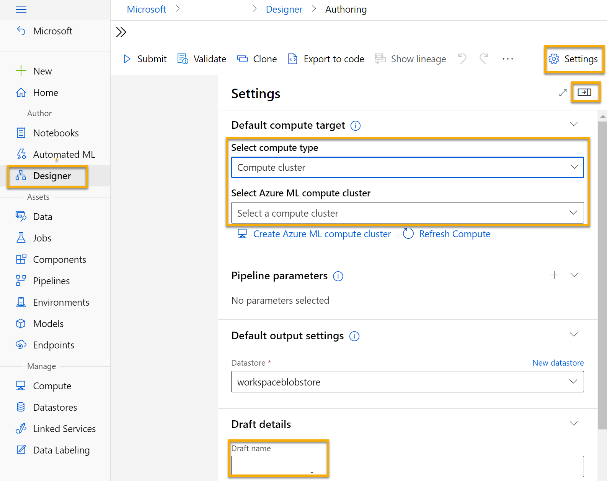

## Create a dataset

1. In [Azure Machine Learning studio](https://ml.azure.com?azure-portal=true), expand the left pane by selecting the menu icon at the top left of the screen. View the **Data** page (under **Assets**). The Data page contains specific data files or tables that you plan to work with in Azure ML. You can create datasets from this page as well.

1. On the **Data** page, under the **Data assets** tab, select **Create**. Then configure a data asset with the following settings:
    * **Data type**:
        * **Name**: diabetes-data
        * **Description**: Diabetes data
        * **Dataset type**: Tabular
    * **Data source**: From Web Files
    * **Web URL**:
        * **Web URL**: https://aka.ms/diabetes-data
        * **Skip data validation**: *do not select*
    * **Settings**:
        * **File format**: Delimited
        * **Delimiter**: Comma
        * **Encoding**: UTF-8
        * **Column headers**: Only first file has headers
        * **Skip rows**: None
        * **Dataset contains multi-line data**: *do not select*
    * **Schema**:
        * Include all columns other than **Path**
        * Review the automatically detected types
    * **Review**
        * Select **Create**

1. After the dataset has been created, open it and view the **Explore** page to see a sample of the data. This data represents details from patients who have been tested for diabetes.

### Load data to canvas

1. Return to your pipeline by selecting **Designer** on the left-hand menu. On the **Designer** page, select the **Diabetes Training** pipeline.

1. Then in the project, next to the pipeline name on the left, select the arrows icon to expand the panel if it is not already expanded. The panel should open by default to the **Asset library** pane, indicated by the books icon at the top of the panel. Note that there is a search bar to locate assets. Notice two buttons, **Data** and **Component**.

    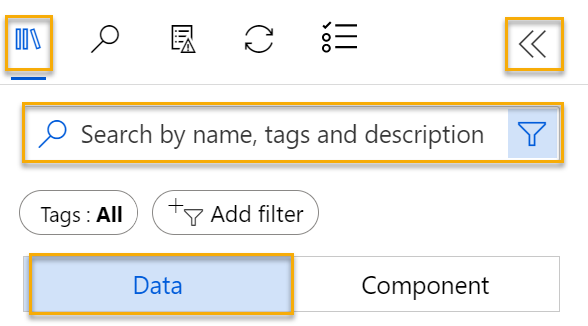

1. Click on **Data**. Search for and place the **diabetes-data** dataset onto the canvas.

1. Right-click (Ctrl+click on a Mac) the **diabetes-data** dataset on the canvas, and click on **Preview data**.

1. Review the schema of the data in the *Profile* tab, noting that you can see the distributions of the various columns as histograms.

1. Scroll down and select the column heading for the **Diabetic** column, and note that it contains two values **0** and **1**. These values represent the two possible classes for the *label* that your model will predict, with a value of **0** meaning that the patient does not have diabetes, and a value of **1** meaning that the patient is diabetic.

1. Scroll back up and review the other columns, which represent the *features* that will be used to predict the label. Note that most of these columns are numeric, but each feature is on its own scale. For example, **Age** values range from 21 to 77, while **DiabetesPedigree** values range from 0.078 to 2.3016. When training a machine learning model, it is sometimes possible for larger values to dominate the resulting predictive function, reducing the influence of features that on a smaller scale. Typically, data scientists mitigate this possible bias by *normalizing* the numeric columns so they're on the similar scales.

1. Close the **diabetes-data result visualization** tab so that you can see the dataset on the canvas like this:

    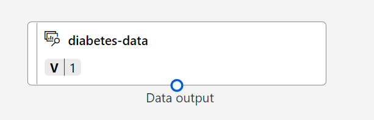

## Add transformations

Before you can train a model, you typically need to apply some pre-processing transformations to the data.

1. In the **Asset library** pane on the left, click on **Component**, which contain a wide range of modules you can use for data transformation and model training. You can also use the search bar to quickly locate modules.

    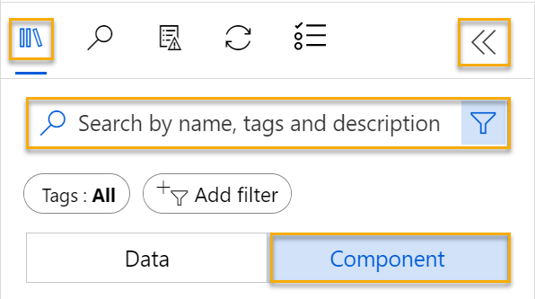

1. Find the **Select Columns in Dataset** module and place it on the canvas, below the **diabetes-data** dataset. Then connect the output from the bottom of the **diabetes-data** dataset to the input at the top of the **Select Columns in Dataset** module.

1. Double click on the **Select Columns in Dataset** module to access a settings pane on the right. Select **Edit column**. Then in the **Select columns** window, select **By name** and **Add all** the columns. Then remove **PatientID** and click **Save**. 

1. Find the **Normalize Data** module and place it on the canvas, below the **Select Columns in Dataset** module. Then connect the output from the bottom of the **Select Columns in Dataset** module to the input at the top of the **Normalize Data** module, like this:

    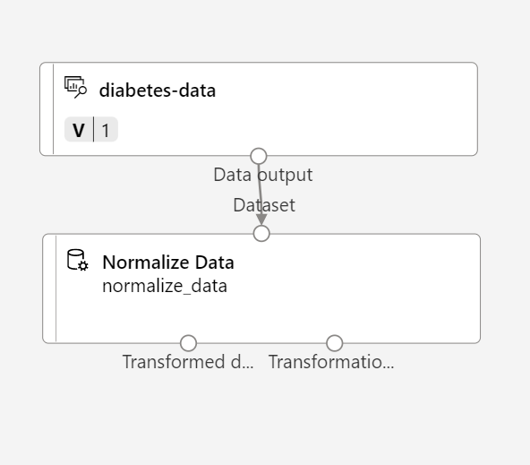

1. Double-click the **Normalize Data** module to view its settings, noting that it requires you to specify the transformation method and the columns to be transformed. 

1. Set the *Transformation method* to **MinMax** and the *Use 0 for constant columns when checked* to **True**. Edit the columns to transform with **Edit columns**. Select columns **With Rules** and copy and paste the following list under include column names:  

```
Pregnancies, PlasmaGlucose, DiastolicBloodPressure, TricepsThickness, SerumInsulin, BMI, DiabetesPedigree, Age
```
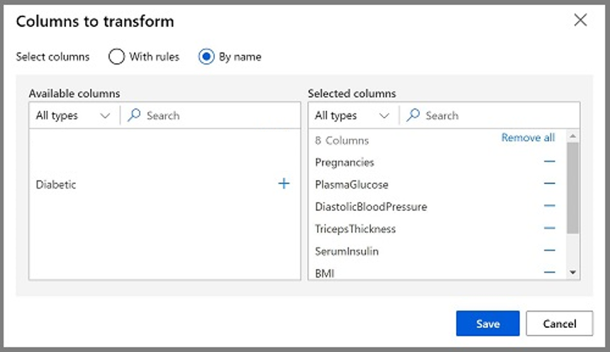

Click **Save** and close the selection box. 

The data transformation is normalizing the numeric columns to put them on the same scale, which should help prevent columns with large values from dominating model training. You'd usually apply a whole bunch of pre-processing transformations like this to prepare your data for training, but we'll keep things simple in this exercise.

## Run the pipeline

To apply your data transformations, you need to run the pipeline as an experiment.

1. Select **Submit**, and run the pipeline as a new experiment named **mslearn-diabetes-training** on your compute cluster.

1. Wait a few minutes for the run to finish.

    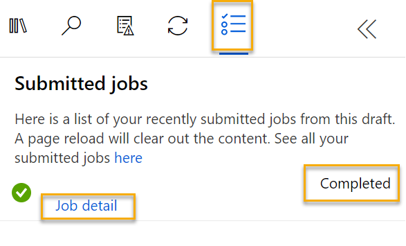

    Notice that the left hand panel is now on the **Submitted Jobs** pane. You will know when the run is complete because the status of the job will change to **Completed**.

## View the transformed data

1. When the run has completed, the dataset is now prepared for model training. Click on **Job detail**. You will be taken to a new tab.

1. Right-click (Ctrl+click on a Mac) the **Normalize Data** module on the canvas, and click on **Preview data**. Select **Transformed dataset**.

1. View the data, noting that the numeric columns you selected have been normalized to a common scale.

1. Close the normalized data result visualization. Return to the previous tab.

After you've used data transformations to prepare the data, you can use it to train a machine learning model.

## Add training modules

It's common practice to train the model using a subset of the data, while holding back some data with which to test the trained model. This enables you to compare the labels that the model predicts with the actual known labels in the original dataset.

In this exercise, you're going to work through steps to extend the **Diabetes Training** pipeline as shown here:

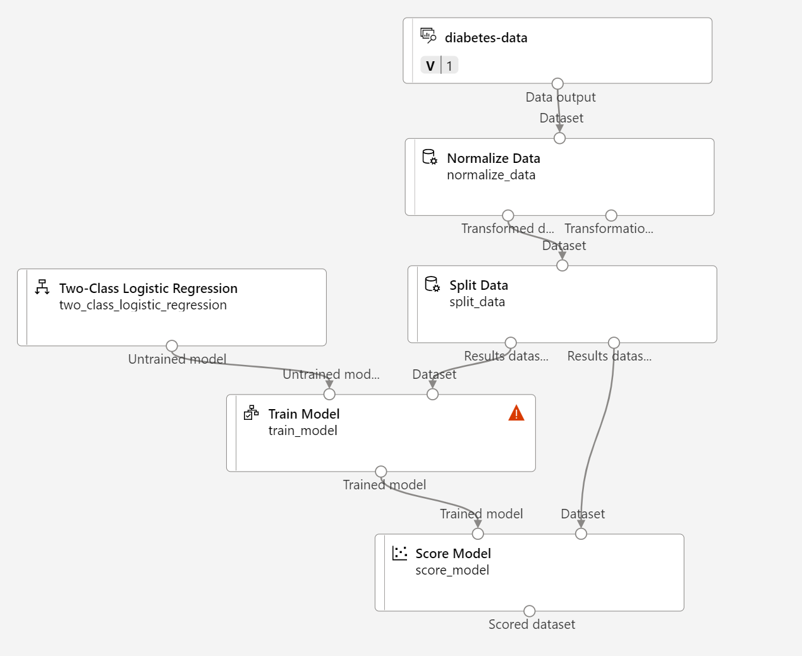

Follow the steps below, using the image above for reference as you add and configure the required modules.

1. Open the **Diabetes Training** pipeline you created in the previous unit if it's not already open.

1. In the **Asset library** pane on the left, in **Component**, search for and place a **Split Data** module onto the canvas under the **Normalize Data** module. Then connect the *Transformed Dataset* (left) output of the **Normalize Data** module to the input of the **Split Data** module.

    >**Tip**
    > Use the search bar to quickly locate modules.

1. Select the **Split Data** module, and configure its settings as follows:
    * **Splitting mode**: Split Rows
    * **Fraction of rows in the first output dataset**: 0.7
    * **Randomized split**: True
    * **Random seed**: 123
    * **Stratified split**: False

1. In the **Asset library**, search for and place a **Train Model** module to the canvas, under the **Split Data** module. Then connect the *Results dataset1* (left) output of the **Split Data** module to the *Dataset* (right) input of the **Train Model** module.

1. The model we're training will predict the **Diabetic** value, so select the **Train Model** module and modify its settings to set the **Label column** to **Diabetic**.

    The **Diabetic** label the model will predict is a class (0 or 1), so we need to train the model using a *classification* algorithm. Specifically, there are two possible classes, so we need a *binary classification* algorithm.

1. In the **Asset library**, search for and place a **Two-Class Logistic Regression** module to the canvas, to the left of the **Split Data** module and above the **Train Model** module. Then connect its output to the **Untrained model** (left) input of the **Train Model** module.

   To test the trained model, we need to use it to *score* the validation dataset we held back when we split the original data - in other words, predict labels for the features in the validation dataset.

1. In the **Asset library**, search for and place a **Score Model** module to the canvas, below the **Train Model** module. Then connect the output of the **Train Model** module to the **Trained model** (left) input of the **Score Model** module; and connect the **Results dataset2** (right) output of the **Split Data** module to the **Dataset** (right) input of the **Score Model** module.

## Run the training pipeline

Now you're ready to run the training pipeline and train the model.

1. Select **Submit**, and run the pipeline using the existing experiment named **mslearn-diabetes-training**.

1. Wait for the experiment run to finish. This may take 5 minutes or more.

1. When the experiment run has finished, select **Job detail**. You'll be directed to a new tab.

1. On the new tab, right-click (Ctrl+click on a Mac) the **Score Model** module on the canvas, and click on **Preview data**. Select **Scored dataset** to view the results.

1. Scroll to the right, and note that next to the **Diabetic** column (which contains the known true values of the label) there is a new column named **Scored Labels**, which contains the predicted label values, and a **Scored Probabilities** column containing a probability value between 0 and 1. This indicates the probability of a *positive* prediction, so probabilities greater than 0.5 result in a predicted label of ***1*** (diabetic), while probabilities between 0 and 0.5 result in a predicted label of ***0*** (not diabetic).

1. Close the **Score Model result visualization** tab.

The model is predicting values for the **Diabetic** label, but how reliable are its predictions? To assess that, you need to evaluate the model.

The validation data you held back and used to score the model includes the known values for the label. So to validate the model, you can compare the true values for the label to the label values that were predicted when you scored the validation dataset. Based on this comparison, you can calculate various metrics that describe how well the model performs.

## Add an Evaluate Model module

1. Open the **Diabetes Training** pipeline you created.

1. In the **Asset library**, search for and place an **Evaluate Model** module to the canvas, under the **Score Model** module, and connect the output of the **Score Model** module to the **Scored dataset** (left) input of the **Evaluate Model** module.

1. Ensure your pipeline looks like this:

    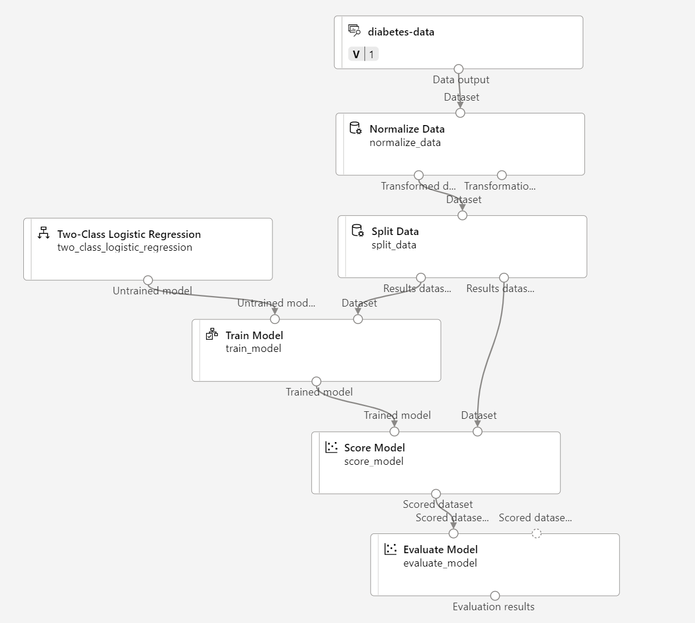

1. Select **Submit**, and run the pipeline using the existing experiment named **mslearn-diabetes-training**.

1. Wait for the experiment run to finish.

1. When the experiment run has finished, select **Job detail**. You'll be directed to a new tab.

1. On the new tab, right-click (Ctrl+click on a Mac) the **Evaluate Model** module on the canvas, and click on **Preview data**. Select **Evaluation results** to view the performance metrics. These metrics can help data scientists assess how well the model predicts based on the validation data.

1. Scroll down to view the *confusion matrix* for the model. Observe the predicted and actual value counts for each possible class. 

1. Review the metrics to the left of the confusion matrix, which include:
    - **Accuracy**: In other words, what proportion of diabetes predictions did the model get right?
    - **Precision**: In other words, out of all the patients that *the model predicted* as having diabetes, the percentage of time the model is correct. 
    - **Recall**:  In other words, out of all the patients *who actually have* diabetes, how many diabetic cases did the model identify correctly?
    - **F1 Score**

1. Use the **Threshold** slider located above the list of metrics. Try moving the threshold slider and observe the effect on the confusion matrix. If you move it all the way to the left (0), the Recall metric becomes 1, and if you move it all the way to the right (1), the Recall metric becomes 0.

1. Look above the Threshold slider at the **ROC curve** and **AUC** metric listed with the other metrics below. To get an idea of how this area represents the performance of the model, imagine a straight diagonal line from the bottom left to the top right of the ROC chart. This represents the expected performance if you just guessed or flipped a coin for each patient - you could expect to get around half of them right, and half of them wrong, so the area under the diagonal line represents an AUC of 0.5. If the AUC for your model is higher than this for a binary classification model, then the model performs better than a random guess.

1. Close the **Evaluate Model result visualization** tab.

The performance of this model isn't all that great, partly because we performed only minimal feature engineering and pre-processing. You could try a different classification algorithm, such as **Two-Class Decision Forest**, and compare the results. You can connect the outputs of the **Split Data** module to multiple **Train Model** and **Score Model** modules, and you can connect a second **Score Model** module to the **Evaluate Model** module to see a side-by-side comparison. The point of the exercise is simply to introduce you to classification and the Azure Machine Learning designer interface, not to train a perfect model!

## Create an inference pipeline

1. In Azure Machine Learning studio, expand the left-hand pane by selecting the menu icon at the top left of the screen. Click on **Jobs** (under **Assets**) to view all of the jobs you have run. Select the experiment **mslearn-diabetes-training**, then select the **Diabetes Training** pipeline.

1. Locate the menu above the canvas and click on **Create inference pipeline**. You may need to expand your screen to full and click on the three dots icon **...** on the top right hand corner of the screen in order to find **Create inference pipeline** in the menu.  

    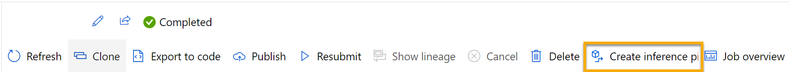

1. In the **Create inference pipeline** drop-down list, click **Real-time inference pipeline**. After a few seconds, a new version of your pipeline named **Diabetes Training-real time inference** will be opened.

1. Navigate to **Settings** on the upper right hand menu. Under **Draft details**, rename the new pipeline to **Predict Diabetes**, and then review the new pipeline. Some of the transformations and training steps are a part of this pipeline. The trained model will be used to score the new data. The pipeline also contains a web service output to return results. 

    You're going to make the following changes to the inference pipeline:

    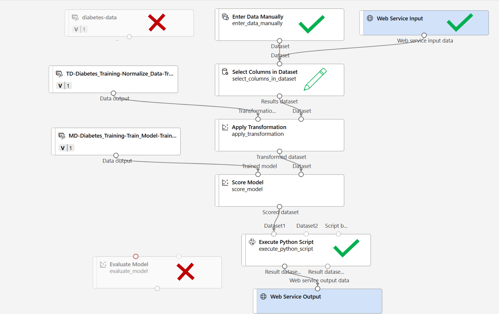
    
    - Add a **web service input** component for new data to be submitted.
    - Replace the **diabetes-data** dataset with an **Enter Data Manually** module that doesn't include the label column (**Diabetic**).
    - Edit the columns selected in the **Select Columns in Dataset** module.
    - Remove the **Evaluate Model** module.
    - Insert an **Execute Python Script** module before the web service output to return only the patient ID, predicted label value, and probability.

1. The pipeline does not automatically include a **Web Service Input** component for models created from custom data sets. Search for a **Web Service Input** component from the asset library and place it at the top of the pipeline. Connect the output of the **Web Service Input** component to the right-side input of the **Apply Transformation** component that is already on the canvas.

1. The inference pipeline assumes that new data will match the schema of the original training data, so the **diabetes-data** dataset from the training pipeline is included. However, this input data includes the **Diabetic** label that the model predicts, which is not included in new patient data for which a diabetes prediction hasn't yet been made. Delete this module and replace it with an **Enter Data Manually** module, containing the following CSV data, which includes feature values without labels for three new patient observations:

    ```CSV
    PatientID,Pregnancies,PlasmaGlucose,DiastolicBloodPressure,TricepsThickness,SerumInsulin,BMI,DiabetesPedigree,Age
    1882185,9,104,51,7,24,27.36983156,1.350472047,43
    1662484,6,73,61,35,24,18.74367404,1.074147566,75
    1228510,4,115,50,29,243,34.69215364,0.741159926,59
    ```

1. Connect the new **Enter Data Manually** module to the same **Dataset** input of the **Apply Transformation** module as the **Web Service Input**.

1. Edit the **Select Columns in Dataset** module. Remove **Diabetic** from the *Selected Columns*. 

1. The inference pipeline includes the **Evaluate Model** module, which isn't useful when predicting from new data, so delete this module.

1. The output from the **Score Model** module includes all of the input features and the predicted label and probability score. To limit the output to only the prediction and probability:
    - Delete the connection between the **Score Model** module and the **Web Service Output**.
    - Add an **Execute Python Script** module, replacing all of the default python script with the following code (which selects only the **PatientID**, **Scored Labels** and **Scored Probabilities** columns and renames them appropriately):

```Python
import pandas as pd

def azureml_main(dataframe1 = None, dataframe2 = None):

    scored_results = dataframe1[['Scored Labels', 'Scored Probabilities']]
    scored_results.rename(columns={'Scored Labels':'DiabetesPrediction',
                                'Scored Probabilities':'Probability'},
                        inplace=True)
    return scored_results
```

1. Connect the output from the **Score Model** module to the **Dataset1** (left-most) input of the **Execute Python Script**, and connect the output of the **Execute Python Script** module to the **Web Service Output**.

1. Verify that your pipeline looks similar to the following image:

    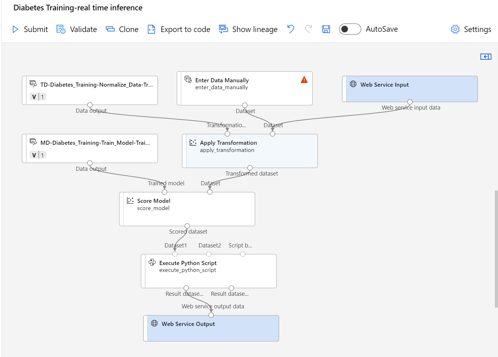

1. Run the pipeline as a new experiment named **mslearn-diabetes-inference** on your compute cluster. The experiment may take a while to run.

1. When the pipeline has completed, select **Job detail**. In the new tab, right click the **Execute Python Script** module. Select the **Preview data** and select **Result dataset** to see the predicted labels and probabilities for the three patient observations in the input data.

Your inference pipeline predicts whether or not patients are at risk for diabetes based on their features. Now you're ready to publish the pipeline so that client applications can use it.

After you've created and tested an inference pipeline for real-time inferencing, you can publish it as a service for client applications to use.

> **Note**
> In this exercise, you'll deploy the web service to an Azure Container Instance (ACI). This type of compute is created dynamically, and is useful for development and testing. For production, you should create an *inference cluster*, which provide an Azure Kubernetes Service (AKS) cluster that provides better scalability and security.

## Deploy a service

1. View the **Predict Diabetes** inference pipeline you created in the previous unit.

1. Select **Job detail** on the left hand pane. This will open up another window.

    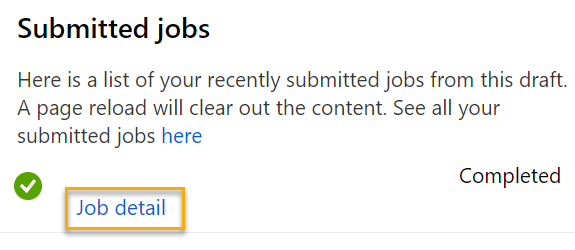

1. In the new window, select **Deploy**.

    

1. At the top right, select **Deploy**, and deploy a **new real-time endpoint**, using the following settings:
    -  **Name**: predict-diabetes
    -  **Description**: Classify diabetes
    - **Compute type**: Azure Container Instance

1. Wait for the web service to be deployed - this can take several minutes. The deployment status is shown at the top left of the designer interface.

## Test the service

1. On the **Endpoints** page, open the **predict-diabetes** real-time endpoint.

    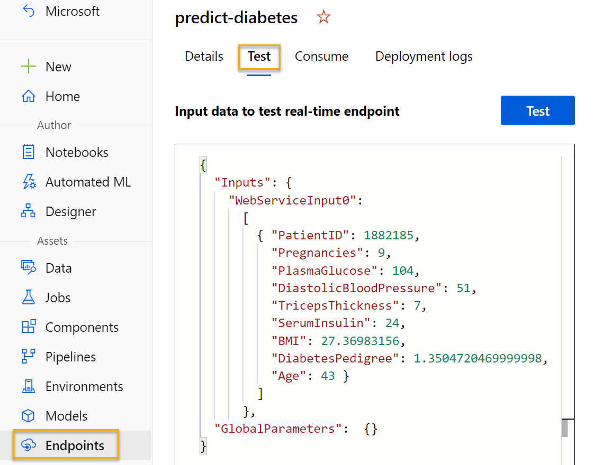

1. When the **predict-diabetes** endpoint opens, select the **Test** tab. We will use it to test our model with new data. Delete the current data under **Input data to test real-time endpoint**. Copy and paste the below data into the data section:  

    ```JSON
    {
      "Inputs": {
        "input1":
          [
            { "PatientID": 1882185,
              "Pregnancies": 9,
              "PlasmaGlucose": 104,
              "DiastolicBloodPressure": 51,
              "TricepsThickness": 7,
              "SerumInsulin": 24,
              "BMI": 27.36983156,
              "DiabetesPedigree": 1.3504720469999998,
              "Age": 43 }
            ]
          },
      "GlobalParameters":  {}
    }
    ```

    > **Note**
    > The JSON above defines features for a patient, and uses the **predict-diabetes** service you created to predict a diabetes diagnosis.

1. Select **Test**. On the right hand of the screen, you should see the output **'DiabetesPrediction'**. The output is 1 if the patient is predicted to have diabetes, and 0 if the patient is predicted not to have diabetes.  

    

    You have just tested a service that is ready to be connected to a client application using the credentials in the **Consume** tab. We will end the lab here. You are welcome to continue to experiment with the service you just deployed.

## Clean-up

The web service you created is hosted in an *Azure Container Instance*. If you don't intend to experiment with it further, you should delete the endpoint to avoid accruing unnecessary Azure usage.

1. In [Azure Machine Learning studio](https://ml.azure.com?azure-portal=true), on the **Endpoints** tab, select the **predict-diabetes** endpoint. Then select **Delete** and confirm that you want to delete the endpoint.

1. On the **Compute** page, on the **Compute clusters** tab, select your compute cluster and then select **Delete**.

>**Note**
> Stopping your compute ensures your subscription won't be charged for compute resources. You will however be charged a small amount for data storage as long as the Azure Machine Learning workspace exists in your subscription. If you have finished exploring Azure Machine Learning, you can delete the Azure Machine Learning workspace and associated resources. However, if you plan to complete any other labs in this series, you will need to recreate it.
>
> To delete your workspace:
>
> 1. In the [Azure portal](https://portal.azure.com?azure-portal=true), in the **Resource groups** page, open the resource group you specified when creating your Azure Machine Learning workspace.
> 1. Click **Delete resource group**, type the resource group name to confirm you want to delete it, and select **Delete**.
