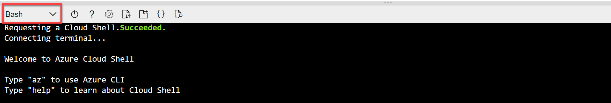
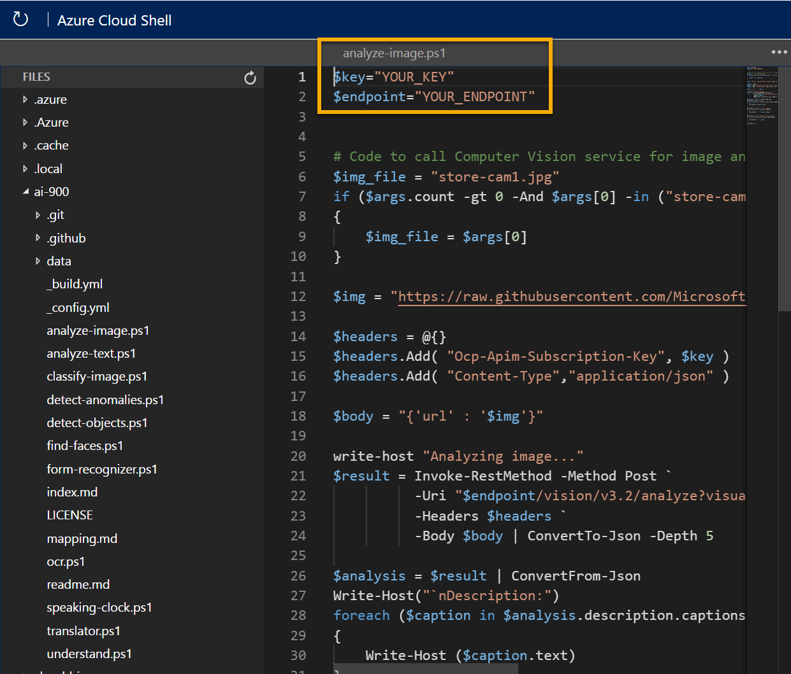

---
lab:
    title: 'Explore Computer Vision'
---

# Explore Computer Vision

> **Note**
> To complete this lab, you will need an [Azure subscription](https://azure.microsoft.com/free?azure-portal=true) in which you have administrative access.

The *Computer Vision* cognitive service uses pre-trained machine learning models to analyze images and extract information about them.

For example, suppose the fictitious retailer *Northwind Traders* has decided to implement a "smart store", in which AI services monitor the store to identify customers requiring assistance, and direct employees to help them. By using the Computer Vision service, images taken by cameras throughout the store can be analyzed to provide meaningful descriptions of what they depict.

In this lab, you'll use a simple command-line application to see the Computer Vision service in action. The same principles and functionality apply in real-world solutions, such as web sites or phone apps.

## Create a *Cognitive Services* resource

You can use the Computer Vision service by creating either a **Computer Vision** resource or a **Cognitive Services** resource.

If you haven't already done so, create a **Cognitive Services** resource in your Azure subscription.

1. In another browser tab, open the Azure portal at [https://portal.azure.com](https://portal.azure.com?azure-portal=true), signing in with your Microsoft account.

1. Click the **&#65291;Create a resource** button, search for *Cognitive Services*, and create a **Cognitive Services** resource with the following settings:
    - **Subscription**: *Your Azure subscription*.
    - **Resource group**: *Select or create a resource group with a unique name*.
    - **Region**: *Choose any available region*.
    - **Name**: *Enter a unique name*.
    - **Pricing tier**: Standard S0
    - **By checking this box I acknowledge that I have read and understood all the terms below**: Selected.

1. Review and create the resource, and wait for deployment to complete. Then go to the deployed resource.

1. View the **Keys and Endpoint** page for your Cognitive Services resource. You will need the endpoint and keys to connect from client applications.

## Run Cloud Shell

To test the capabilities of the Computer Vision service, we'll use a simple command-line application that runs in the Cloud Shell on Azure.

1. In the Azure portal, select the **[>_]** (*Cloud Shell*) button at the top of the page to the right of the search box. This opens a Cloud Shell pane at the bottom of the portal.

    

1. The first time you open the Cloud Shell, you may be prompted to choose the type of shell you want to use (*Bash* or *PowerShell*). Select **PowerShell**. If you do not see this option, skip the step.  

1. If you are prompted to create storage for your Cloud Shell, ensure your subscription is specified and select **Create storage**. Then wait a minute or so for the storage to be created.

    

1. Make sure the the type of shell indicated on the top left of the Cloud Shell pane is switched to *PowerShell*. If it is *Bash*, switch to *PowerShell* by using the drop-down menu.

    

1. Wait for PowerShell to start. You should see the following screen in the Azure portal:  

    

## Configure and run a client application

Now that you have a Cloud Shell environment, you can run a simple application that uses the Computer Vision service to analyze an image.

1. In the command shell, enter the following command to download the sample application and save it to a folder called ai-900.

    ```PowerShell
    git clone https://github.com/MicrosoftLearning/AI-900-AIFundamentals ai-900
    ```

    > **Tip**
    > If you already used this command in another lab to clone the *ai-900* repository, you can skip this step.

1. The files are downloaded to a folder named **ai-900**. Now we want to see all of the files in your Cloud Shell storage and work with them. Type the following command into the shell:

    ```PowerShell
    code .
    ```

    Notice how this opens up an editor like the one in the image below:

    

1. In the **Files** pane on the left, expand **ai-900** and select **analyze-image.ps1**. This file contains some code that uses the Computer Vision service to analyze an image, as shown here:

    

1. Don't worry too much about the code, the important thing is that it needs the endpoint URL and either of the keys for your Cognitive Services resource. Copy these from the **Keys and Endpoints** page for your resource from the Azure portal and paste them into the code editor, replacing the **YOUR_KEY** and **YOUR_ENDPOINT** placeholder values respectively.

    > **Tip**
    > You may need to use the separator bar to adjust the screen area as you work with the **Keys and Endpoint** and **Editor** panes.

    After pasting the key and endpoint values, the first two lines of code should look similar to this:

    ```PowerShell
    $key="1a2b3c4d5e6f7g8h9i0j...."    
    $endpoint="https..."
    ```

1. At the top right of the editor pane, use the **...** button to open the menu and select **Save** to save your changes.

    The sample client application will use your Computer Vision service to analyze the following image, taken by a camera in the Northwind Traders store:

    

1. In the PowerShell pane, enter the following commands to run the code:

    ```PowerShell
    cd ai-900
    ./analyze-image.ps1 store-camera-1.jpg
    ```

1. Review the results of the image analysis, which include:
    - A suggested caption that describes the image.
    - A list of objects identified in the image.
    - A list of "tags" that are relevant to the image.

1. Now let's try another image:

    

    To analyze the second image, enter the following command:

    ```PowerShell
    ./analyze-image.ps1 store-camera-2.jpg
    ```

1. Review the results of the image analysis for the second image.

1. Let's try one more:

    

    To analyze the third image, enter the following command:

    ```PowerShell
    ./analyze-image.ps1 store-camera-3.jpg
    ```

1. Review the results of the image analysis for the third image.

## Learn more

This simple app shows only some of the capabilities of the Computer Vision service. To learn more about what you can do with this service, see the [Computer Vision page](https://azure.microsoft.com/services/cognitive-services/computer-vision/).
