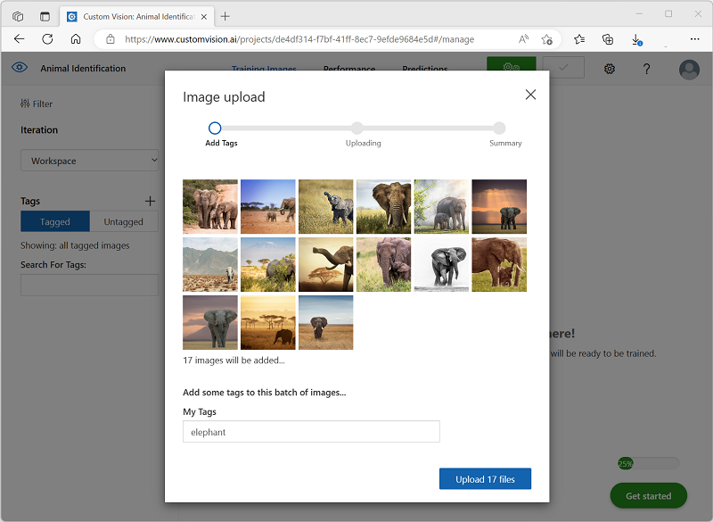
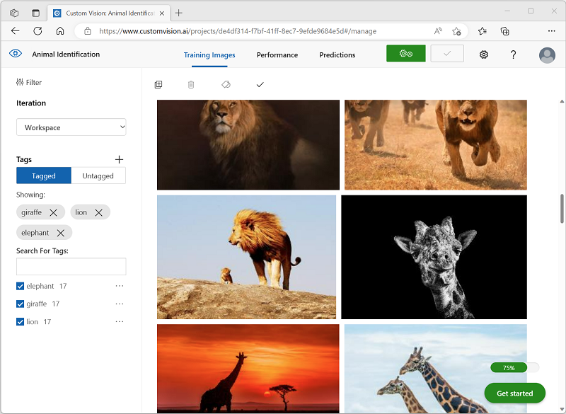
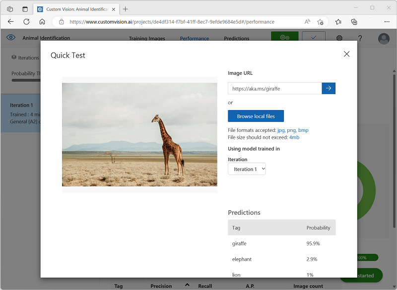
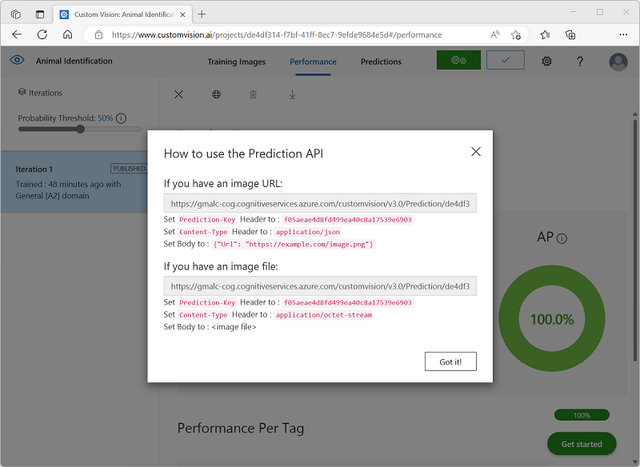
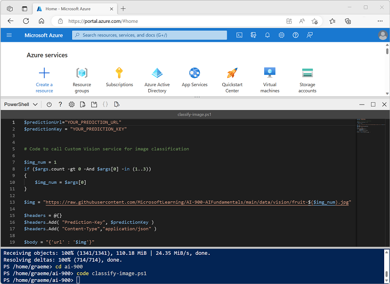
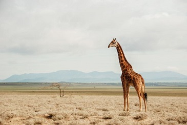

---
lab:
    title: 'Explore image classification'
---

# Explore image classification​

The *Computer Vision* cognitive service provides useful pre-built models for working with images, but you'll often need to train your own model for computer vision. For example, suppose a wildlife conservation organization organization wants to track sightings of animals by using motion-sensitive cameras. The images captured by the cameras could then be used to verify the presence of particular species in a particular area and assist with conservation efforts for endangered species. To accomplish this, the organization would benefit from an *image classification* model that is trained to identify different species of animal in the captured photographs.

In Azure, you can use the ***Custom Vision*** cognitive service to train an image classification model based on existing images. There are two elements to creating an image classification solution. First, you must train a model to recognize different classes using existing images. Then, when the model is trained you must publish it as a service that can be consumed by applications.

To test the capabilities of the Custom Vision service, we'll use a simple command-line application that runs in the Cloud Shell. The same principles and functionality apply in real-world solutions, such as web sites or mobile apps.

## Before you start

To complete this lab, you will need an [Azure subscription](https://azure.microsoft.com/free?azure-portal=true) in which you have administrative access.

## Create a *Cognitive Services* resource

You can use the Custom Vision service by creating either a **Custom Vision** resource or a **Cognitive Services** resource.

>**Note**
>Not every resource is available in every region. Whether you create a Custom Vision or Cognitive Services resource, only resources created in [certain regions](https://azure.microsoft.com/global-infrastructure/services/?products=cognitive-services) can be used to access Custom Vision services. For simplicity, a region is pre-selected for you in the configuration instructions below.

Create a **Cognitive Services** resource in your Azure subscription.

1. Open the Azure portal at [https://portal.azure.com](https://portal.azure.com?azure-portal=true), signing in with your Microsoft account.

1. Click the **&#65291;Create a resource** button, search for *Cognitive Services*, and create a **Cognitive Services** resource with the following settings:
    - **Subscription**: *Your Azure subscription*.
    - **Resource group**: *Select or create a resource group with a unique name*.
    - **Region**: East US
    - **Name**: *Enter a unique name*.
    - **Pricing tier**: Standard S0
    - **By checking this box I acknowledge that I have read and understood all the terms below**: Selected.

1. Review and create the resource, and wait for deployment to complete. Then go to the deployed resource.

1. View the **Keys and Endpoint** page for your Cognitive Services resource. You will need the endpoint and keys to connect from client applications.

## Create a Custom Vision project

To train an object detection model, you need to create a Custom Vision project based on your training resource. To do this, you'll use the Custom Vision portal.

1. Download and extract the training images from [https://aka.ms/animal-images](https://aka.ms/animal-images). These images are provided in a zipped folder, which when extracted contains subfolders called **elephant**, **giraffe**, and **lion**.

1. Open a new browser tab, and browse to the Custom Vision portal at [https://customvision.ai](https://customvision.ai?azure-portal=true). If prompted, sign in using the Microsoft account associated with your Azure subscription and agree to the terms of service.

1. In the Custom Vision portal, create a new project with the following settings:

    - **Name**: Animal Identification
    - **Description**: Image classification for animals
    - **Resource**: *The Cognitive Services or Custom Vision resource you created previously*
    - **Project Types**: Classification
    - **Classification Types**: Multiclass (Single tag per image)
    - **Domains**: General \[A2]

1. Click **Add images**, and select all of the files in the **elephant** folder you extracted previously. Then upload the image files, specifying the tag *elephant*, like this:

    

1. Use the **Add images** ([+]) button to upload the images in the **giraffe** folder with the tag *giraffe*, and the images in the **lion** folder with the tag *lion*.

1. Explore the images you have uploaded in the Custom Vision project - there should be 17 images of each class, like this:

    

1. In the Custom Vision project, above the images, click **Train** to train a classification model using the tagged images. Select the **Quick Training** option, and then wait for the training iteration to complete.

    > **Tip**: Training may take a few minutes. While you're waiting, check out [How snow leopard selfies and AI can help save the species from extinction](https://news.microsoft.com/transform/snow-leopard-selfies-ai-save-species/), which describes a real project that uses computer vision to track endangered animals in the wild.

1. When the model iteration has been trained, review the *Precision*, *Recall*, and *AP* performance metrics - these measure the prediction accuracy of the classification model, and should all be high.

## Test the model

Before publishing this iteration of the model for applications to use, you should test it.

1. Above the performance metrics, click **Quick Test**.

1. In the **Image URL** box, type `https://aka.ms/giraffe` and click the **quick test image (&#10132;)** button.

1. View the predictions returned by your model - the probability score for *giraffe* should be the highest, like this:

    

1. Close the **Quick Test** window.

## Publish the image classification model

Now you're ready to publish your trained model and use it from a client application.

1. Click **&#128504; Publish** to publish the trained model with the following settings:
    - **Model name**: animals
    - **Prediction Resource**: *The Cognitive Services or Custom Vision prediction resource you created previously*.

1. After publishing, click the *Prediction URL* (&#127760;) icon to see information required to use the published model.

    

Later, you will need the appropriate URL and Prediction-Key values to get a prediction from an Image URL, so keep this dialog box open and carry on to the next task.

## Prepare a client application

To test the capabilities of the Custom Vision service, we'll use a simple command-line application that runs in the cloud shell on Azure.

1. Switch back to the browser tab containing the Azure portal, and select the **Cloud shell** (**[>_]**)  button at the top of the page to the right of the search box. This opens a cloud shell pane at the bottom of the portal.

    The first time you open the Cloud Shell, you may be prompted to choose the type of shell you want to use (*Bash* or *PowerShell*). If so, select **PowerShell**.

    If you are prompted to create storage for your Cloud Shell, ensure your subscription is selected and select **Create storage**. Then wait a minute or so for the storage to be created.

    When the cloud shell is ready, it should look similar to this:
    
    

    > **Tip**: Ensure that the type of shell indicated on the top left of the Cloud Shell pane is *PowerShell*. If it is *Bash*, switch to *PowerShell* by using the drop-down menu.

    Note that you can resize the cloud shell by dragging the separator bar at the top of the pane, or by using the **&#8212;**, **&#9723;**, and **X** icons at the top right of the pane to minimize, maximize, and close the pane. For more information about using the Azure Cloud Shell, see the [Azure Cloud Shell documentation](https://docs.microsoft.com/azure/cloud-shell/overview).

2. In the command shell, enter the following commands to download the files for this exercise and save them in a folder named **ai-900** (after removing that folder if it already exists)

    ```PowerShell
    rm -r ai-900 -f
    git clone https://github.com/MicrosoftLearning/AI-900-AIFundamentals ai-900
    ```

3. After the files have been downloaded, enter the following commands to change to the **ai-900** directory and edit the code file for this exercise:

    ```PowerShell
    cd ai-900
    code classify-image.ps1
    ```

    Notice how this opens an editor like the one in the image below:

     

     > **Tip**: You can use the separator bar between the cloud shell command line and the code editor to resize the panes.

4. Don't worry too much about the details of the code. The important thing is that it starts with some code to specify the prediction URL and key for your Custom Vision model. You'll need to update these so that the rest of the code uses your model.

    Get the *prediction URL* and *prediction key* from the dialog box you left open in the browser tab for your Custom Vision project. **You need the versions to be used *if you have an image URL*.**

    Use these values to replace the **YOUR_PREDICTION_URL** and **YOUR_PREDICTION_KEY** place holders in the code file.

    After pasting the Prediction URL and Prediction Key values, the first two lines of code should look similar to this:

    ```PowerShell
    $predictionUrl="https..."
    $predictionKey ="1a2b3c4d5e6f7g8h9i0j...."
    ```

5. After making the changes to the variables in the code, press **CTRL+S** to save the file. Then press **CTRL+Q** to close the code editor.

## Test the client application

Now you can use the sample client application to classify images based on the animal they contain.

1. In the PowerShell pane, enter the following command to run the code:

    ```PowerShell
    ./classify-image.ps1 1
    ```

    This code uses your model to classify the following image:

    

1. Review the prediction, which should be **giraffe**.

1. Now let's try another image. Run this command:

    ```PowerShell
    ./classify-image.ps1 2
    ```

    This time the following image is classified:

    

1. Verify that the model classifies this image as **elephant**.

1. Let's try one more. Run this command:

    ```PowerShell
    ./classify-image.ps1 3
    ```

    The final image looks like this:

    

1. Verify that the model classifies this image as **lion**.

Hopefully, your image classification model correctly classified all three images.

## Learn more

This exercise shows only some of the capabilities of the Custom Vision service. To learn more about what you can do with this service, see the [Custom Vision page](https://azure.microsoft.com/services/cognitive-services/custom-vision-service/).
