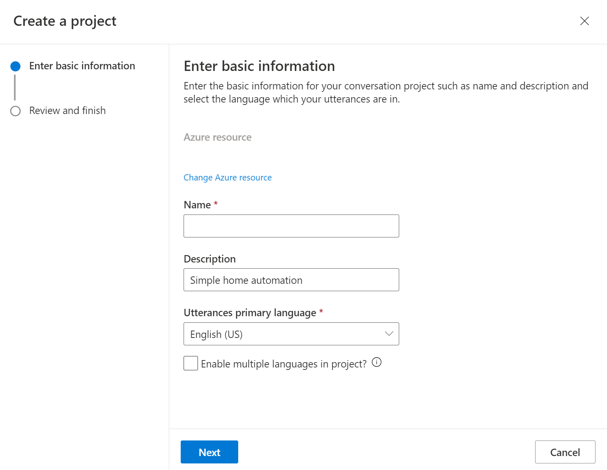
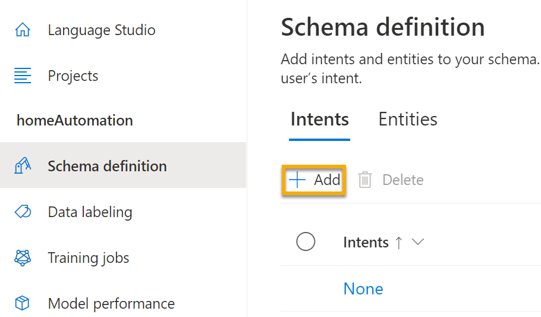
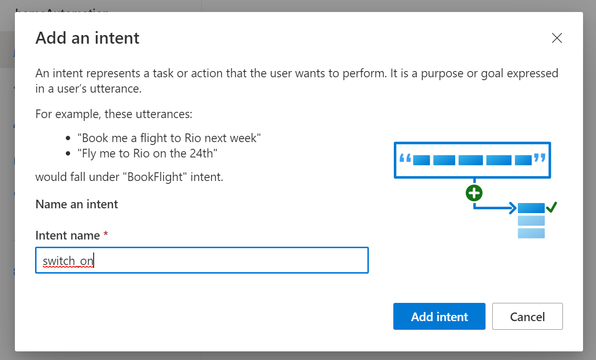
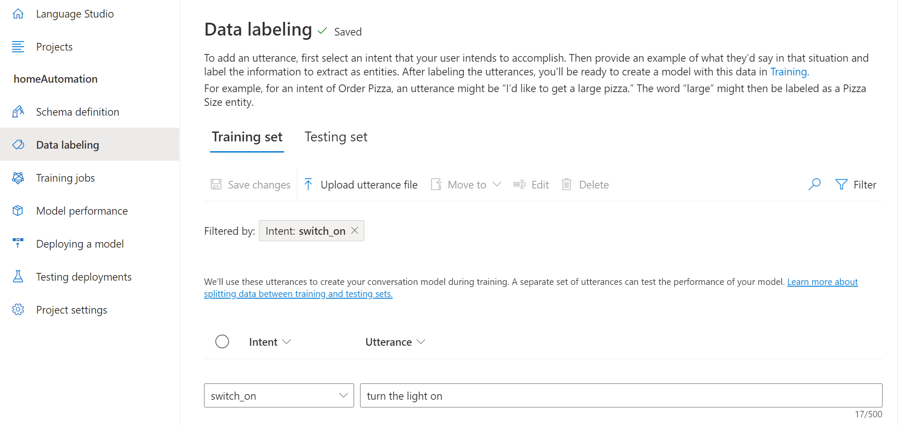
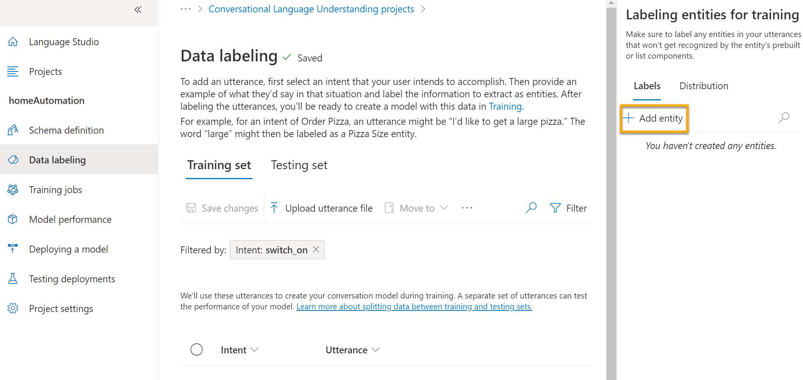
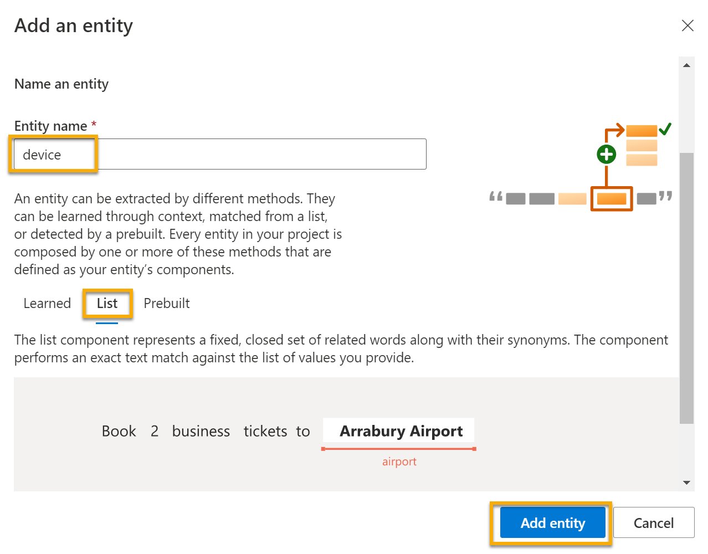
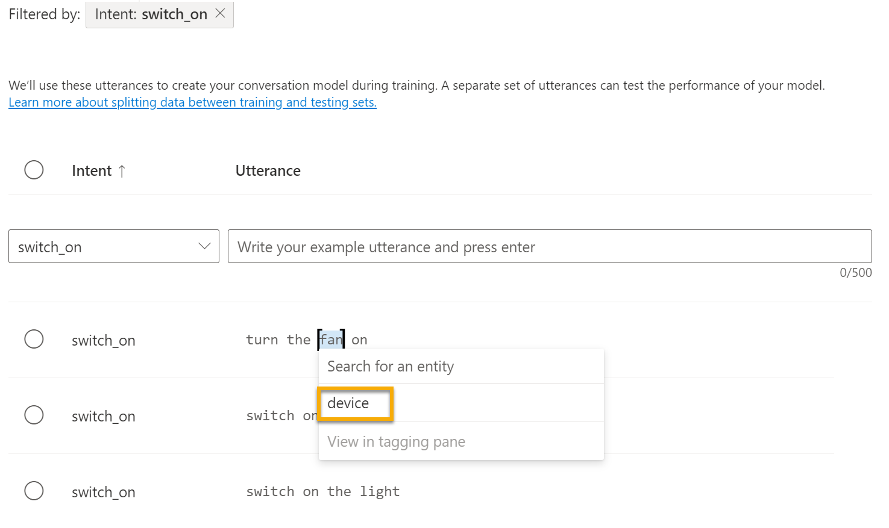
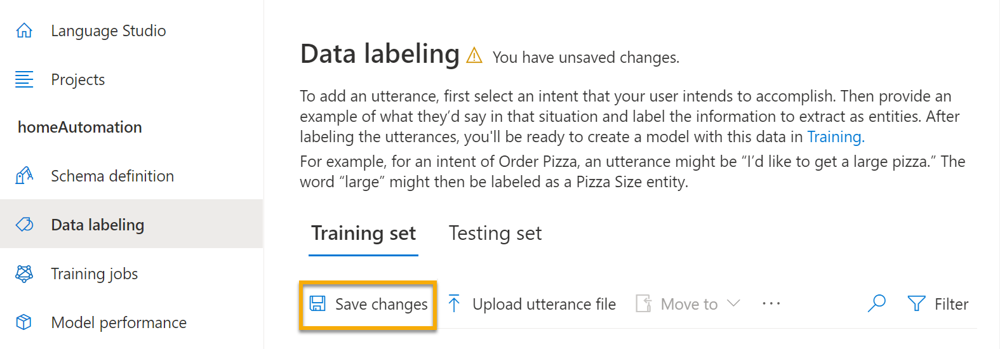
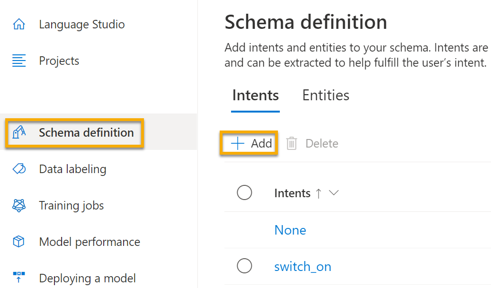
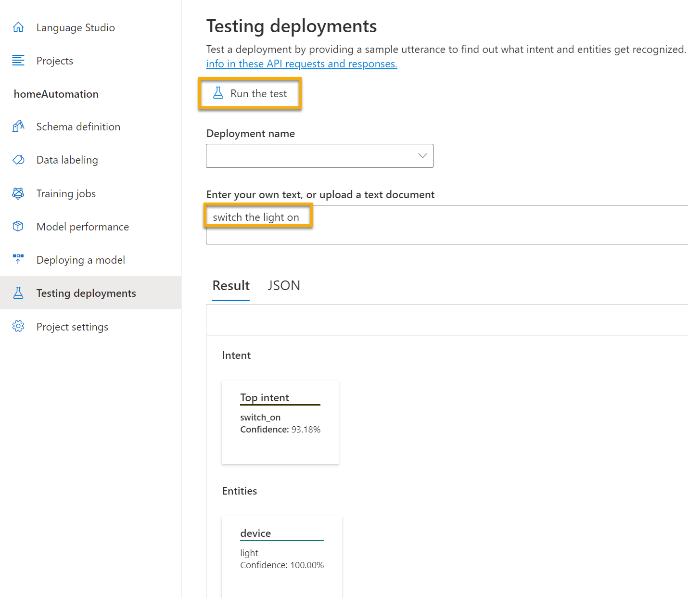

---
lab:
    title: 'Use Conversational Language Understanding with Language Studio'
---

# Use Conversational Language Understanding with Language Studio

Increasingly, we expect computers to be able to use AI to understand natural language commands, either spoken or typed. For example, you might want a home automation system to control devices in your home by using voice commands such as “switch on the light” or “put the fan on.” AI-powered devices can understand these commands and take appropriate action.
In this exercise, you will use Language Studio to create and test a project that sends instructions to devices such as lights or fans. You’ll use the capabilities of the Conversational Language Understanding service to configure your project. 

> **Note**
> To complete this lab, you will need an [Azure subscription](https://azure.microsoft.com/free?azure-portal=true) in which you have administrative access.

## Create a *Language service* resource

You can use the Conversational Language Understanding service by creating a **Language service** resource.

If you haven't already done so, create a **Language service** resource in your Azure subscription.

1. In another browser tab, open the Azure portal at [https://portal.azure.com](https://portal.azure.com?azure-portal=true), signing in with your Microsoft account.

1. Click the **&#65291;Create a resource** button, search for *Language service*, and create a **Language service** resource with the following settings:
    - Select additional features: *Keep the default features and click Continue to create your resource*  
    - **Subscription**: *Your Azure subscription*.
    - **Resource group**: *Select or create a resource group with a unique name*.
    - **Region**: East US 2
    - **Name**: *Enter a unique name*.
    - **Pricing tier**: *S (1K Calls per minute)*
    - **By checking this box I certify that I have reviewed and acknowledge the terms in the Responsible AI Notice.**: *Selected.*

1. **Review and create** the resource, and wait for deployment to complete.

### Create a Conversational Language Understanding App

To implement natural language understanding with Conversational Language Understanding, you create an app; and then add entities, intents, and utterances to define the commands you want the app to execute.

1. In a new browser tab, open the Language Studio portal at [https://language.azure.com](https://language.azure.com?azure-portal=true) and sign in using the Microsoft account associated with your Azure subscription.

1. If prompted to choose a Language resource, select the following settings:
    - **Azure directory**: The Azure directory containing your subscription.
    - **Azure subscription**: Your Azure subscription.
    - **Language resource**: The Language resource you created previously.

    >**Tip**
    >If you are ***not*** prompted to choose a language resource, it may be because you have multiple Language resources in your subscription; in which case:
    >1. On the bar at the top if the page, click the **Settings (&#9881;)** button.
    >1. On the **Settings** page, view the **Resources** tab.
    >1. Select your language resource, and click **Switch resource**.
    >1. At the top of the page, click **Language Studio** to return to the Language Studio home page.

1. At the top of the portal, in the **Create new** menu, select **Conversational language understanding**.

1. In the **Create a project** dialog box, on the **Enter basic information** page, enter the following details and click **Next**:
    - **Name**: *Create a unique name*
    - **Description**: *Simple home automation*
    - **Utterances primary language**: *English*
    - **Enable multiple languages in project**: *Do not select*

    

    >**Tip**
    >Write down your *project name*, you will use it later.

1. On the *Review and finish* page, click **Create**.

### Create intents, utterances, and entities

An *intent* is an action you want to perform - for example, you might want to switch on a light, or turn off a fan. In this case, you'll define two intents: one to switch on a device, and another to switch off a device. For each intent, you'll specify sample *utterances* that indicate the kind of language used to indicate the intent.

1. In the **Schema definition** pane, ensure that **Intents** is selected Then click **Add**, and add an intent with the name **switch_on** (in lower-case) and click **Add intent**.

    
    

1. Select the **switch_on** intent. It will take you to the **Data labeling** page. In the **Intent** drop down, select **switch_on**. Next to the **switch_on** intent, type the utterance ***turn the light on*** and press **Enter** to submit this utterance to the list.

    

1. The language service needs at least five different utterance examples for each intent to sufficiently train the language model. Add five more utterance examples for the **switch_on** intent:  
    - ***switch on the fan***
    - ***put the fan on***
    - ***put the light on***
    - ***switch on the light***
    - ***turn the fan on***

1. On the **Labeling entities for training** pane on the right-hand side of the screen, select **Labels**, then select **Add entity**. Type **device** (in lower-case), select **List** and select **Add entity**.

     
    

1. In the ***turn the fan on*** utterance, highlight the word "fan". Then in the list that appears, in the *Search for an entity* box select **device**.

    

1. Do the same for all the utterances. Label the rest of the *fan* or *light* utterances with the **device** entity. When you're finished, verify that you have the following utterances and make sure to select **Save changes**:

    | **intent** | **utterance** | **entity** |
    | --------------- | ------------------ | ------------------ |
    | switch_on   | Put on the fan      | Device - *select fan* |
    | switch_on   | Put on the light    | Device - *select light* |
    | switch_on   | Switch on the light | Device - *select light* |
    | switch_on   | Turn the fan on     | Device - *select fan* |
    | switch_on   | Switch on the fan   | Device - *select fan* |
    | switch_on   | Turn the light on   | Device - *select light* |

     

1. In the pane on the left, click **Schema definition** and verify that your **switch_on** intent is listed. Then click **Add** and add a new intent with the name **switch_off** (in lower-case).

     

1. Click on the **switch_off** intent. It will take you to the **Data labeling** page. In the **Intent** drop down, select **switch_off**. Next to the **switch_off** intent, add the utterance ***turn the light off***.

1. Add five more utterance examples to the **switch_off** intent.
    - ***switch off the fan***
    - ***put the fan off***
    - ***put the light off***
    - ***turn off the light***
    - ***switch the fan off***

1. Label the words *light* or *fan* with the **device** entity. When you're finished, verify that you have the following utterances and make sure to select **Save changes**:  

    | **intent** | **utterance** | **entity** | 
    | --------------- | ------------------ | ------------------ |
    | switch_off   | Put the fan off    | Device - *select fan* | 
    | switch_off   | Put the light off  | Device - *select light* |
    | switch_off   | Turn off the light | Device - *select light* |
    | switch_off   | Switch the fan off | Device - *select fan* |
    | switch_off   | Switch off the fan | Device - *select fan* |
    | switch_off   | Turn the light off | Device - *select light* |

### Train the model

Now you're ready to use the intents and entities you have defined to train the conversational language model for your app.

1. On the left hand side of Language Studio, select **Training jobs**, then select **Start a training job**. Use the following settings: 
    - **Train a new model**: *Selected and choose a model name*
    - **Training mode**: Standard training (free)
    - **Data Splitting**: *select Automatically split the testing set from the training data, keep default percentages*
    - Click **Train** at the bottom of the page.

1. Wait for training to complete. 

### Deploy and test the model

To use your trained model in a client application, you must deploy it as an endpoint to which the client applications can send new utterances; from which intents and entities will be predicted.

1. On the left-hand side of Language Studio, click **Deploying a model**.

1. Select your model name and click **Add deployment**. Use these settings:
    - **Create or select an existing deployment name**: *Select create a new deployment name. Add a unique name*.
    - **Assign trained model to your deployment name**: *Select the name of the trained model*.
    - Click **Deploy**

    >**Tip**
    >Write down your *deployment name*, you will use it later. 

1. When the model is deployed, click **Testing deployments** on the left-hand side of the page, and then select your deployed model under **Deployment name**.

1. Enter the following text, and then select **Run the test**:

    *switch the light on*

     

    Review the result that is returned, noting that it includes the predicted intent (which should be **switch_on**) and the predicted entity (**device**) with confidence scores that indicates the probability the model calculated for the predicted intent and entity. The JSON tab shows the comparative confidence for each potential intent (the one with the highest confidence score is the predicted intent)

1. Clear the text box and test the model with the following utterances under *Enter your own text, or upload a text document*:
    - *turn off the fan*
    - *put the light on*
    - *put the fan off*

You have now successfully configured a conversational language project, and defined entities, intents, and utterances. You have seen how to train and deploy a model in the Language Studio. And you have tried it out with both utterances you defined, and some that you did not explicitly define but the model was able to determine. 
>**NOTE**
>Conversational language understanding provides the intelligence to interpret the intention of the input; it doesn't perform any actions such as turning on the light or the fan.

## Clean up
If you don’t intend to do more exercises, delete any resources that you no longer need. This avoids accruing any unnecessary costs.
1.	Open the [Azure portal]( https://portal.azure.com) and select the resource group that contains the resource you created. 
1.	Select the resource and select **Delete** and then **Yes** to confirm. The resource is then deleted.

## Learn more

This app shows only some of the capabilities of the Conversational Language Understanding feature of the Language service. To learn more about what you can do with this service, see the [Conversational Language Understanding page](https://docs.microsoft.com/azure/cognitive-services/language-service/conversational-language-understanding/overview). 
