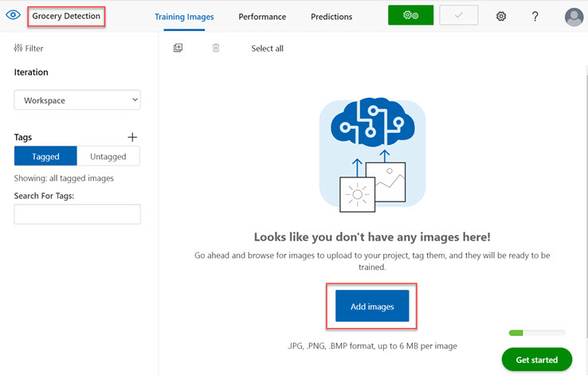
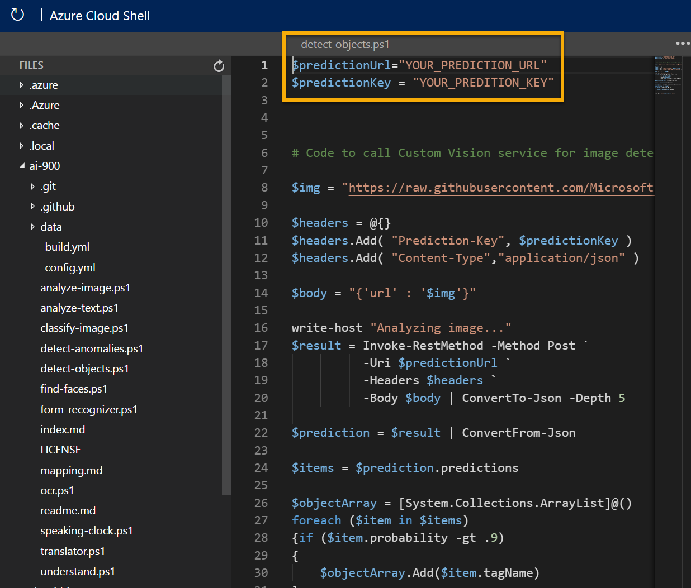
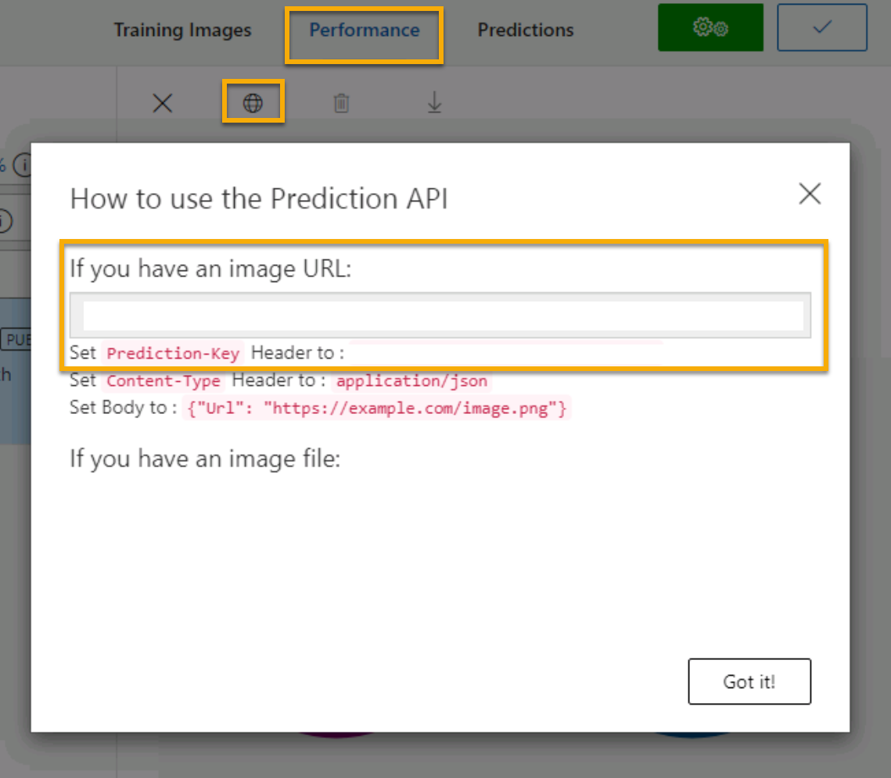

---
lab:
    title: 'Explore object detection​'
---

# Explore object detection

> **Note**
> To complete this lab, you will need an [Azure subscription](https://azure.microsoft.com/free?azure-portal=true) in which you have administrative access.

*Object detection* is a form of computer vision in which a machine learning model is trained to classify individual instances of objects in an image, and indicate a *bounding box* that marks its location. You can think of this as a progression from *image classification* (in which the model answers the question "what is this an image of?") to building solutions where we can ask the model "what objects are in this image, and where are they?".

For example, a grocery store might use an object detection model to implement an automated checkout system that scans a conveyor belt using a camera, and can identify specific items without the need to place each item on the belt and scan them individually.

The **Custom Vision** cognitive service in Microsoft Azure provides a cloud-based solution for creating and publishing custom object detection models. In Azure, you can use the Custom Vision service to train an image classification model based on existing images. There are two elements to creating an image classification solution. First, you must train a model to recognize different classes using existing images. Then, when the model is trained you must publish it as a service that can be consumed by applications.

To test the capabilities of the Custom Vision service to detect objects in images, we'll use a simple command-line application that runs in the Cloud Shell. The same principles and functionality apply in real-world solutions, such as web sites or phone apps.

## Create a *Cognitive Services* resource

You can use the Custom Vision service by creating either a **Custom Vision** resource or a **Cognitive Services** resource.

> **Note**
> Not every resource is available in every region. Whether you create a Custom Vision or Cognitive Services resource, only resources created in [certain regions](https://azure.microsoft.com/global-infrastructure/services/?products=cognitive-services) can be used to access Custom Vision services. For simplicity, a region is pre-selected for you in the configuration instructions below.

Create a **Cognitive Services** resource in your Azure subscription.

1. In another browser tab, open the Azure portal at [https://portal.azure.com](https://portal.azure.com?azure-portal=true), signing in with your Microsoft account.

1. Click the **&#65291;Create a resource** button, search for *Cognitive Services*, and create a **Cognitive Services** resource with the following settings:
    - **Subscription**: *Your Azure subscription*.
    - **Resource group**: *Select or create a resource group with a unique name*.
    - **Region**: East US
    - **Name**: *Enter a unique name*.
    - **Pricing tier**: Standard S0
    - **By checking this box I acknowledge that I have read and understood all the terms below**: Selected.

1. Review and create the resource, and wait for deployment to complete. Then go to the deployed resource.

1. View the **Keys and Endpoint** page for your Cognitive Services resource. You will need the endpoint and keys to connect from client applications.

## Create a Custom Vision project

To train an object detection model, you need to create a Custom Vision project based on your training resource. To do this, you'll use the Custom Vision portal.

1. In a new browser tab, open the Custom Vision portal at [https://customvision.ai](https://customvision.ai?azure-portal=true), and sign in using the Microsoft account associated with your Azure subscription.

1. Create a new project with the following settings:
    - **Name**: Grocery Detection
    - **Description**: Object detection for groceries.
    - **Resource**: *The resource you created previously*
    - **Project Types**: Object Detection
    - **Domains**: General

1. Wait for the project to be created and opened in the browser.

## Add and tag images

To train an object detection model, you need to upload images that contain the classes you want the model to identify, and tag them to indicate bounding boxes for each object instance.

1. Download and extract the training images from https://aka.ms/fruit-objects. The extracted folder contains a collection of images of fruit.

1. In the Custom Vision portal [https://customvision.ai](https://customvision.ai?azure-portal=true), make sure you are working in your object detection project _Grocery Detection_. Then select **Add images** and upload all of the images in the extracted folder.

    

1. After the images have been uploaded, select the first one to open it.

1. Hold the mouse over any object in the image until an automatically detected region is displayed like the image below. Then select the object, and if necessary resize the region to surround it.

    

    Alternatively, you can simply drag around the object to create a region.

1. When the region surrounds the object, add a new tag with the appropriate object type (*apple*, *banana*, or *orange*) as shown here:

    

1. Select and tag each other object in the image, resizing the regions and adding new tags as required.

    

1. Use the **>** link on the right to go to the next image, and tag its objects. Then just keep working through the entire image collection, tagging each apple, banana, and orange.

1. When you have finished tagging the last image, close the **Image Detail** editor and on the **Training Images** page, under **Tags**, select **Tagged** to see all of your tagged images:

    

## Train and test a model

Now that you've tagged the images in your project, you're ready to train a model.

1. In the Custom Vision project, click **Train** to train an object detection model using the tagged images. Select the **Quick Training** option.

1. Wait for training to complete (it might take ten minutes or so), and then review the *Precision*, *Recall*, and *mAP* performance metrics - these measure the prediction goodness of the object detection model, and should all be high.

1. At the top right of the page, click **Quick Test**, and then in the **Image URL** box, enter `https://aka.ms/apple-orange` and view the prediction that is generated. Then close the **Quick Test** window.

## Publish the object detection model

Now you're ready to publish your trained model and use it from a client application.

1. Click **&#128504; Publish** to publish the trained model with the following settings:
    - **Model name**: detect-produce
    - **Prediction resource**: *The resource you created previously*.

1. After publishing, click the *Prediction URL* (&#127760;) icon to see information required to use the published model. Later, you will need the appropriate URL and Prediction-Key values to get a prediction from an Image URL, so keep this dialog box open and carry on to the next task.

## Run Cloud Shell

To test the capabilities of the Custom Vision service, we'll use a simple command-line application that runs in the Cloud Shell on Azure.

1. In the Azure portal, select the **[>_]** (*Cloud Shell*) button at the top of the page to the right of the search box. This opens a Cloud Shell pane at the bottom of the portal. 

    

1. The first time you open the Cloud Shell, you may be prompted to choose the type of shell you want to use (*Bash* or *PowerShell*). Select **PowerShell**. If you do not see this option, skip the step.  

1. If you are prompted to create storage for your Cloud Shell, ensure your subscription is specified and select **Create storage**. Then wait a minute or so for the storage to be created.

    

1. Make sure the type of shell indicated on the top left of the Cloud Shell pane is switched to *PowerShell*. If it is *Bash*, switch to *PowerShell* by using the drop-down menu.

     

1. Wait for PowerShell to start. You should see the following screen in the Azure portal:  

     

## Configure and run a client application

Now that you have a custom model, you can run a simple client application that uses the Custom Vision service to detect objects in an image.

1. In the command shell, enter the following command to download the sample application and save it to a folder called ai-900.

    ```PowerShell
    git clone https://github.com/MicrosoftLearning/AI-900-AIFundamentals ai-900
    ```

    >**Note**
    >If you already used this command in another lab to clone the *ai-900* repository, you can skip this step.

1. The files are downloaded to a folder named **ai-900**. Now we want to see all of the files in your Cloud Shell storage and work with them. Type the following command into the shell:

    ```PowerShell
    code .
    ```

    Notice how this opens up an editor like the one in the image below: 

    

1. In the **Files** pane on the left, expand **ai-900** and select **detect-objects.ps1**. This file contains some code that uses the Custom Vision service to detect objects an image, as shown here:

    

1. Don't worry too much about the details of the code, the important thing is that it needs the prediction URL and key for your Custom Vision model when using an image URL. 

    Get the *prediction URL* from the dialog box in your Custom Vision project. 

    >**Note**
    >Remember, you reviewed the *prediction URL* after you published the image classification model. To find the *prediction URL*, navigate to the **Performance** tab in your project, then click on **Prediction URL** (if the screen is compressed, you may just see a globe icon). A dialogue box will appear. Copy the url for **If you have an image URL**. Paste it into the code editor, replacing **YOUR_PREDICTION_URL**. 

    Using the same dialog box, get the *prediction key*. Copy the prediction key displayed after *Set Prediction-Key Header to*. Paste it in the code editor, replacing the **YOUR_PREDICTION_KEY** placeholder value. 

    

    After pasting the Prediction URL and Prediction Key values, the first two lines of code should look similar to this:

    ```PowerShell
    $predictionUrl="https..."
    $predictionKey ="1a2b3c4d5e6f7g8h9i0j...."
    ```

1. At the top right of the editor pane, use the **...** button to open the menu and select **Save** to save your changes. Then open the menu again and select **Close Editor**.

    You will use the sample client application to detect objects in this image:

    

1. In the PowerShell pane, enter the following command to run the code:

    ```PowerShell
    cd ai-900
    ./detect-objects.ps1 
    ```

1. Review the prediction, which should be *apple orange banana*.

## Learn more

This simple app shows only some of the capabilities of the Custom Vision service. To learn more about what you can do with this service, see the [Custom Vision page](https://azure.microsoft.com/services/cognitive-services/custom-vision-service/).
