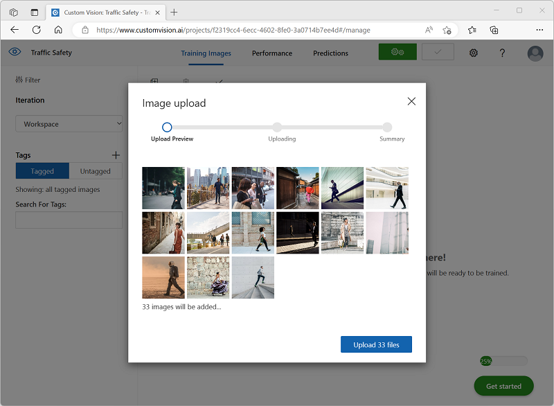
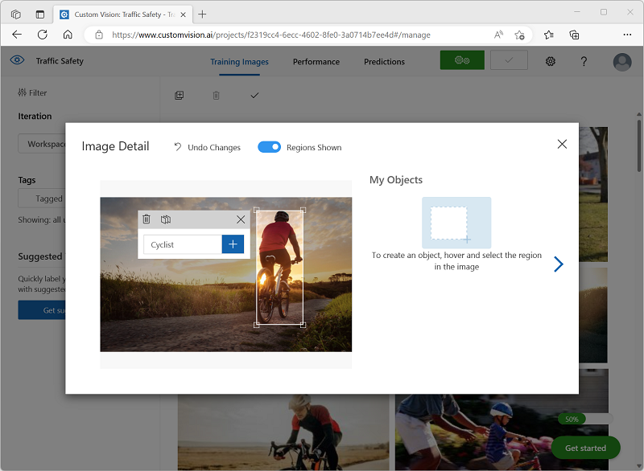
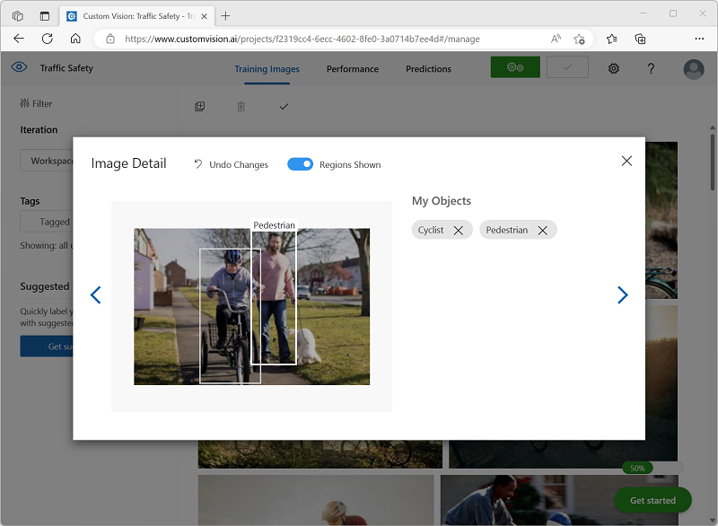
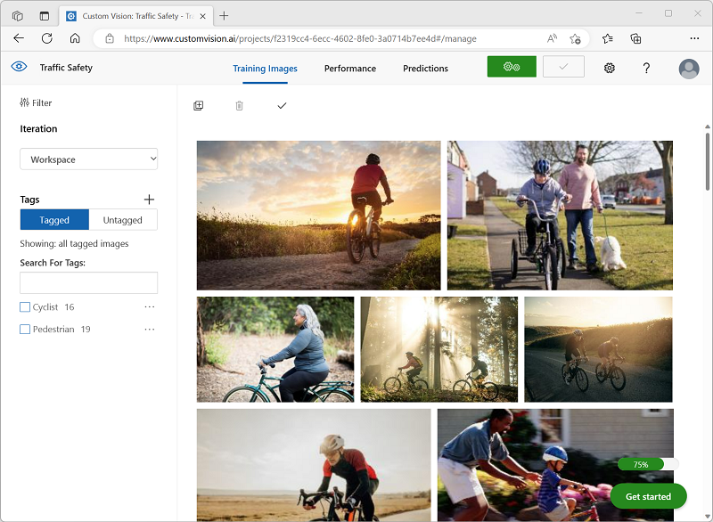
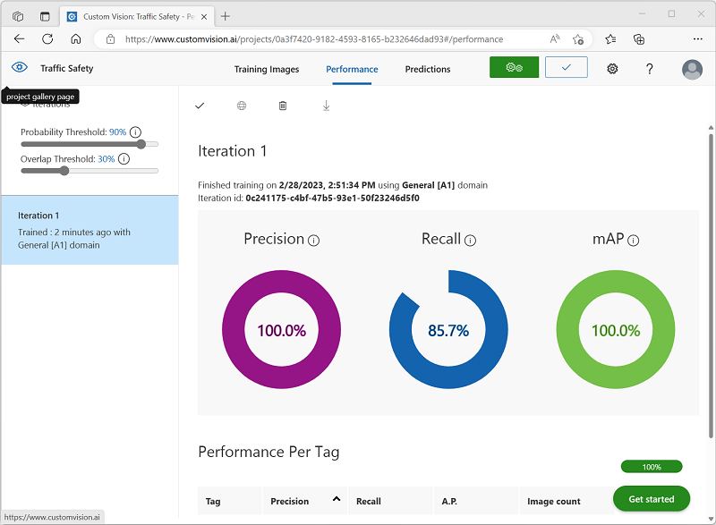
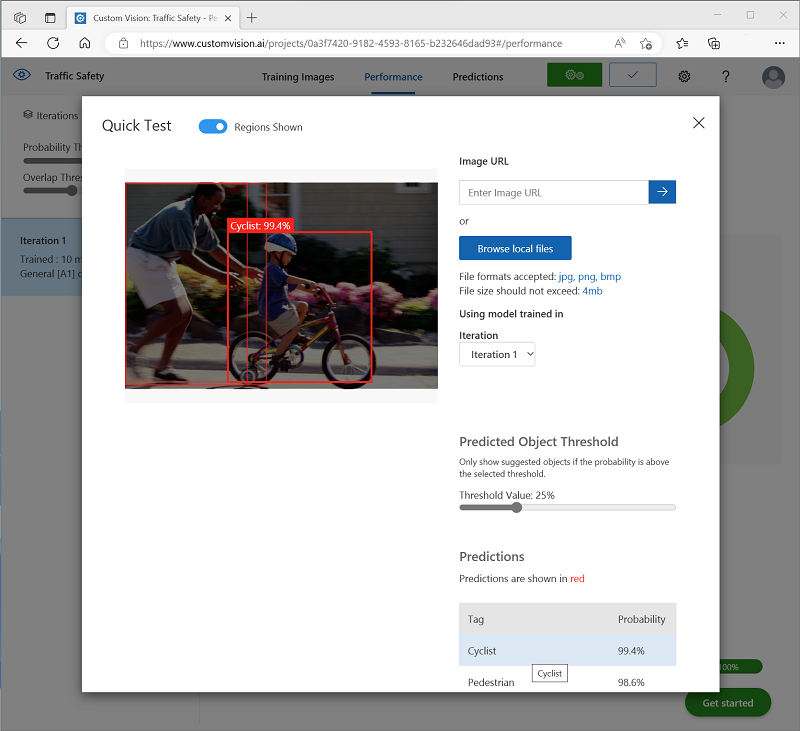
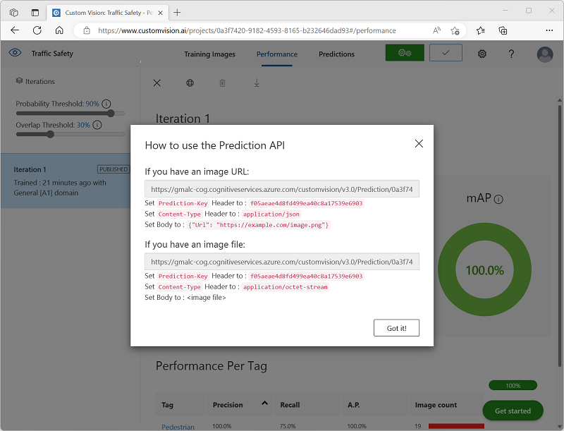
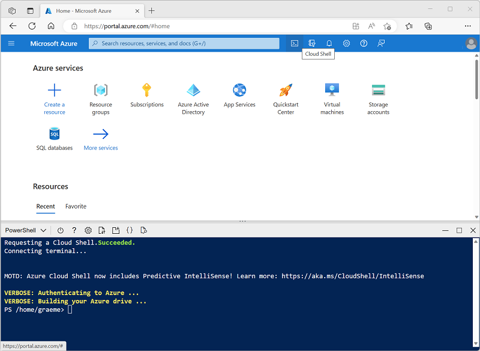
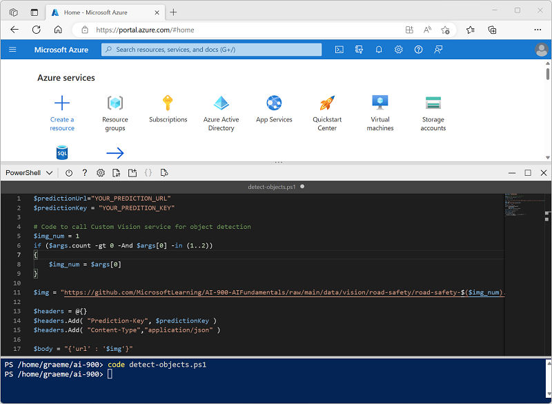

---
lab:
    title: 'Explore object detection​'
---

# Explore object detection

> **Note**
> To complete this lab, you will need an [Azure subscription](https://azure.microsoft.com/free?azure-portal=true) in which you have administrative access.

*Object detection* is a form of computer vision in which a machine learning model is trained to classify individual instances of objects in an image, and indicate a *bounding box* that marks its location. You can think of this as a progression from *image classification* (in which the model answers the question "what is this an image of?") to building solutions where we can ask the model "what objects are in this image, and where are they?".

For example, a road safety initiative might identify pedestrians and cyclists as being the most vulnerable road users at traffic intersections. By using cameras to monitor intersections, images of road users could be analyzed to detect pedestrians and cyclists in order to monitor their numbers or even change the behavior of traffic signals.

The **Custom Vision** cognitive service in Microsoft Azure provides a cloud-based solution for creating and publishing custom object detection models. In Azure, you can use the Custom Vision service to train an object detection model based on existing images. There are two elements to creating an object detection solution. First, you must train a model to detect the location and class of objects using labelled images. Then, when the model is trained you must publish it as a service that can be consumed by applications.

To test the capabilities of the Custom Vision service to detect objects in images, we'll use a simple command-line application that runs in the Cloud Shell. The same principles and functionality apply in real-world solutions, such as web sites or mobile apps.

## Create a *Cognitive Services* resource

You can use the Custom Vision service by creating either a **Custom Vision** resource or a **Cognitive Services** resource.

> **Note**
> Not every resource is available in every region. Whether you create a Custom Vision or Cognitive Services resource, only resources created in [certain regions](https://azure.microsoft.com/global-infrastructure/services/?products=cognitive-services) can be used to access Custom Vision services. For simplicity, a region is pre-selected for you in the configuration instructions below.

Create a **Cognitive Services** resource in your Azure subscription.

1. In another browser tab, open the Azure portal at [https://portal.azure.com](https://portal.azure.com?azure-portal=true), signing in with your Microsoft account.

1. Click the **&#65291;Create a resource** button, search for *Cognitive Services*, and create a **Cognitive Services** resource with the following settings:
    - **Subscription**: *Your Azure subscription*.
    - **Resource group**: *Select or create a resource group with a unique name*.
    - **Region**: East US
    - **Name**: *Enter a unique name*.
    - **Pricing tier**: Standard S0
    - **By checking this box I acknowledge that I have read and understood all the terms below**: Selected.

1. Review and create the resource, and wait for deployment to complete. Then go to the deployed resource.

1. View the **Keys and Endpoint** page for your Cognitive Services resource. You will need the endpoint and keys to connect from client applications.

## Create a Custom Vision project

To train an object detection model, you need to create a Custom Vision project based on your training resource. To do this, you'll use the Custom Vision portal.

1. In a new browser tab, open the Custom Vision portal at [https://customvision.ai](https://customvision.ai?azure-portal=true), and sign in using the Microsoft account associated with your Azure subscription.

1. Create a new project with the following settings:
    - **Name**: Traffic Safety
    - **Description**: Object detection for road safety.
    - **Resource**: *The resource you created previously*
    - **Project Types**: Object Detection
    - **Domains**: General \[A1]

1. Wait for the project to be created and opened in the browser.

## Add and tag images

To train an object detection model, you need to upload images that contain the classes you want the model to identify, and tag them to indicate bounding boxes for each object instance.

1. Download and extract the training images from [https://aka.ms/traffic-images](https://aka.ms/traffic-images). The extracted folder contains a collection of images of cyclists and pedestrians.

1. In the Custom Vision portal, in your **Traffic Safety** object detection project, select **Add images** and upload all of the images in the extracted folder.

    

1. After the images have been uploaded, select the first one to open it.

1. Hold the mouse over any object (cyclist or pedestrian) in the image until an automatically detected region is displayed. Then select the object, and if necessary resize the region to surround it. Alternatively, you can simply drag around the object to create a region.

    When the object is tightly selected within the rectangular region, enter the appropriate tag for the object (*Cyclist* or *Pedestrian*) and use the **Tag region** (**+**) button to add the tag to the project.

    

1. Use the **Next** (**(>)** link on the right to go to the next image, and tag its objects. Then just keep working through the entire image collection, tagging each cyclist and pedestrian.

    As you tag the images, note the following:

    - Some images contain multiple objects, potentially of different types. Tag each one, even if they overlap.
    - After a tag has been entered once, you can select it from the list when tagging new objects.
    - You can go back and forward through the images to adjust tags.

    

1. When you have finished tagging the last image, close the **Image Detail** editor and on the **Training Images** page, under **Tags**, select **Tagged** to see all of your tagged images:

    

## Train and test a model

Now that you've tagged the images in your project, you're ready to train a model.

1. In the Custom Vision project, click **Train** to train an object detection model using the tagged images. Select the **Quick Training** option.

    > **Tip**: Training may take several minutes. While you're waiting, check out [Video analytics for smart cities](https://www.microsoft.com/research/video/video-analytics-for-smart-cities/), which describes a real project to use computer vision in a road safety improvement initiative.

2. When training is complete, review the *Precision*, *Recall*, and *mAP* performance metrics - these measure the prediction goodness of the object detection model, and should all be reasonably high.

3. Adjust the **Probability Threshold** on the left, increasing it from 50% to 90% and observe the affect on the performance metrics. This setting determines the probability value that each tag evaluation must meet or exceed to be counted as a prediction.

    

4. At the top right of the page, click **Quick Test**, and then in the **Image URL** box, enter `https://aka.ms/pedestrian-cyclist` and view the results.

    In the pane on the right, under **Predictions**, each detected object is listed with its tag and probability. Select each object to see it highlighted in the image.

    The predicted objects may not all be correct - after all, cyclists and pedestrians share many common features. The predictions that the model is most confident about have the highest probability values. Use the **Threshold Value** slider to eliminate objects with a low probability. You should be able to find a point at which only correct predictions are included (probably at around 85-90%).

    

5. Then close the **Quick Test** window.

## Publish the object detection model

Now you're ready to publish your trained model and use it from a client application.

1. Click **&#128504; Publish** to publish the trained model with the following settings:
    - **Model name**: traffic-safety
    - **Prediction resource**: *The resource you created previously*.

1. After publishing, click the *Prediction URL* (&#127760;) icon to see information required to use the published model.

    

Later, you will need the appropriate URL and Prediction-Key values to get a prediction from an Image URL, so keep this dialog box open and carry on to the next task.

## Prepare a client application

To test the capabilities of the Custom Vision service, we'll use a simple command-line application that runs in the cloud shell on Azure.

1. Switch back to the browser tab containing the Azure portal, and select the **Cloud shell** (**[>_]**)  button at the top of the page to the right of the search box. This opens a cloud shell pane at the bottom of the portal.

    The first time you open the Cloud Shell, you may be prompted to choose the type of shell you want to use (*Bash* or *PowerShell*). If so, select **PowerShell**.

    If you are prompted to create storage for your Cloud Shell, ensure your subscription is selected and select **Create storage**. Then wait a minute or so for the storage to be created.

    When the cloud shell is ready, it should look similar to this:
    
    

    > **Tip**: Ensure that the type of shell indicated on the top left of the Cloud Shell pane is *PowerShell*. If it is *Bash*, switch to *PowerShell* by using the drop-down menu.

    Note that you can resize the cloud shell by dragging the separator bar at the top of the pane, or by using the **&#8212;**, **&#9723;**, and **X** icons at the top right of the pane to minimize, maximize, and close the pane. For more information about using the Azure Cloud Shell, see the [Azure Cloud Shell documentation](https://docs.microsoft.com/azure/cloud-shell/overview).

2. In the command shell, enter the following commands to download the files for this exercise and save them in a folder named **ai-900** (after removing that folder if it already exists)

    ```PowerShell
    rm -r ai-900 -f
    git clone https://github.com/MicrosoftLearning/AI-900-AIFundamentals ai-900
    ```

3. After the files have been downloaded, enter the following commands to change to the **ai-900** directory and edit the code file for this exercise:

    ```PowerShell
    cd ai-900
    code detect-objects.ps1
    ```

    Notice how this opens an editor like the one in the image below:

     

     > **Tip**: You can use the separator bar between the cloud shell command line and the code editor to resize the panes.

4. Don't worry too much about the details of the code. The important thing is that it starts with some code to specify the prediction URL and key for your Custom Vision model. You'll need to update these so that the rest of the code uses your model.

    Get the *prediction URL* and *prediction key* from the dialog box you left open in the browser tab for your Custom Vision project. You need the versions to be used *if you have an image URL*.

    Use these values to replace the **YOUR_PREDICTION_URL** and **YOUR_PREDICTION_KEY** place holders in the code file.

    After pasting the Prediction URL and Prediction Key values, the first two lines of code should look similar to this:

    ```PowerShell
    $predictionUrl="https..."
    $predictionKey ="1a2b3c4d5e6f7g8h9i0j...."
    ```

5. After making the changes to the variables in the code, press **CTRL+S** to save the file. Then press **CTRL+Q** to close the code editor.

## Test the client application

Now you can use the sample client application to detect cyclists and pedestrians in images.

1. In the PowerShell pane, enter the following command to run the code:

    ```PowerShell
    ./detect-objects.ps1 1
    ```

    This code uses your model to detect objects in the following image:

    

1. Review the prediction, which lists any objects detected with a probability of 90% or more, along with the coordinates of a bounding box around their location.

1. Now let's try another image. Run this command:

    ```PowerShell
    ./detect-objects.ps1 2
    ```

    This time the following image is analyzed:

    

Hopefully, your object detection model did a good job of detecting pedestrians and cyclists in the test images.

## Learn more

This exercise shows only some of the capabilities of the Custom Vision service. To learn more about what you can do with this service, see the [Custom Vision page](https://azure.microsoft.com/services/cognitive-services/custom-vision-service/).
