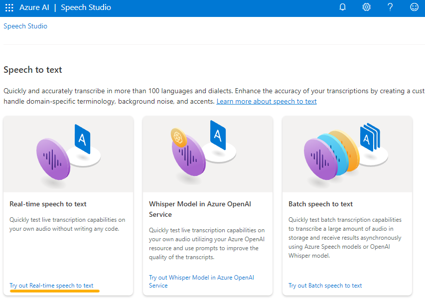
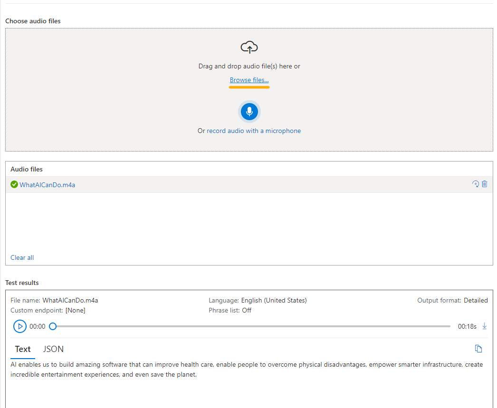

---
lab:
    title: 'Explore Speech Studio'
---

# Explore Speech Studio

> **Note**
> To complete this exercise, you will need an [Azure subscription](https://azure.microsoft.com/free?azure-portal=true) in which you have administrative access.

The **Azure AI Speech** service transcribes speech into text, and text into audible speech. You might use AI Speech to create an application that can transcribe meeting notes or generate text from the recording of interviews.

In this exercise, you will try out the capabilities of Azure AI Speech using Azure AI Speech Studio. 

## Create an *Azure AI Speech* resource

You can use the Speech service by creating either a **Speech** resource or an **Azure AI services** resource.

In this exercise, you will create an AI Speech resource, unless you already have a resource that you can use.

1. In another browser tab, open [Azure AI Speech Studio](https://speech.microsoft.com/), signing in with your Microsoft account.

1. Select **Settings** then **Create a resource.** Configure it with the following settings:
    - **Name of new resource**: *Enter a unique name*.
    - **Subscription**: *Your Azure subscription*.
    - **Region**: *Select a [supported region](https://learn.microsoft.com/azure/ai-services/speech-service/regions)*.
    - **Pricing tier**: *Free FO (if available, otherwise select Standard S0).*
    - **Resource group**: *Select or create a resource group with a unique name*.
1. Select **Create resource.** Wait until the resource has been created and then select **Use resource**. The Get started with Speech page is displayed.

## Explore speech to text in Speech Studio

1. Select https://github.com/MicrosoftLearning/AI-900-AIFundamentals/raw/main/data/speech/speech.zip) and save the file to a folder on your computer. Unzip the files and make a note of the folder name.
1. On the Get started with Speech page, under *Speech* find *Real-time speech to text*. Select **Try out Real-time speech to text**.

    

1. Under *Choose audio files*, select **Browse files** and navigate to the folder where you saved the file. Select **WhatAICanDo.m4a** and then **Open**.

    

1. The Speech service transcribes and displays the text in real time. If you have audio on your computer, you can listen to the recording as the text is being transcribed.
1. Review the output, which should have successfully recognized and transcribed the audio into text.

In this exercise you created an AI Speech resource in Speech Studio. You then used the Real-time speech to text service to transcribe an audio recording. You were able to see the text transcription being generated as the audio file was played.

## Clean up

If you don’t intend to do more exercises, delete any resources that you no longer need. This avoids accruing any unnecessary costs.

1. Open the [Azure portal]( https://portal.azure.com) and select the resource group that contains the resource you created.
1. Select the resource and select **Delete** and then **Yes** to confirm. The resource is then deleted.

## Learn more

This exercise demonstrated only some of the capabilities of the Speech service. To learn more about what you can do with this service, see the [Speech page]([https://azure.microsoft.com/services/cognitive-services/speech-services/]).
