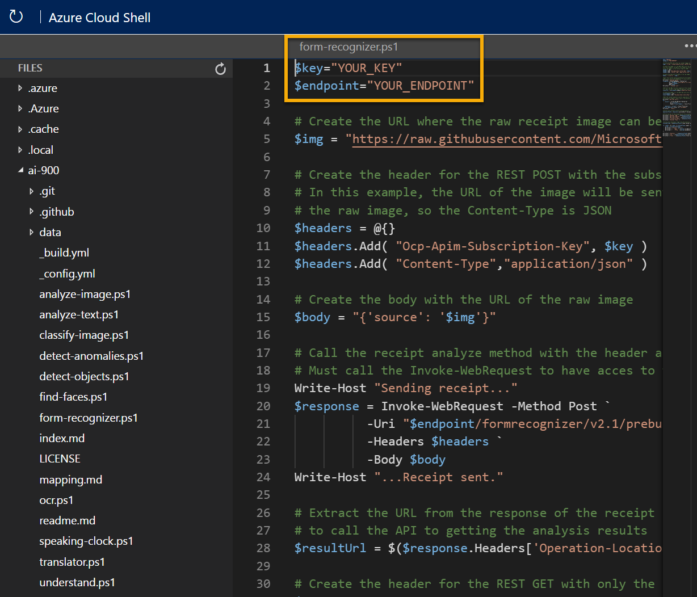

---
lab:
    title: 'Explore form recognition​'
---

# Explore form recognition

> **Note**
> To complete this lab, you will need an [Azure subscription](https://azure.microsoft.com/free?azure-portal=true) in which you have administrative access.

In the artificial intelligence (AI) field of computer vision, optical character recognition (OCR) is commonly used to read printed or handwritten documents. Often, the text is simply extracted from the documents into a format that can be used for further processing or analysis.

A more advanced OCR scenario is the extraction of information from forms, such as purchase orders or invoices, with a semantic understanding of what the fields in the form represent. The **Form Recognizer** service is specifically designed for this kind of AI problem.

Form Recognizer uses machine learning models trained to extract text from images of invoices, receipts, and more. While other computer vision models can capture text, Form Recognizer also captures the structure of the text, such as key/value pairs and information in tables. This way, instead of having to manually type in entries from a form into a database, you can automatically capture the relationships between text from the original file. 

To test the capabilities of the Form Recognizer service, we'll use a simple command-line application that runs in the Cloud Shell. The same principles and functionality apply in real-world solutions, such as web sites or phone apps.

## Create a *Cognitive Services* resource

You can use the Form Recognizer service by creating either a **Form Recognizer** resource or a **Cognitive Services** resource.

If you haven't already done so, create a **Cognitive Services** resource in your Azure subscription.

1. In another browser tab, open the Azure portal at [https://portal.azure.com](https://portal.azure.com?azure-portal=true), signing in with your Microsoft account.

1. Click the **&#65291;Create a resource** button, search for *Cognitive Services*, and create a **Cognitive Services** resource with the following settings:
    - **Subscription**: *Your Azure subscription*.
    - **Resource group**: *Select or create a resource group with a unique name*.
    - **Region**: *Choose any available region*.
    - **Name**: *Enter a unique name*.
    - **Pricing tier**: Standard S0
    - **By checking this box I acknowledge that I have read and understood all the terms below**: Selected.

1. Review and create the resource, and wait for deployment to complete. Then go to the deployed resource.

1. View the **Keys and Endpoint** page for your Cognitive Services resource. You will need the endpoint and keys to connect from client applications.

## Run Cloud Shell

To test the capabilities of the Form Recognizer service, we'll use a simple command-line application that runs in the Cloud Shell on Azure. 

1. In the Azure portal, select the **[>_]** (*Cloud Shell*) button at the top of the page to the right of the search box. This opens a Cloud Shell pane at the bottom of the portal. 

    

1. The first time you open the Cloud Shell, you may be prompted to choose the type of shell you want to use (*Bash* or *PowerShell*). Select **PowerShell**. If you do not see this option, skip the step.  

1. If you are prompted to create storage for your Cloud Shell, ensure your subscription is specified and select **Create storage**. Then wait a minute or so for the storage to be created.

    

1. Make sure the the type of shell indicated on the top left of the Cloud Shell pane is switched to *PowerShell*. If it is *Bash*, switch to *PowerShell* by using the drop-down menu.

     

1. Wait for PowerShell to start. You should see the following screen in the Azure portal:  

     

## Configure and run a client application

Now that you have a custom model, you can run a simple client application that uses the Form Recognizer service.

1. In the command shell, enter the following command to download the sample application and save it to a folder called ai-900.

    ```PowerShell
    git clone https://github.com/MicrosoftLearning/AI-900-AIFundamentals ai-900
    ```

    >**Tip** If you already used this command in another lab to clone the *ai-900* repository, you can skip this step.

1. The files are downloaded to a folder named **ai-900**. Now we want to see all of the files in your Cloud Shell storage and work with them. Type the following command into the shell:

    ```PowerShell
    code .
    ```

    Notice how this opens up an editor like the one in the image below: 

    

1. In the **Files** pane on the left, expand **ai-900** and select **form-recognizer.ps1**. This file contains some code that uses the Form Recognizer service to analyze the fields in a receipt, as shown here:

    

1. Don't worry too much about the details of the code, the important thing is that it needs the endpoint URL and either of the keys for your Cognitive Services resource. Copy these from the **Keys and Endpoints** page for your resource from the Azure portal and paste them into the code editor, replacing the **YOUR_KEY** and **YOUR_ENDPOINT** placeholder values respectively.

    > **Tip**
    > You may need to use the separator bar to adjust the screen area as you work with the **Keys and Endpoint** and **Editor** panes.

    After pasting the key and endpoint values, the first two lines of code should look similar to this:

    ```PowerShell
    $key="1a2b3c4d5e6f7g8h9i0j...."    
    $endpoint="https..."
    ```

1. At the top right of the editor pane, use the **...** button to open the menu and select **Save** to save your changes. Then open the menu again and select **Close Editor**. Now that you've set up the key and endpoint, you can use your resource to analyze fields from a receipt. In this case, you'll use the Form Recognizer's built-in model to analyze a receipt for the fictional Northwind Traders retail company.

    The sample client application will analyze the following image:

    

1. In the PowerShell pane, enter the following commands to run the code to read the text:

    ```PowerShell
    cd ai-900
    ./form-recognizer.ps1
    ```

1. Review the returned results. See that Form Recognizer is able to interpret the data in the form, correctly identifying the merchant address and phone number, and the transaction date and time, as well as the line items, subtotal, tax, and total amounts.

## Learn more

This simple app shows only some of the Form Recognizer capabilities of the Computer Vision service. To learn more about what you can do with this service, see the [Form Recognizer page](https://docs.microsoft.com/azure/applied-ai-services/form-recognizer/overview).
