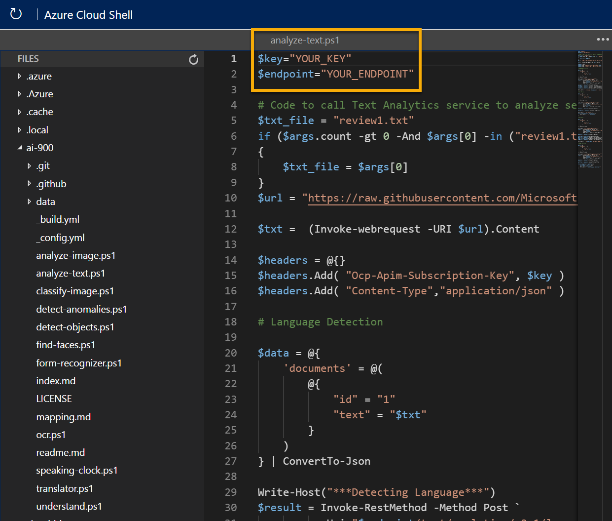
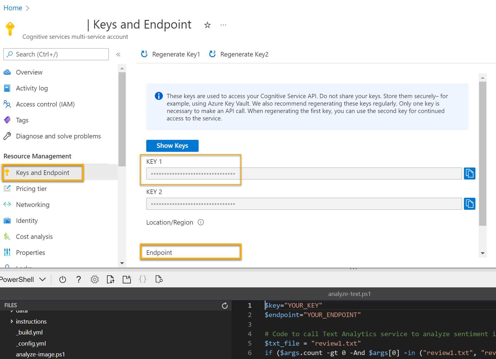

---
lab:
    title: 'Explore text analytics'
---

# Explore text analytics

> **Note**
> To complete this lab, you will need an [Azure subscription](https://azure.microsoft.com/free?azure-portal=true) in which you have administrative access.

Natural Language Processing (NLP) is a branch of artificial intelligence (AI) that deals with written and spoken language. You can use NLP to build solutions that extracting semantic meaning from text or speech, or that formulate meaningful responses in natural language.

Microsoft Azure *Cognitive Services* includes the text analytics capabilities in the *Language* service, which provides some out-of-the-box NLP capabilities, including the identification of key phrases in text, and the classification of text based on sentiment.

For example, suppose the fictional *Margie's Travel* organization encourages customers to submit reviews for hotel stays. You could use the Language service to summarize the reviews by extracting key phrases, determine which reviews are positive and which are negative, or analyze the review text for mentions of known entities such as locations or people.

To test the capabilities of the Language service, we'll use a simple command-line application that runs in the Cloud Shell. The same principles and functionality apply in real-world solutions, such as web sites or phone apps.

## Create a *Cognitive Services* resource

You can use the Language service by creating either a **Language** resource or a **Cognitive Services** resource.

If you haven't already done so, create a **Cognitive Services** resource in your Azure subscription.

1. In another browser tab, open the Azure portal at [https://portal.azure.com](https://portal.azure.com?azure-portal=true), signing in with your Microsoft account.

1. Select the **&#65291;Create a resource** button, search for *Cognitive Services*, and create a **Cognitive Services** resource with the following settings:
    - **Subscription**: *Your Azure subscription*.
    - **Resource group**: *Select or create a resource group with a unique name*.
    - **Region**: *Choose any available region*.
    - **Name**: *Enter a unique name*.
    - **Pricing tier**: Standard S0
    - **By checking this box I acknowledge that I have read and understood all the terms below**: Selected.

1. Review and create the resource.

### Get the key and endpoint for your Cognitive Services resource

1. Wait for deployment to complete. Then go to your Cognitive Services resource, and on the **Overview** page, select the link to manage the keys for the service. You will need the endpoint and keys to connect to your Cognitive Services resource from client applications.

1. View the **Keys and Endpoint** page for your resource. You will need the **key** and **endpoint** to connect from client applications.

## Run Cloud Shell

To test the text analytics capabilities of the Language service, we'll use a simple command-line application that runs in the Cloud Shell on Azure.

1. In the Azure portal, select the **[>_]** (*Cloud Shell*) button at the top of the page to the right of the search box. This opens a Cloud Shell pane at the bottom of the portal.

    

1. The first time you open the Cloud Shell, you may be prompted to choose the type of shell you want to use (*Bash* or *PowerShell*). Select **PowerShell**. If you do not see this option, skip the step.  

1. If you are prompted to create storage for your Cloud Shell, ensure your subscription is specified and select **Create storage**. Then wait a minute or so for the storage to be created.

    

1. Make sure the type of shell indicated on the top left of the Cloud Shell pane is switched to *PowerShell*. If it is *Bash*, switch to *PowerShell* by using the drop-down menu.

    

1. Wait for PowerShell to start. You should see the following screen in the Azure portal:  

    

## Configure and run a client application

Now that you have a custom model, you can run a simple client application that uses the Language service.

1. In the command shell, enter the following command to download the sample application and save it to a folder called ai-900.

    ```PowerShell
    git clone https://github.com/MicrosoftLearning/AI-900-AIFundamentals ai-900
    ```

    >**Tip**
    > If you already used this command in another lab to clone the *ai-900* repository, you can skip this step.

1. The files are downloaded to a folder named **ai-900**. Now we want to see all of the files in your Cloud Shell storage and work with them. Type the following command into the shell:

     ```PowerShell
    code .
    ```

    Notice how this opens up an editor like the one in the image below:

    

1. In the **Files** pane on the left, expand **ai-900** and select **analyze-text.ps1**. This file contains some code that uses the Language service:

    

1. Don't worry too much about the details of the code. In the Azure portal, navigate to your Cognitive Services resource. Then select the **Keys and Endpoints** page on the left hand pane. Copy the key and endpoint from the page and paste them into the code editor, replacing the **YOUR_KEY** and **YOUR_ENDPOINT** placeholder values respectively.

    > **Tip**
    > You may need to use the separator bar to adjust the screen area as you work with the **Keys and Endpoint** and **Editor** panes.

    

    After replacing the key and endpoint values, the first lines of code should look similar to this:

    ```PowerShell
    $key="1a2b3c4d5e6f7g8h9i0j...."
    $endpoint="https..."
    ```

1. At the top right of the editor pane, use the **...** button to open the menu and select **Save** to save your changes. Then open the menu again and select **Close Editor**.

    The sample client application will use Cognitive Services' Language service to detect language, extract key phrases, determine sentiment, and extract known entities for reviews.

1. In the Cloud Shell, enter the following command to run the code:

    ```PowerShell
    cd ai-900
    ./analyze-text.ps1 review1.txt
    ```

    You will be reviewing this text:

    >Good Hotel and staff
    The Royal Hotel, London, UK
    3/2/2018
    Clean rooms, good service, great location near Buckingham Palace and Westminster Abbey, and so on. We thoroughly enjoyed our stay. The courtyard is very peaceful and we went to a restaurant which is part of the same group and is Indian ( West coast so plenty of fish) with a Michelin Star. We had the taster menu which was fabulous. The rooms were very well appointed with a kitchen, lounge, bedroom and enormous bathroom. Thoroughly recommended.

1. Review the output.

1. In the PowerShell pane, enter the following command to run the code:

    ```PowerShell
    ./analyze-text.ps1 review2.txt
    ```

    You will be reviewing this text:

    >Tired hotel with poor service
    The Royal Hotel, London, United Kingdom
    5/6/2018
    This is an old hotel (has been around since 1950's) and the room furnishings are average - becoming a bit old now and require changing. The internet didn't work and had to come to one of their office rooms to check in for my flight home. The website says it's close to the British Museum, but it's too far to walk.

1. Review the output.

1. In the PowerShell pane, enter the following command to run the code:

    ```PowerShell
    ./analyze-text.ps1 review3.txt
    ```

    You will be reviewing this text:

    >Good location and helpful staff, but on a busy road.
    The Lombard Hotel, San Francisco, USA
    8/16/2018
    We stayed here in August after reading reviews. We were very pleased with location, just behind Chestnut Street, a cosmopolitan and trendy area with plenty of restaurants to choose from. The
    Marina district was lovely to wander through, very interesting houses. Make sure to walk to the San Francisco Museum of Fine Arts and the Marina to get a good view of Golden Gate bridge and the city. On a bus route and easy to get into centre. Rooms were clean with plenty of room and staff were friendly and helpful. The only down side was the noise from Lombard Street so ask to have a room furthest away from traffic noise.

1. Review the output.

1. In the PowerShell pane, enter the following command to run the code:

    ```PowerShell
    ./analyze-text.ps1 review4.txt
    ```

    You will be reviewing this text:

    >Very noisy and rooms are tiny
    The Lombard Hotel, San Francisco, USA
    9/5/2018
    Hotel is located on Lombard street which is a very busy SIX lane street directly off the Golden Gate Bridge. Traffic from early morning until late at night especially on weekends. Noise would not be so bad if rooms were better insulated but they are not. Had to put cotton balls in my ears to be able to sleep--was too tired to enjoy the city the next day. Rooms are TINY. I picked the room because it had two queen size beds--but the room barely had space to fit them. With family of four in the room it was tight. With all that said, rooms are clean and they've made an effort to update them. The hotel is in Marina district with lots of good places to eat, within walking distance to Presidio. May be good hotel for young stay-up-late adults on a budget

1. Review the output.

## Learn more

This simple app shows only some of the capabilities of the Language service. To learn more about what you can do with this service, see the [Language service page](https://azure.microsoft.com/services/cognitive-services/language-service/).
