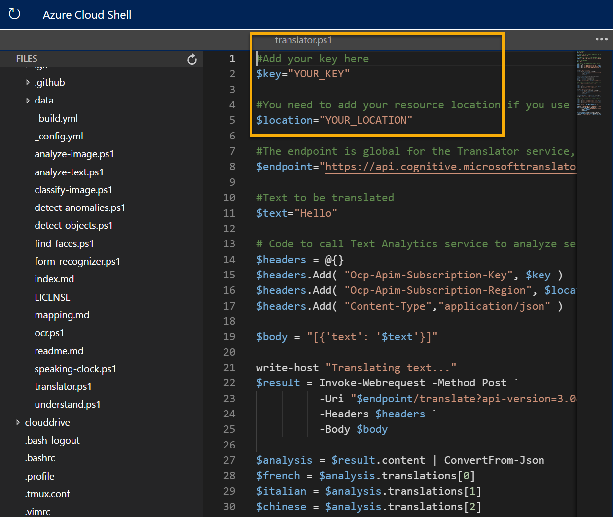

---
lab:
    title: 'Explore translation'
---

# Explore translation

> **Note**
> To complete this lab, you will need an [Azure subscription](https://azure.microsoft.com/free?azure-portal=true) in which you have administrative access.

One of the driving forces that has enabled human civilization to develop is the ability to communicate with one another. In most human endeavors, communication is key.

Artificial Intelligence (AI) can help simplify communication by translating text or speech between languages, helping to remove barriers to communication across countries and cultures.

To test the capabilities of the Translator service, we'll use a simple command-line application that runs in the Cloud Shell. The same principles and functionality apply in real-world solutions, such as web sites or phone apps.

## Create a *Cognitive Services* resource

You can use the Translator service by creating either a **Translator** resource or a **Cognitive Services** resource.

If you haven't already done so, create a **Cognitive Services** resource in your Azure subscription.

1. In another browser tab, open the Azure portal at [https://portal.azure.com](https://portal.azure.com?azure-portal=true), signing in with your Microsoft account.

1. Select the **&#65291;Create a resource** button, search for *Cognitive Services*, and create a **Cognitive Services** resource with the following settings:
    - **Subscription**: *Your Azure subscription*.
    - **Resource group**: *Select or create a resource group with a unique name*.
    - **Region**: *Choose any available region*.
    - **Name**: *Enter a unique name*.
    - **Pricing tier**: Standard S0
    - **By checking this box I acknowledge that I have read and understood all the terms below**: Selected.

1. Review and create the resource, and wait for deployment to complete. Then go to the deployed resource.

1. View the **Keys and Endpoint** page for your Cognitive Services resource. You will need the keys and location to connect from client applications.

### Get the Key and Location for your Cognitive Services resource

1. Wait for deployment to complete. Then go to your Cognitive Services resource, and on the **Overview** page, select the link to manage the keys for the service. You will need the keys and location to connect to your Cognitive Services resource from client applications.

1. View the **Keys and Endpoint** page for your resource. You will need the **location/region** and **key** to connect from client applications.

> **Note**
> To use the Translator service you do not need to use the Cognitive Service endpoint. A global endpoint just for the Translator service is provided. 

## Run Cloud Shell

To test the capabilities of the Translation service, we'll use a simple command-line application that runs in the Cloud Shell on Azure. 

1. In the Azure portal, select the **[>_]** (*Cloud Shell*) button at the top of the page to the right of the search box. This opens a Cloud Shell pane at the bottom of the portal.

    

1. The first time you open the Cloud Shell, you may be prompted to choose the type of shell you want to use (*Bash* or *PowerShell*). Select **PowerShell**. If you do not see this option, skip the step.  

1. If you are prompted to create storage for your Cloud Shell, ensure your subscription is specified and select **Create storage**. Then wait a minute or so for the storage to be created.

    

1. Make sure the type of shell indicated on the top left of the Cloud Shell pane is switched to *PowerShell*. If it is *Bash*, switch to *PowerShell* by using the drop-down menu. 

     

1. Wait for PowerShell to start. You should see the following screen in the Azure portal:  

    

## Configure and run a client application

Now that you have a custom model, you can run a simple client application that uses the Translation service.

1. In the command shell, enter the following command to download the sample application and save it to a folder called ai-900.

    ```PowerShell
    git clone https://github.com/MicrosoftLearning/AI-900-AIFundamentals ai-900
    ```

    >**Tip**
    >If you already used this command in another lab to clone the *ai-900* repository, you can skip this step.

1. The files are downloaded to a folder named **ai-900**. Now we want to see all of the files in your Cloud Shell storage and work with them. Type the following command into the shell: 

     ```PowerShell
    code .
    ```

    Notice how this opens up an editor like the one in the image below: 

    

1. In the **Files** pane on the left, expand **ai-900** and select **translator.ps1**. This file contains some code that uses the Translator service:

    

1. Don't worry too much about the details of the code, the important thing is that it needs the region/location and either of the keys for your Cognitive Services resource. Copy these from the **Keys and Endpoints** page for your resource from the Azure portal and paste them into the code editor, replacing the **YOUR_KEY** and **YOUR_LOCATION** placeholder values respectively.

    After pasting the key and location values, the first lines of code should look similar to this:

    ```PowerShell
    $key="1a2b3c4d5e6f7g8h9i0j...."
    $location="somelocation"
    ```

1. At the top right of the editor pane, use the **...** button to open the menu and select **Save** to save your changes. Then open the menu again and select **Close Editor**.

    The sample client application will use the Translator service to do several tasks:
    - Translate text from English into French, Italian, and Chinese.
    - Translate audio from English into text in French

    Use the video player below to hear the input audio the application will process:

    <div class="embeddedvideo"><iframe src="https://www.microsoft.com/videoplayer/embed/RWORN0" frameborder="0" allowfullscreen="true" data-linktype="external"></iframe></div>


    > **Note**
    > A real application could accept the input from a microphone and send the response to a speaker, but in this simple example, we'll use pre-recorded input in an audio file.

1. In the Cloud Shell pane, enter the following command to run the code:

    ```PowerShell
    cd ai-900
    ./translator.ps1
    ```

1. Review the output. Did you see the translation from text in English to French, Italian, and Chinese?  Did you see the English audio "hello" translated into text in French?

## Learn more

This simple app shows only some of the capabilities of the Translator service. To learn more about what you can do with this service, see the [Translator page](https://docs.microsoft.com/azure/cognitive-services/translator/translator-overview).