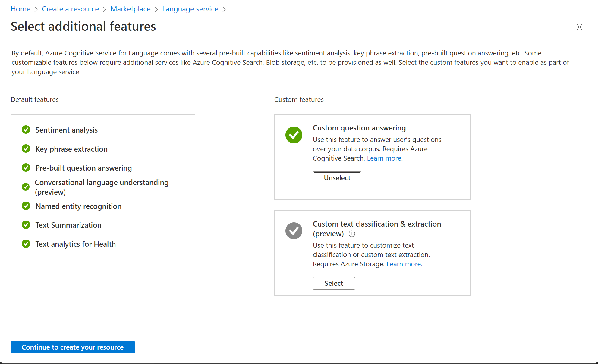

---
lab:
    title: 'Explore question answering'
---

# Explore question answering

> **Note**
> To complete this lab, you will need an [Azure subscription](https://azure.microsoft.com/free?azure-portal=true) in which you have administrative access.

For customer support scenarios, it's common to create a bot that can interpret and answer frequently asked questions through a website chat window, email, or voice interface. Underlying the bot interface is a knowledge base of questions and appropriate answers that the bot can search for suitable responses.

## Create a custom question answering knowledge base

The Language service's custom question answering feature enables you to quickly create a knowledge base, either by entering question and answer pairs or from an existing document or web page. It can then use some built-in natural language processing capabilities to interpret questions and find appropriate answers.

1. Open the Azure portal at [https://portal.azure.com](https://portal.azure.com?azure-portal=true), signing in with your Microsoft account.

1. Click the **&#65291;Create a resource** button, search for *Language service*, and create a **Language service** resource with the following settings, and then click **Continue to create your resource**:
    **Select Additional Features**
    - **Default features**: *Keep the default features*.
    - **Custom features**: *Select custom question answering*.

    

1. On the **Create Language** page, specify the following settings:
    - **Subscription**: *Your Azure subscription*.
    - **Resource group**: *Select an existing resource group or create a new one*.
    - **Name**: *A unique name for your Language resource*.
    - **Pricing tier**: S (1K Calls per minute)
    - **Azure search region**: *Any available location*.
    - **Azure search pricing tier**: Free F (3 Indexes) - (*If this tier is not available, select Standard S (50 Indexes)*)
    - **By checking this box I certify that I have reviewed and acknowledge the terms in the Responsible AI Notice**: *Selected*.

    > **Note**
    > If you have already provisioned a free-tier **Azure Cognitive Search** resources, your quota may not allow you to create another one. In which case, select a tier other than **Free F**.

1. Click **Review and Create** and then click **Create**. Wait for the deployment of the Language service that will support your custom question answering knowledge base.

1. In a new browser tab, open the Language Studio portal at [https://language.azure.com](https://language.azure.com?azure-portal=true) and sign in using the Microsoft account associated with your Azure subscription.

1. If prompted to choose a Language resource, select the following settings:
    - **Azure directory**: The Azure directory containing your subscription.
    - **Azure subscription**: Your Azure subscription.
    - **Language resource**: The Language resource you created previously.

1. If you are ***not*** prompted to choose a language resource, it may be because you have multiple Language resources in your subscription; in which case:
    1. On the bar at the top if the page, click the **Settings (&#9881;)** button.
    2. On the **Settings** page, view the **Resources** tab.
    3. Select the language resource you just created, and click **Switch resource**.
    4. At the top of the page, click **Language Studio** to return to the Language Studio home page.

1. At the top of the Language Studio portal, in the **Create new** menu, select **Custom question answering**.

1. On the **Choose language setting for resource *your resource*** page, select **I want to select the language when I create a project in this resource** and click **Next**.

1. On the **Enter basic information** page, enter the following details and click **Next**:
    - **Language resource**: *choose your language resource*.  
    - **Azure search resource**: *choose your Azure search resource*.
    - **Name**: MargiesTravel
    - **Description**: A simple knowledge base
    - **Source language**: English
    - **Default answer when no answer is returned**: No answer found

1. On the **Review and finish** page, click **Create project**.

1. You will be taken to the **Manage sources** page. Click **&#65291;Add source** and select **URLs**.

1. In the **Add URLs** box, click **+ Add url**. Type in the following and select **Add all**:
    - **URL name**: MargiesKB
    - **URL**: `https://raw.githubusercontent.com/MicrosoftLearning/AI-900-AIFundamentals/main/data/qna/margies_faq.docx`
    - **Classify file structure**: *Auto-detect* 

## Edit the knowledge base

Your knowledge base is based on the details in the FAQ document and some pre-defined responses. You can add custom question-and-answer pairs to supplement these.

1. Click **Edit knowledge base** on the left hand panel. Then click **+ Add question pair**.

1. In the **Questions** box, type `Hello`, then click **Submit changes**.

1. Click **+ Add alternate phrase** and type `Hi`, then click **Submit changes**.

1. In the **Answer and prompts** box, type `Hello`. Keep the **Source**: Editorial.

1. Click **Submit**. Then at the top of the page click **Save changes**. You may need to change the size of your window to see the button.

## Train and test the knowledge base

Now that you have a knowledge base, you can test it.

1. At the top of the page, click **Test** to test your knowledge base.

1. In the test pane, at the bottom enter the message *Hi*. The response **Hello** should be returned.

1. In the test pane, at the bottom enter the message *I want to book a flight*. An appropriate response from the FAQ should be returned.

    > **Note**
    > The response includes a *short answer* as well as a more verbose *answer passage* - the answer passage shows the full text in the FAQ document for the closest matched question, while the short answer is intelligently extracted from the passage. You can control whether the short answer is from the response by using the **Display short answer** checkbox at the top of the test pane.

1. Try another question, such as *How can I cancel a reservation?*

1. When you're done testing the knowledge base, click **Test** to close the test pane.

## Create a bot for the knowledge base

The knowledge base provides a back-end service that client applications can use to answer questions through some sort of user interface. Commonly, these client applications are bots. To make the knowledge base available to a bot, you must publish it as a service that can be accessed over HTTP. You can then use the Azure Bot Service to create and host a bot that uses the knowledge base to answer user questions.

1. At the left of the Language Studio page, click **Deploy knowledge base**.

1. At the top of the page, click **Deploy**, and the click **Deploy** again.

1. After the service has been deployed, click **Create a bot**. This opens the Azure portal in a new browser tab so you can create a Web App Bot in your Azure subscription.

1. In the Azure portal, create a Web App Bot with the following settings (most of these will be pre-populated for you):
    - **Bot handle**: *A unique name for your bot*
    - **Subscription**: *Your Azure subscription*
    - **Resource group**: *The resource group containing your Language resource*
    - **Location**: *The same location as your Language service*.
    - **Pricing tier**: Free (F0)
    - **App name**: *Same as the **Bot handle** with **.azurewebsites.net** appended automatically*
    - **SDK language**: *Choose either C# or Node.js*
    - **Language Resource Key**: *automatically generated, if you do not see it, you need to start by creating a question answering project in the Language Studio* 
    - **App service plan/Location**: *Select the arrow to create a plan. Then create a unique App service plan name and choose a suitable location*
    - **Application Insights**: Off
    - **Microsoft App ID and password**: *Auto create App ID and password*

1. Wait for your bot to be created (the notification icon at the top right, which looks like a bell, will be animated while you wait). Then in the notification that deployment has completed, click **Go to resource** (or alternatively, on the home page, click **Resource groups**, open the resource group where you created the web app bot, and click it.)

1. In the left-hand pane of your bot look for **Settings**, click on **Test in Web Chat**, and wait until the bot displays the message **Hello and Welcome** (it may take a few seconds to initialize).

1. Use the test chat interface to ensure your bot answers questions from your knowledge base as expected. For example, try submitting *I need to cancel my hotel*.

Experiment with the bot. You'll probably find that it can answer questions from the FAQ quite accurately, but it will have limited ability to interpret questions that it has not been trained with. You can always use the Language Studio to edit the knowledge base to improve it, and republish it.

## Learn more

- To learn more about the Question Answering service, view [the documentation](https://docs.microsoft.com/azure/cognitive-services/language-service/question-answering/overview).
- To learn more about the Microsoft Bot Service, view [the Azure Bot Service page](https://azure.microsoft.com/services/bot-service/).
