---
lab:
    title: 'Explore knowledge mining'
---

# Explore knowledge mining

> **Note**
> To complete this lab, you will need an [Azure subscription](https://azure.microsoft.com/free?azure-portal=true) in which you have administrative access.

Let's imagine you work for Fourth Coffee, a national coffee chain. You're asked to help build a knowledge mining solution that makes it easy to search for insights about customer experiences. You decide to build an Azure Cognitive Search index using data extracted from customer reviews.  

In this lab you'll:

- Create Azure resources
- Extract data from a data source
- Enrich data with AI skills
- Use Azure's indexer in the Azure portal
- Query your search index
- Review results saved to a Knowledge Store

## Azure resources needed

The solution you'll create for Fourth Coffee requires the following resources in your Azure subscription:

- An **Azure Cognitive Search** resource, which will manage indexing and querying.
- A **Cognitive Services** resource, which provides AI services for skills that your search solution can use to enrich the data in the data source with AI-generated insights.

    > **Note**
    > Your Azure Cognitive Search and Cognitive Services resources must be in the same location!

- A **Storage account** with blob containers, which will store raw documents and other collections of tables, objects, or files.

### Create an *Azure Cognitive Search* resource

1. Sign into the [Azure portal](https://portal.azure.com/learn.docs.microsoft.com?azure-portal=true).

1. Click the **+ Create a resource** button, search for *Azure Cognitive Search*, and create a **Azure Cognitive Search** resource with the following settings:

    - **Subscription**: *Your Azure subscription*.
    - **Resource group**: *Select or create a resource group with a unique name*.
    - **Service name**: *A unique name*.
    - **Location**: *Choose any available region*.
    - **Pricing tier**: Basic

1. Select **Review + create**, and after you see the response **Validation Success**, select **Create**.

1. After deployment completes, select **Go to resource**. On the Azure Cognitive Search overview page, you can add indexes, import data, and search created indexes.

### Create a Cognitive Services resource

You'll need to provision a **Cognitive Services** resource that's in the same location as your Azure Cognitive Search resource. Your search solution will use this resource to enrich the data in the datastore with AI-generated insights.

1. Return to the home page of the Azure portal, and then select the **+ Create a resource** button, search for *Cognitive Services*, and create a **Cognitive Services** resource with the following settings:
    - **Subscription**: *Your Azure subscription*.
    - **Resource group**: *The same resource group as your Azure Cognitive Search resource*.
    - **Region**: *The same location as your Azure Cognitive Search resource*.
    - **Name**: *A unique name*.
    - **Pricing tier**: Standard S0
    - **By checking this box I acknowledge that I have read and understood all the terms below**: Selected

1. Select **Review + create**. After you see the response **Validation Passed**, select **Create**.

1. Wait for deployment to complete, then view the deployment details.

### Create a storage account

1. Return to the home page of the Azure portal, and then select the **+ Create a resource** button.

1. Search for *storage account*, and create a **Storage account** resource with the following settings:
    - **Subscription**: *Your Azure subscription*.
    - **Resource group**: *The same resource group as your Azure Cognitive Search and Cognitive Services resources*.
    - **Storage account name**: *A unique name*.
    - **Location**: *Choose any available location*.
    - **Performance**: Standard
    - **Redundancy**: Locally redundant storage (LRS)

1. Click **Review** and then click **Create**. Wait for deployment to complete, and then go to the deployed resource.

## Upload Documents to Azure Storage

1. In the Azure Storage account you created, in the left-hand menu pane, select **Containers**.

    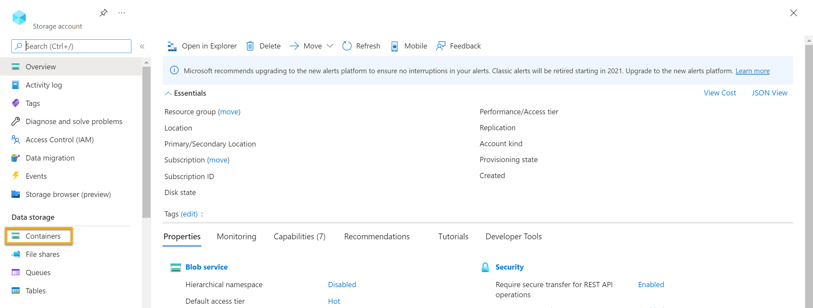

1. Select **+ Container**. A pane on your right-hand side opens.

1. Enter the following settings, and click **Create**:
    - **Name**: coffee-reviews  
    - **Public access level**: Container (anonymous read access for containers and blobs)
    - **Advanced**: *no changes*.

1. In a new browser tab, download the zipped documents from https://aka.ms/km-documents, and then extract the files to the *reviews* folder.

1. In the Azure portal, select your *coffee-reviews* container. In the container, select **Upload**.

    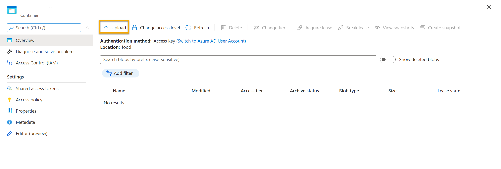

1. In the **Upload blob** pane, select **Select a file**.

1. In the Explorer window, select **all** the files in the *reviews* folder, select **Open**, and then select **Upload**.

    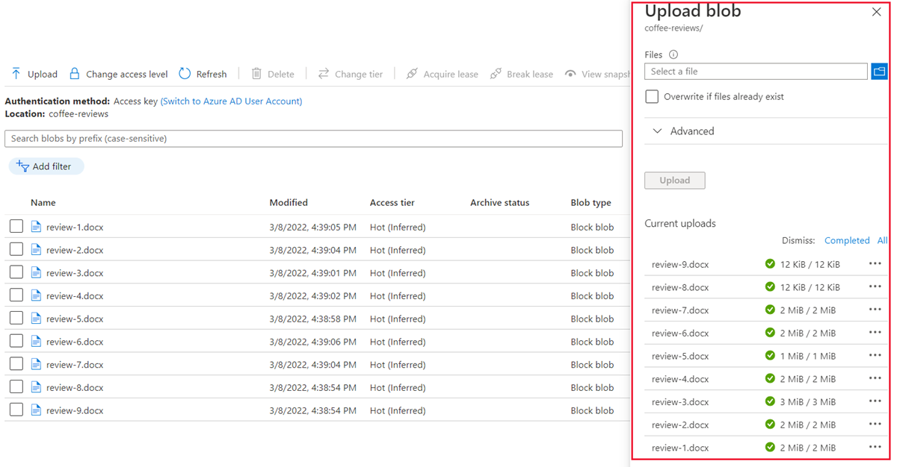

1. After the upload is complete, you can close the **Upload blob** pane. Your documents are now in your *coffee-reviews* storage container.

## Index the documents

Once you have the documents in storage, you can use Azure Cognitive Search to extract insights from the documents. The Azure portal provides an *Import data wizard*. With this wizard, you can automatically create an index and indexer for supported data sources. You'll use the wizard to create an index, and import your search documents from storage into the Azure Cognitive Search index.

1. In the Azure portal, browse to your Azure Cognitive Search resource. On the **Overview** page, select **Import data**.

    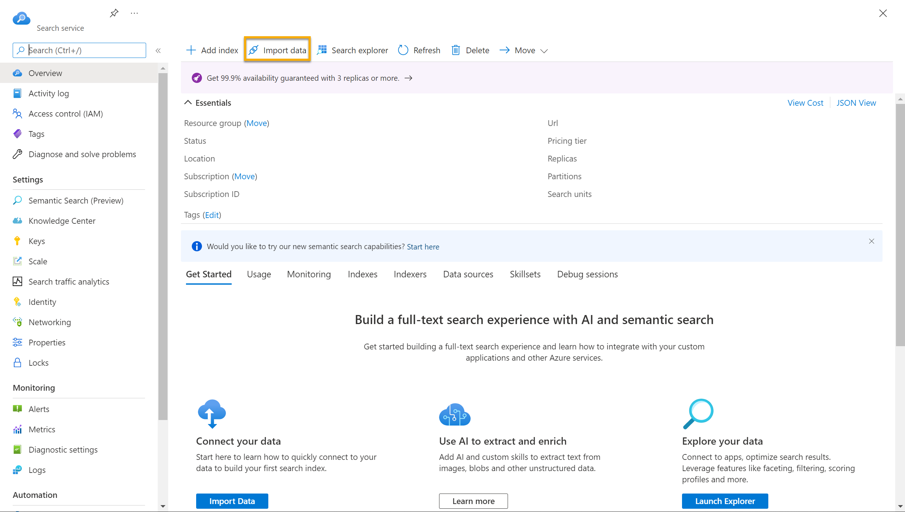

1. On the **Connect to your data** page, in the **Data Source** list, select **Azure Blob Storage**. Complete the data store details with the following values:
    - **Data Source**: Azure Blob Storage
    - **Data source name**: coffee-customer-data
    - **Data to extract**: Content and metadata
    - **Parsing mode**: Default
    - **Connection string**: *Select **Choose an existing connection**. Select your storage account, select the **coffee-reviews** container, and then click **Select**.
    - **Managed identity authentication**: None
    - **Container name**: *this setting is auto-populated after you choose an existing connection*.
    - **Blob folder**: *Leave this blank*.
    - **Description**: Reviews for Fourth Coffee shops.

1. Select **Next: Add cognitive skills (Optional)**.

1. In the **Attach Cognitive Services** section, select your Cognitive Services resource.  

1. In the **Add enrichments** section:
    - Change the **Skillset name** to **coffee-skillset**.
    - Select the checkbox **Enable OCR and merge all text into merged_content field**.
        > **Note**
        > It's important to select **Enable OCR** to see all of the enriched field options.
    - Ensure that the **Source data field** is set to **merged_content**.
    - Change the **Enrichment granularity level** to **Pages (5000 character chunks)**.
    - Don't select *Enable incremental enrichment*
    - Select the following enriched fields:

        | Cognitive Skill | Parameter | Field name |
        | --------------- | ---------- | ---------- |
        | Extract location names | | locations |
        | Extract key phrases | | keyphrases |
        | Detect sentiment | | sentiment |
        | Generate tags from images | | imageTags |
        | Generate captions from images | | imageCaption |

1. Under **Save enrichments to a knowledge store**, select:
    - Image projections
    - Documents
    - Pages
    - Key phrases
    - Entities
    - Image details
    - Image references

    > **Note**
    > If a warning asking for a **Storage Account Connection String** appears.
    >
    > 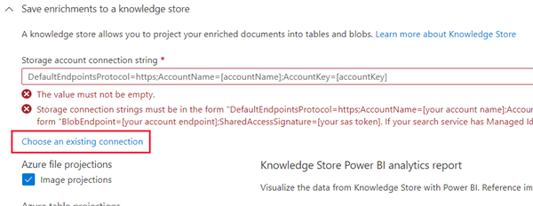

    > 1. Select **Choose an existing connection**. Choose the storage account you created earlier.

    > 1. Click on **+ Container** to create a new container called **knowledge-store** with the privacy level set to private, and select **Create**.

    > 1. Select the **knowledge-store** container, and then click **Select** at the bottom of the screen.

1. Select **Azure blob projects: Document**. A setting for *Container name* with the *knowledge-store* container auto-populated displays. Don't change the container name.

1. Select **Next: Customize target index**. Change the **Index name** to **coffee-index**.

1. Ensure that the **Key** is set to **metadata_storage_path**. Leave **Suggester name** blank and **Search mode** autopopulated.

1. Review the index fields' default settings. Select **filterable** for all the fields that are already selected by default.

    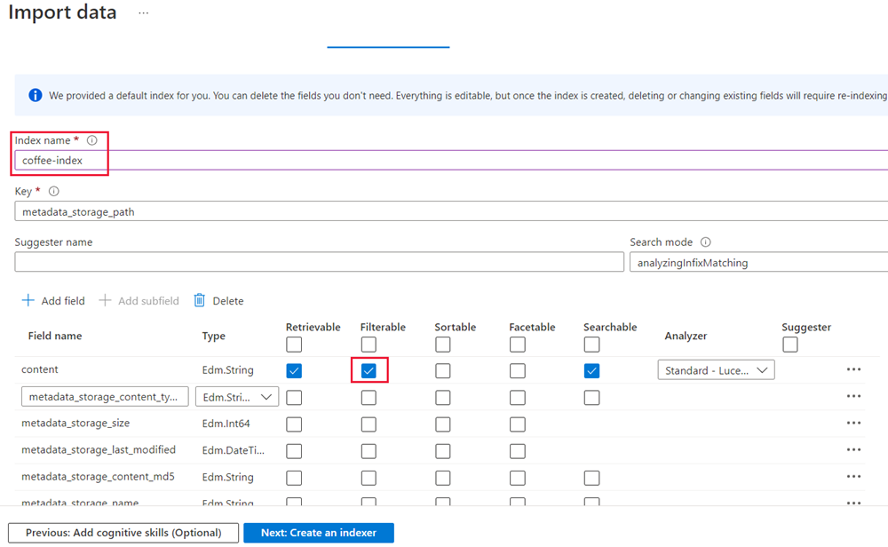

1. Select **Next: Create an indexer**.

1. Change the **Indexer name** to **coffee-indexer**.

1. Leave the **Schedule** set to **Once**.

1. Expand the **Advanced options**. Ensure that the **Base-64 Encode Keys** option is selected, as encoding keys can make the index more efficient.

1. Select **Submit** to create the data source, skillset, index, and indexer. The indexer is run automatically and runs the indexing pipeline, which:
    - Extracts the document metadata fields and content from the data source.
    - Runs the skillset of cognitive skills to generate more enriched fields.
    - Maps the extracted fields to the index.

1. In the bottom half of the **Overview** page for your Azure Cognitive Search resource, select the **Indexers** tab. This tab shows the newly created **coffee-indexer**. Wait a minute, and select **&orarr; Refresh** until the **Status** indicates success.

1. Select the indexer name to see more details.

    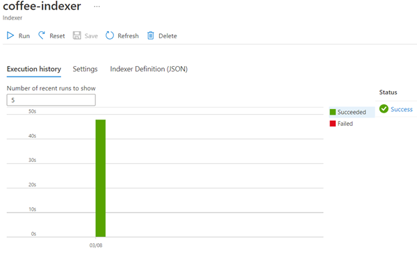

## Query the index

Use the Search explorer to write and test queries. Search explorer is a tool built into the Azure portal that gives you an easy way to validate the quality of your search index. You can use Search explorer to write queries and review results in JSON.

1. In your Search service's *Overview* page, select **Search explorer** at the top of the screen.

   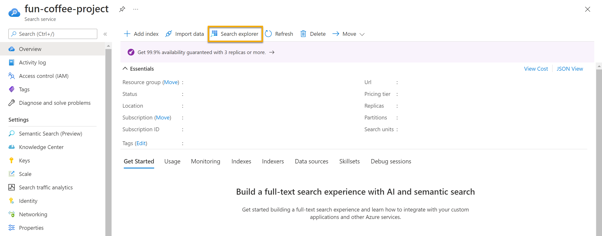

1. Notice how the index selected is the *coffee-index* you created.

    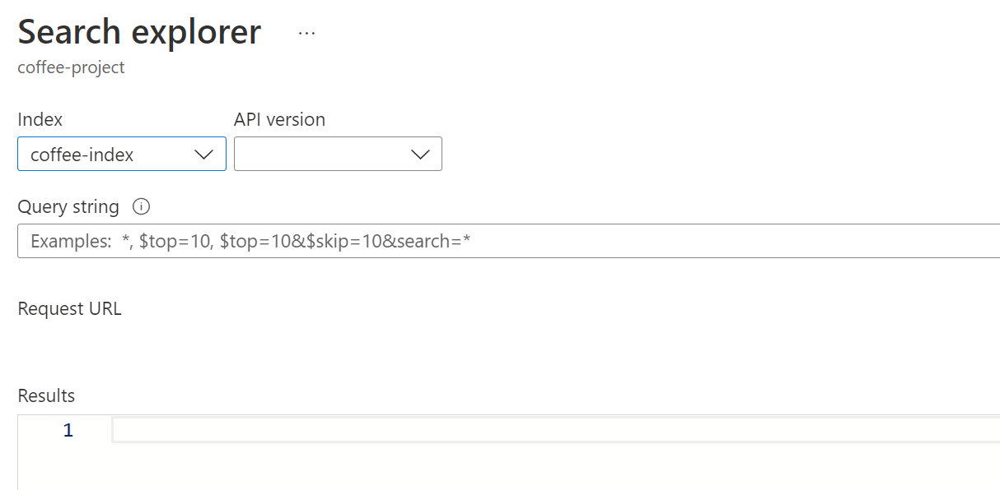

    In the **Query string** field, enter `search=*&$count=true`, and then select **Search**. The search query returns all the documents in the search index, including a count of all the documents in the **@odata.count** field. The search index should return a JSON document containing your search results.

    > **Note**
    > If a **To search in the portal, please allow the portal origin in your index CORS settings** message appears, select **Allow portal**, and then select **Search**.

1. Now let's filter by location. Enter `search=$filter=locations eq 'Chicago'` in the **Query string** field, and then select **Search**. The query searches all the documents in the  index and filters for reviews with a Chicago location.

1. Now let's filter by sentiment. Enter `search=$filter=sentiment eq 'negative'` in the **Query string** field, and then select **Search**. The query searches all the documents in the index and filters for reviews with a negative sentiment.

   > **Note**
   > See how the results are sorted by `@search.score`. This is the score assigned by the search engine to show how closely the results match the given query.

1. One of the problems we might want to solve for is why there might be certain reviews. Let's take a look at the key phrases associated with the negative review. What do you think might be the cause of the review?

## Review the knowledge store

Let's see the power of the knowledge store in action. When you ran the *Import data wizard*, you also created a knowledge store. Inside the knowledge store, you'll find the enriched data extracted by AI skills persists in the form of projections and tables.

1. In the Azure portal, navigate back to your Azure storage account.

1. In the left-hand menu pane, select **Containers**. Select the **knowledge-store** container.

    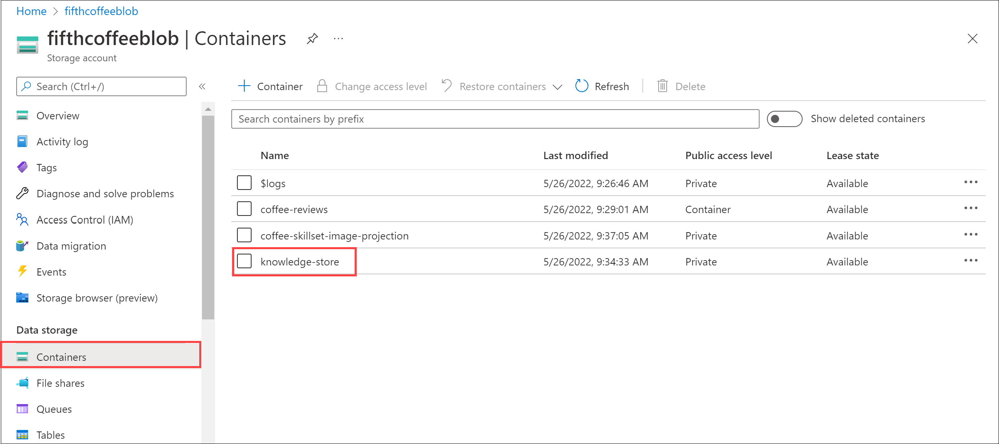

1. Select any of the items, and then click the **objectprojection.json** file.

    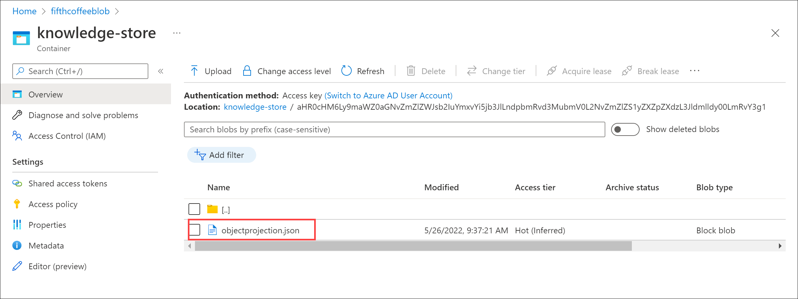

1. Select **Edit** to see the JSON produced for one of the documents from your Azure data store.

    

1. Select the storage blob breadcrumb at the top left of the screen to return to the Storage account *Containers*.

    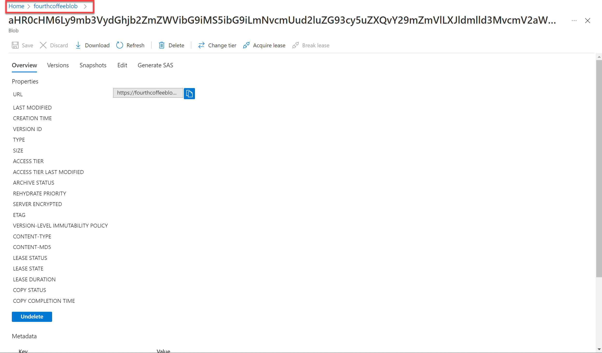

1. In the *Containers*, select the container *coffee-skillset-image-projection*. Select any of the items.

    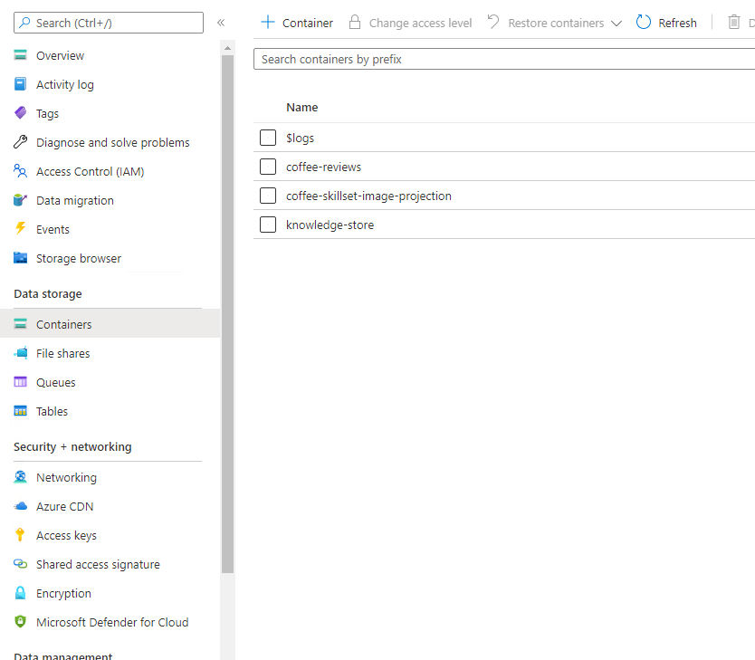

1. Select any of the *.jpg* files. Select **Edit** to see the image stored from the document. Notice how all the images from the documents are stored in this manner.

    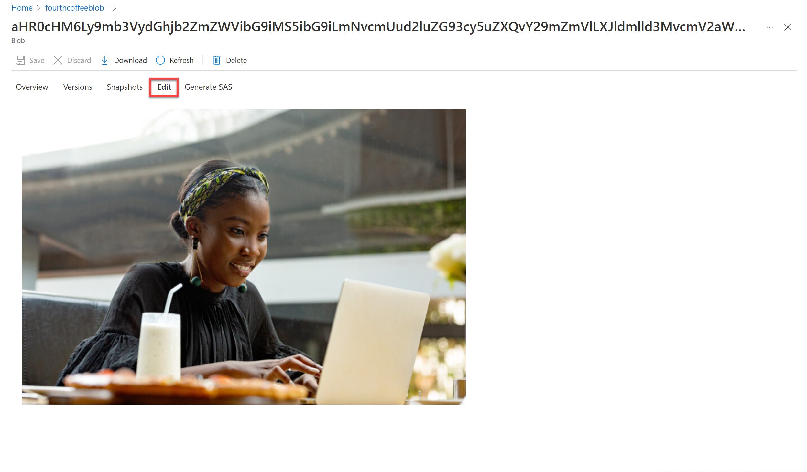

1. Select the storage blob breadcrumb at the top left of the screen to return to the Storage account *Containers*.

1. Select **Storage browser** on the left-hand panel, and select **Tables**. There's a table for each entity in the index. Select the table *coffeeSkillsetKeyPhrases*.

    Look at the key phrases the knowledge store was able to capture from the content in the reviews. Many of the fields are keys, so you can link the tables like a relational database. The last field shows the key phrases that were extracted by the skillset.

## Learn more

This simple search index only some of the capabilities of the Azure Cognitive Search service. To learn more about what you can do with this service, see the [Azure Cognitive Search service page](/azure/search/search-what-is-azure-search).
