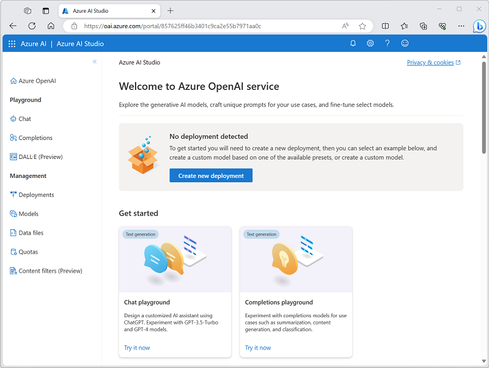
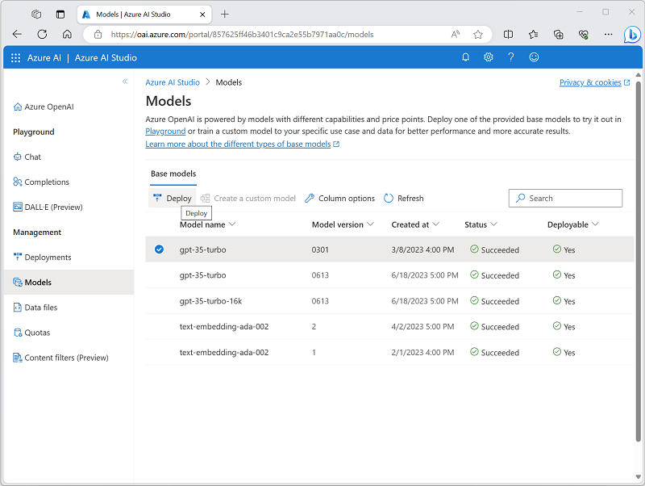
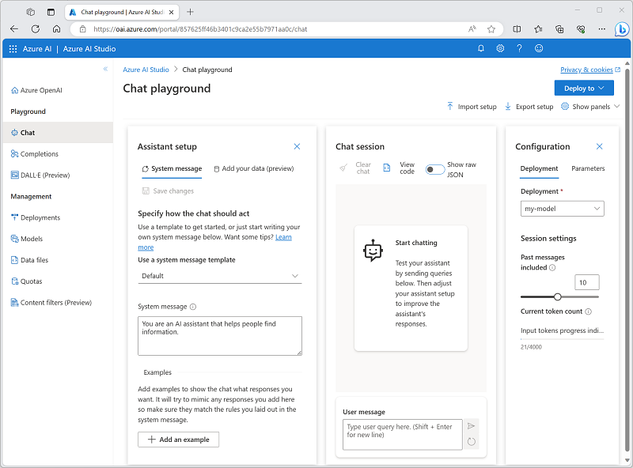
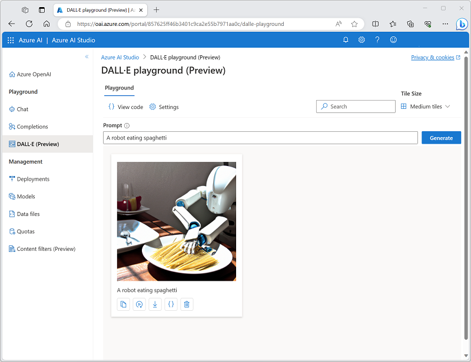
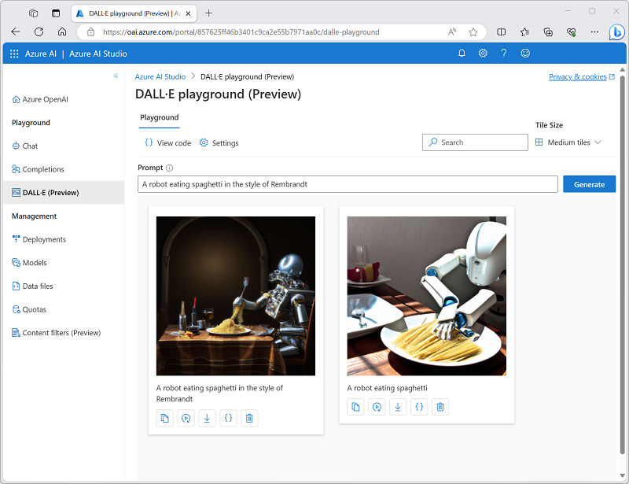

---
lab:
    title: 'Use Azure OpenAI Studio Playground'
---


# Use Azure OpenAI Studio Playground

Azure OpenAI Service brings the generative AI models developed by OpenAI to the Azure platform, enabling you to develop powerful AI solutions that benefit from the security, scalability, and integration of services provided by the Azure cloud platform.

In this exercise, you'll explore Azure OpenAI Service and use it to deploy and experiment with generative AI models.

This exercise will take approximately **25** minutes.

## Before you start

You will need an Azure subscription that has been approved for access to the Azure OpenAI service for both text and code models, and DALL-E image generation models.

- To sign up for a free Azure subscription, visit [https://azure.microsoft.com/free](https://azure.microsoft.com/free).
- To request access to the Azure OpenAI service, visit [https://aka.ms/oaiapply](https://aka.ms/oaiapply).

## Provision an Azure OpenAI resource

Before you can use Azure OpenAI models, you must provision an Azure OpenAI resource in your Azure subscription.

1. Sign into the [Azure portal](https://portal.azure.com).
2. Create an **Azure OpenAI** resource with the following settings:
    - **Subscription**: *An Azure subscription that has been approved for access to the Azure OpenAI service.*
    - **Resource group**: *Create a new resource group with a name of your choice.*
    - **Region**: *East US*
    - **Name**: *A unique name of your choice.*
    - **Pricing tier**: Standard S0
3. Wait for deployment to complete. Then go to the deployed Azure OpenAI resource in the Azure portal.

## Explore Azure AI Studio

You can deploy, manage, and explore models in your Azure OpenAI Service by using Azure AI Studio.

1. On the **Overview** page for your Azure OpenAI resource, use the **Explore** button to open Azure AI Studio in a new browser tab. Alternatively, navigate to [Azure AI Studio](https://oai.azure.com/) directly.

    When you first open Azure AI Studio, it should look similar to this:

    

1. View the pages available in the pane on the left. You can always return to the home page at the top. Additionally, AI Studio provides multiple pages where you can:
    - Experiment with models in a *playground*.
    - Manage model deployments and data.

## Deploy a model for language generation

To experiment with natural language generation, you must first deploy a model.

1. On the **Models** page view the available models in your Azure OpenAI service instance.
1. Select any of the **gpt-35-turbo** models for which the **Deployable** status is **Yes**, and then select **Deploy**:

    

1. Create a new deployment with the following settings:
    - **Model**: gpt-35-turbo
    - **Model version**: Auto-update to default
    - **Deployment name**: *A unique name for your model deployment*

   > **Note**: You can only deploy one instance of each model. If you have already deployed a **gpt-35-turbo** model, you can use it to complete the rest of this exercise.

## Use the *Chat* playground to work with the model

Now that you have deployed a model, you can use it in the *Chat* playground to generate natural language output from prompts that you submit in a chat interface.

1. In [Azure AI Studio](https://oai.azure.com/), navigate to the **Chat** playground in the left pane.

    The *Chat* playground provides a chatbot interface with which you can interact with your deployed model, as shown here:

    

1. In the **Configuration** pane, ensure that your model deployment is selected.
1. In the **Assistant setup** pane, select the **Default** system message template, and view the system message this template creates. The system message defines how the model will behave in your chat session.
1. In the **Chat session** section, enter the following user message.

    ```code
   What is generative AI?
    ```

1. Observe the output returned by the model, which should provide a definition of generative AI.
1. Enter the following user message as a follow-up question:

    ```code
   What are three benefits it provides?
    ```

1. Review the output, noting that the chat session has kept track of the previous input and response to provide context (so it correctly interprets "it" as referring to "generative AI") and that it provides a suitable response based on what was requested (it should return three benefits of generative AI).

## Use the *DALL-E* playground to generate images

In addition to language generation models, Azure OpenAI Service supports the DALL-E 2 model for image generation.

> **Note**: You must have applied for and received access to DALL-E functionality in your Azure OpenAI service access application to complete this section of the exercise.

1. In [Azure AI Studio](https://oai.azure.com/), navigate to the **DALL-E** playground in the left pane.
1. Enter the following prompt:

    ```code
    A robot eating spaghetti
    ```

1. Select **Generate** and view the results, which should consist of an image based on the description you provided in the prompt, similar to this:

    

1. Generate a second image by modifying the prompt to:

    ```code
    A robot eating spaghetti in the style of Rembrandt
    ```
1. Verify that the new image matches the requirements of the prompt, similar to this:

    
